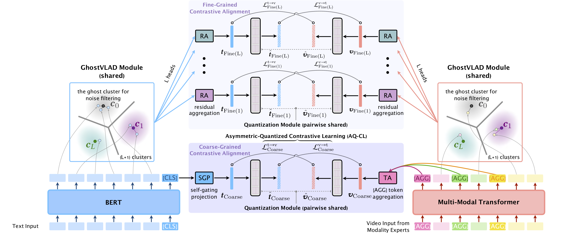

# HCQ: Hybrid Contrastive Quantization for Efficient Cross-View Video Retrieval

[toc]

## 1. Introduction



This repository provides the code for our paper at **TheWebConf 2022**:

**Hybrid Contrastive Quantization for Efficient Cross-View Video Retrieval**. Jinpeng Wang, Bin Chen, Dongliang Liao, Ziyun Zeng, Gongfu Li, Shu-Tao Xia, Jin Xu. [[arXiv](https://arxiv.org/abs/2202.03384)].

Our proposed Hybrid Contrastive Quantization (HCQ) is the first quantization learning method for cross-view (e.g., text-to-video) retrieval, which learns both coarse-grained and fine-grained quantizations with transformers. Experiments on MSRVTT, LSMDC and ActivityNet Captions datasets demonstrate that it can achieve competitive performance with state-of-the-art non-compressed retrieval methods while showing high efficiency in storage and computation.

In the following, we will guide you how to use this repository step by step. 🤗

## 2. Preparation
```bash
git clone https://github.com/gimpong/WWW22-HCQ.git
```

### 2.1 Requirements

* python 3.7.4
* gensim 4.1.2
* h5py 3.6.0
* numpy 1.17.3
* pandas 1.2.3
* pytorch-warmup 0.0.4
* scikit-learn 0.23.0
* scipy 1.6.1
* tensorboardX 2.4.1
* torch 1.6.0+cu101
* transformers 3.1.0

```bash
cd WWW22-HCQ
# Install the requirements
pip install -r requirements.txt
```

We conduct each training experiment on a single NVIDIA® Tesla® V100 GPU (32 GB).

### 2.2 Download the features

Before running the code, we need to download the datasets and arrange them in the "data" directory properly. We use the video features provided by the authors of [MMT](https://github.com/gabeur/mmt). These features can be downloaded from [this page](http://thoth.inrialpes.fr/research/video-features/) by running the following commands:

```bash
# Create and move to WWW22-HCQ/data directory
cd data
# Download the video features
wget http://pascal.inrialpes.fr/data2/vgabeur/video-features/MSRVTT.tar.gz
wget http://pascal.inrialpes.fr/data2/vgabeur/video-features/activity-net.tar.gz
wget http://pascal.inrialpes.fr/data2/vgabeur/video-features/LSMDC.tar.gz
# Extract the video features
tar -xvf MSRVTT.tar.gz
tar -xvf activity-net.tar.gz
tar -xvf LSMDC.tar.gz
```

## 3. Training and Evaluation

### 3.1 Training from scratch

Let us take "training HCQ on MSRVTT dataset ('1k-A' split)" as an example:
```bash
# working directory: WWW22-HCQ/
python -m train --config configs/HCQ_MSRVTT_1kA.json
```

Expected results:

```
MSRVTT_jsfusion_test:
 t2v_metrics/R1/final_eval: 25.9
 t2v_metrics/R5/final_eval: 54.8
 t2v_metrics/R10/final_eval: 69.0
 t2v_metrics/R50/final_eval: 88.8
 t2v_metrics/MedR/final_eval: 5.0
 t2v_metrics/MeanR/final_eval: 28.062
 t2v_metrics/geometric_mean_R1-R5-R10/final_eval: 46.09386629981193
 v2t_metrics/R1/final_eval: 26.3
 v2t_metrics/R5/final_eval: 57.0
 v2t_metrics/R10/final_eval: 70.1
 v2t_metrics/R50/final_eval: 90.0
 v2t_metrics/MedR/final_eval: 4.0
 v2t_metrics/MeanR/final_eval: 25.1535
 v2t_metrics/geometric_mean_R1-R5-R10/final_eval: 47.18995255588879
```

After training, a folder with the same name as the configuration json file (e.g., "HCQ_MSRVTT_1kA") will be generated under `WWW22-HCQ/exps/`, which contains the model checkpoints, logs, tensorboard files, and so on.

For reproducing other experiments, please see the following tables. You can just replace the config json path with another in the training command.

#### 3.1.1 Main results of HCQ (reported in Table 1-3 in our paper)

<table class="tg">
<thead>
  <tr>
    <th class="tg-0lax" rowspan="2"><span style="font-weight:700;font-style:normal;text-decoration:none;color:black">Model</span></th>
    <th class="tg-0lax" rowspan="2"><span style="font-weight:700;font-style:normal;text-decoration:none;color:black">Dataset (+split)</span></th>
    <th class="tg-0lax" rowspan="2"><span style="font-weight:700;font-style:normal;text-decoration:none;color:black">Config json</span></th>
    <th class="tg-0lax" rowspan="2"><span style="font-weight:700;font-style:normal;text-decoration:none;color:black">Log</span></th>
    <th class="tg-0lax" colspan="7"><span style="font-weight:700;font-style:normal;text-decoration:none;color:black">Text-to-Video Retrieval</span></th>
    <th class="tg-0lax" colspan="7"><span style="font-weight:700;font-style:normal;text-decoration:none;color:black">Video-to-Text Retrieval</span></th>
  </tr>
  <tr>
    <th class="tg-0lax"><span style="font-weight:700;font-style:normal;text-decoration:none;color:black">Recall@1</span></th>
    <th class="tg-0lax"><span style="font-weight:700;font-style:normal;text-decoration:none;color:black">Recall@5</span></th>
    <th class="tg-0lax"><span style="font-weight:700;font-style:normal;text-decoration:none;color:black">Recall@10</span></th>
    <th class="tg-0lax"><span style="font-weight:700;font-style:normal;text-decoration:none;color:black">Recall@50</span></th>
    <th class="tg-0lax"><span style="font-weight:700;font-style:normal;text-decoration:none;color:black">Median rank</span></th>
    <th class="tg-0lax"><span style="font-weight:700;font-style:normal;text-decoration:none;color:black">Mean rank</span></th>
    <th class="tg-0lax"><span style="font-weight:700;font-style:normal;text-decoration:none;color:black">Geometric mean of recall@{1,5,10}</span></th>
    <th class="tg-0lax"><span style="font-weight:700;font-style:normal;text-decoration:none;color:black">Recall@1</span></th>
    <th class="tg-0lax"><span style="font-weight:700;font-style:normal;text-decoration:none;color:black">Recall@5</span></th>
    <th class="tg-0lax"><span style="font-weight:700;font-style:normal;text-decoration:none;color:black">Recall@10</span></th>
    <th class="tg-0lax"><span style="font-weight:700;font-style:normal;text-decoration:none;color:black">Recall@50</span></th>
    <th class="tg-0lax"><span style="font-weight:700;font-style:normal;text-decoration:none;color:black">Median rank</span></th>
    <th class="tg-0lax"><span style="font-weight:700;font-style:normal;text-decoration:none;color:black">Mean rank</span></th>
    <th class="tg-0lax"><span style="font-weight:700;font-style:normal;text-decoration:none;color:black">Geometric mean of recall@{1,5,10}</span></th>
  </tr>
</thead>
<tbody>
  <tr>
    <td class="tg-0lax" rowspan="5"><span style="font-weight:400;font-style:normal;text-decoration:none;color:black">HCQ</span></td>
    <td class="tg-0lax"><span style="font-weight:400;font-style:normal;text-decoration:none;color:black">MSRVTT (1k-A)</span></td>
    <td class="tg-0lax"><span style="font-weight:400;font-style:normal;text-decoration:none;color:black"> <a href="configs/HCQ_MSRVTT_1kA.json">HCQ_MSRVTT_1kA.json</a> </span></td>
    <td class="tg-0lax"><span style="font-weight:400;font-style:normal;text-decoration:none;color:black">  <a href="logs/HCQ_MSRVTT_1kA.txt">HCQ_MSRVTT_1kA.txt</a>　</span></td>
    <td class="tg-0lax"><span style="font-weight:400;font-style:normal;text-decoration:none;color:black">25.90</span> </td>
    <td class="tg-0lax"><span style="font-weight:400;font-style:normal;text-decoration:none;color:black">54.80</span> </td>
    <td class="tg-0lax"><span style="font-weight:400;font-style:normal;text-decoration:none;color:black">69.00</span> </td>
    <td class="tg-0lax"><span style="font-weight:400;font-style:normal;text-decoration:none;color:black">88.80</span> </td>
    <td class="tg-0lax"><span style="font-weight:400;font-style:normal;text-decoration:none;color:black">5</span></td>
    <td class="tg-0lax"><span style="font-weight:400;font-style:normal;text-decoration:none;color:black">28.06</span> </td>
    <td class="tg-0lax"><span style="font-weight:400;font-style:normal;text-decoration:none;color:black">46.09</span> </td>
    <td class="tg-0lax"><span style="font-weight:400;font-style:normal;text-decoration:none;color:black">26.30</span> </td>
    <td class="tg-0lax"><span style="font-weight:400;font-style:normal;text-decoration:none;color:black">57.00</span> </td>
    <td class="tg-0lax"><span style="font-weight:400;font-style:normal;text-decoration:none;color:black">70.10</span> </td>
    <td class="tg-0lax"><span style="font-weight:400;font-style:normal;text-decoration:none;color:black">90.00</span> </td>
    <td class="tg-0lax"><span style="font-weight:400;font-style:normal;text-decoration:none;color:black">4</span></td>
    <td class="tg-0lax"><span style="font-weight:400;font-style:normal;text-decoration:none;color:black">25.15</span> </td>
    <td class="tg-0lax"><span style="font-weight:400;font-style:normal;text-decoration:none;color:black">47.19</span> </td>
  </tr>
  <tr>
    <td class="tg-0lax"><span style="font-weight:400;font-style:normal;text-decoration:none;color:black">MSRVTT (1k-B)</span></td>
    <td class="tg-0lax"><span style="font-weight:400;font-style:normal;text-decoration:none;color:black"> <a href="configs/HCQ_MSRVTT_1kB.json">HCQ_MSRVTT_1kB.json</a> </span></td>
    <td class="tg-0lax"><span style="font-weight:400;font-style:normal;text-decoration:none;color:black">  <a href="logs/HCQ_MSRVTT_1kB.txt">HCQ_MSRVTT_1kB.txt</a>　</span></td>
    <td class="tg-0lax"><span style="font-weight:400;font-style:normal;text-decoration:none;color:black">22.50</span> </td>
    <td class="tg-0lax"><span style="font-weight:400;font-style:normal;text-decoration:none;color:black">51.50</span> </td>
    <td class="tg-0lax"><span style="font-weight:400;font-style:normal;text-decoration:none;color:black">65.90</span> </td>
    <td class="tg-0lax"><span style="font-weight:400;font-style:normal;text-decoration:none;color:black">86.10</span> </td>
    <td class="tg-0lax"><span style="font-weight:400;font-style:normal;text-decoration:none;color:black">5</span></td>
    <td class="tg-0lax"><span style="font-weight:400;font-style:normal;text-decoration:none;color:black">33.65</span> </td>
    <td class="tg-0lax"><span style="font-weight:400;font-style:normal;text-decoration:none;color:black">42.43</span> </td>
    <td class="tg-0lax"><span style="font-weight:400;font-style:normal;text-decoration:none;color:black">23.70</span> </td>
    <td class="tg-0lax"><span style="font-weight:400;font-style:normal;text-decoration:none;color:black">52.20</span> </td>
    <td class="tg-0lax"><span style="font-weight:400;font-style:normal;text-decoration:none;color:black">66.90</span> </td>
    <td class="tg-0lax"><span style="font-weight:400;font-style:normal;text-decoration:none;color:black">88.10</span> </td>
    <td class="tg-0lax"><span style="font-weight:400;font-style:normal;text-decoration:none;color:black">5</span></td>
    <td class="tg-0lax"><span style="font-weight:400;font-style:normal;text-decoration:none;color:black">29.30</span> </td>
    <td class="tg-0lax"><span style="font-weight:400;font-style:normal;text-decoration:none;color:black">43.58</span> </td>
  </tr>
  <tr>
    <td class="tg-0lax"><span style="font-weight:400;font-style:normal;text-decoration:none;color:black">MSRVTT (Full)</span></td>
    <td class="tg-0lax"><span style="font-weight:400;font-style:normal;text-decoration:none;color:black"> <a href="configs/HCQ_MSRVTT_full.json">HCQ_MSRVTT_full.json</a> </span></td>
    <td class="tg-0lax"><span style="font-weight:400;font-style:normal;text-decoration:none;color:black">  <a href="logs/HCQ_MSRVTT_full.txt">HCQ_MSRVTT_full.txt</a>　</span></td>
    <td class="tg-0lax"><span style="font-weight:400;font-style:normal;text-decoration:none;color:black">15.15</span> </td>
    <td class="tg-0lax"><span style="font-weight:400;font-style:normal;text-decoration:none;color:black">38.53</span> </td>
    <td class="tg-0lax"><span style="font-weight:400;font-style:normal;text-decoration:none;color:black">51.00</span> </td>
    <td class="tg-0lax"><span style="font-weight:400;font-style:normal;text-decoration:none;color:black">81.34</span> </td>
    <td class="tg-0lax"><span style="font-weight:400;font-style:normal;text-decoration:none;color:black">10</span></td>
    <td class="tg-0lax"><span style="font-weight:400;font-style:normal;text-decoration:none;color:black">46.22</span> </td>
    <td class="tg-0lax"><span style="font-weight:400;font-style:normal;text-decoration:none;color:black">30.99</span> </td>
    <td class="tg-0lax"><span style="font-weight:400;font-style:normal;text-decoration:none;color:black">18.26</span> </td>
    <td class="tg-0lax"><span style="font-weight:400;font-style:normal;text-decoration:none;color:black">44.88</span> </td>
    <td class="tg-0lax"><span style="font-weight:400;font-style:normal;text-decoration:none;color:black">59.06</span> </td>
    <td class="tg-0lax"><span style="font-weight:400;font-style:normal;text-decoration:none;color:black">87.16</span> </td>
    <td class="tg-0lax"><span style="font-weight:400;font-style:normal;text-decoration:none;color:black">7</span></td>
    <td class="tg-0lax"><span style="font-weight:400;font-style:normal;text-decoration:none;color:black">30.96</span> </td>
    <td class="tg-0lax"><span style="font-weight:400;font-style:normal;text-decoration:none;color:black">36.45</span> </td>
  </tr>
  <tr>
    <td class="tg-0lax"><span style="font-weight:400;font-style:normal;text-decoration:none;color:black">LSMDC</span></td>
    <td class="tg-0lax"><span style="font-weight:400;font-style:normal;text-decoration:none;color:black"> <a href="configs/HCQ_LSMDC.json">HCQ_LSMDC.json</a> </span></td>
    <td class="tg-0lax"><span style="font-weight:400;font-style:normal;text-decoration:none;color:black">  <a href="logs/HCQ_LSMDC.txt">HCQ_LSMDC.txt</a>　</span></td>
    <td class="tg-0lax"><span style="font-weight:400;font-style:normal;text-decoration:none;color:black">14.50</span> </td>
    <td class="tg-0lax"><span style="font-weight:400;font-style:normal;text-decoration:none;color:black">33.60</span> </td>
    <td class="tg-0lax"><span style="font-weight:400;font-style:normal;text-decoration:none;color:black">43.10</span> </td>
    <td class="tg-0lax"><span style="font-weight:400;font-style:normal;text-decoration:none;color:black">68.20</span> </td>
    <td class="tg-0lax"><span style="font-weight:400;font-style:normal;text-decoration:none;color:black">18.5</span></td>
    <td class="tg-0lax"><span style="font-weight:400;font-style:normal;text-decoration:none;color:black">75.95</span> </td>
    <td class="tg-0lax"><span style="font-weight:400;font-style:normal;text-decoration:none;color:black">27.59</span> </td>
    <td class="tg-0lax"><span style="font-weight:400;font-style:normal;text-decoration:none;color:black">13.70</span> </td>
    <td class="tg-0lax"><span style="font-weight:400;font-style:normal;text-decoration:none;color:black">33.20</span> </td>
    <td class="tg-0lax"><span style="font-weight:400;font-style:normal;text-decoration:none;color:black">42.80</span> </td>
    <td class="tg-0lax"><span style="font-weight:400;font-style:normal;text-decoration:none;color:black">66.10</span> </td>
    <td class="tg-0lax"><span style="font-weight:400;font-style:normal;text-decoration:none;color:black">17</span></td>
    <td class="tg-0lax"><span style="font-weight:400;font-style:normal;text-decoration:none;color:black">74.28</span> </td>
    <td class="tg-0lax"><span style="font-weight:400;font-style:normal;text-decoration:none;color:black">26.90</span> </td>
  </tr>
  <tr>
    <td class="tg-0lax"><span style="font-weight:400;font-style:normal;text-decoration:none;color:black">ActivityNet Captions</span></td>
    <td class="tg-0lax"><span style="font-weight:400;font-style:normal;text-decoration:none;color:black"> <a href="configs/HCQ_ActivityNet.json">HCQ_ActivityNet.json</a> </span></td>
    <td class="tg-0lax"><span style="font-weight:400;font-style:normal;text-decoration:none;color:black">  <a href="logs/HCQ_ActivityNet.txt">HCQ_ActivityNet.txt</a>　</span></td>
    <td class="tg-0lax"><span style="font-weight:400;font-style:normal;text-decoration:none;color:black">22.19</span> </td>
    <td class="tg-0lax"><span style="font-weight:400;font-style:normal;text-decoration:none;color:black">53.69</span> </td>
    <td class="tg-0lax"><span style="font-weight:400;font-style:normal;text-decoration:none;color:black">70.12</span> </td>
    <td class="tg-0lax"><span style="font-weight:400;font-style:normal;text-decoration:none;color:black">91.21</span> </td>
    <td class="tg-0lax"><span style="font-weight:400;font-style:normal;text-decoration:none;color:black">5</span></td>
    <td class="tg-0lax"><span style="font-weight:400;font-style:normal;text-decoration:none;color:black">30.71</span> </td>
    <td class="tg-0lax"><span style="font-weight:400;font-style:normal;text-decoration:none;color:black">43.72</span> </td>
    <td class="tg-0lax"><span style="font-weight:400;font-style:normal;text-decoration:none;color:black">23.00</span> </td>
    <td class="tg-0lax"><span style="font-weight:400;font-style:normal;text-decoration:none;color:black">54.85</span> </td>
    <td class="tg-0lax"><span style="font-weight:400;font-style:normal;text-decoration:none;color:black">70.14</span> </td>
    <td class="tg-0lax"><span style="font-weight:400;font-style:normal;text-decoration:none;color:black">91.38</span> </td>
    <td class="tg-0lax"><span style="font-weight:400;font-style:normal;text-decoration:none;color:black">5</span></td>
    <td class="tg-0lax"><span style="font-weight:400;font-style:normal;text-decoration:none;color:black">29.08</span> </td>
    <td class="tg-0lax"><span style="font-weight:400;font-style:normal;text-decoration:none;color:black">44.56</span> </td>
  </tr>
</tbody>
</table>

#### 3.1.2 Result of Hybrid Contrastive Transformer (HCT), Dual Transformer (DT) + DCMH, and DT + JPQ (reported in Table 4 in our paper)

<table class="tg">
<thead>
  <tr>
    <th class="tg-0lax" rowspan="2"><span style="font-weight:700;font-style:normal;text-decoration:none;color:black">Model</span></th>
    <th class="tg-0lax" rowspan="2"><span style="font-weight:700;font-style:normal;text-decoration:none;color:black">Dataset (+split)</span></th>
    <th class="tg-0lax" rowspan="2"><span style="font-weight:700;font-style:normal;text-decoration:none;color:black">Config json</span></th>
    <th class="tg-0lax" rowspan="2"><span style="font-weight:700;font-style:normal;text-decoration:none;color:black">Log</span></th>
    <th class="tg-0lax" colspan="7"><span style="font-weight:700;font-style:normal;text-decoration:none;color:black">Text-to-Video Retrieval</span></th>
    <th class="tg-0lax" colspan="7"><span style="font-weight:700;font-style:normal;text-decoration:none;color:black">Video-to-Text Retrieval</span></th>
  </tr>
  <tr>
    <th class="tg-0lax"><span style="font-weight:700;font-style:normal;text-decoration:none;color:black">Recall@1</span></th>
    <th class="tg-0lax"><span style="font-weight:700;font-style:normal;text-decoration:none;color:black">Recall@5</span></th>
    <th class="tg-0lax"><span style="font-weight:700;font-style:normal;text-decoration:none;color:black">Recall@10</span></th>
    <th class="tg-0lax"><span style="font-weight:700;font-style:normal;text-decoration:none;color:black">Recall@50</span></th>
    <th class="tg-0lax"><span style="font-weight:700;font-style:normal;text-decoration:none;color:black">Median rank</span></th>
    <th class="tg-0lax"><span style="font-weight:700;font-style:normal;text-decoration:none;color:black">Mean rank</span></th>
    <th class="tg-0lax"><span style="font-weight:700;font-style:normal;text-decoration:none;color:black">Geometric mean of recall@{1,5,10}</span></th>
    <th class="tg-0lax"><span style="font-weight:700;font-style:normal;text-decoration:none;color:black">Recall@1</span></th>
    <th class="tg-0lax"><span style="font-weight:700;font-style:normal;text-decoration:none;color:black">Recall@5</span></th>
    <th class="tg-0lax"><span style="font-weight:700;font-style:normal;text-decoration:none;color:black">Recall@10</span></th>
    <th class="tg-0lax"><span style="font-weight:700;font-style:normal;text-decoration:none;color:black">Recall@50</span></th>
    <th class="tg-0lax"><span style="font-weight:700;font-style:normal;text-decoration:none;color:black">Median rank</span></th>
    <th class="tg-0lax"><span style="font-weight:700;font-style:normal;text-decoration:none;color:black">Mean rank</span></th>
    <th class="tg-0lax"><span style="font-weight:700;font-style:normal;text-decoration:none;color:black">Geometric mean of recall@{1,5,10}</span></th>
  </tr>
</thead>
<tbody>
  <tr>
    <td class="tg-0lax" rowspan="5"><span style="font-weight:400;font-style:normal;text-decoration:none;color:black">HCT</span></td>
    <td class="tg-0lax"><span style="font-weight:400;font-style:normal;text-decoration:none;color:black">MSRVTT (1k-A)</span></td>
    <td class="tg-0lax"><span style="font-weight:400;font-style:normal;text-decoration:none;color:black"><a href="configs/HCT_MSRVTT_1kA.json">HCT_MSRVTT_1kA.json</a></span></td>
    <td class="tg-0lax"><span style="font-weight:400;font-style:normal;text-decoration:none;color:black"><a href="logs/HCT_MSRVTT_1kA.txt">HCT_MSRVTT_1kA.txt</a></span></td>
    <td class="tg-0lax"><span style="font-weight:400;font-style:normal;text-decoration:none;color:black">27.80</span> </td>
    <td class="tg-0lax"><span style="font-weight:400;font-style:normal;text-decoration:none;color:black">58.00</span> </td>
    <td class="tg-0lax"><span style="font-weight:400;font-style:normal;text-decoration:none;color:black">70.00</span> </td>
    <td class="tg-0lax"><span style="font-weight:400;font-style:normal;text-decoration:none;color:black">89.50</span> </td>
    <td class="tg-0lax"><span style="font-weight:400;font-style:normal;text-decoration:none;color:black">4</span></td>
    <td class="tg-0lax"><span style="font-weight:400;font-style:normal;text-decoration:none;color:black">26.79</span> </td>
    <td class="tg-0lax"><span style="font-weight:400;font-style:normal;text-decoration:none;color:black">48.33</span> </td>
    <td class="tg-0lax"><span style="font-weight:400;font-style:normal;text-decoration:none;color:black">27.30</span> </td>
    <td class="tg-0lax"><span style="font-weight:400;font-style:normal;text-decoration:none;color:black">57.80</span> </td>
    <td class="tg-0lax"><span style="font-weight:400;font-style:normal;text-decoration:none;color:black">72.10</span> </td>
    <td class="tg-0lax"><span style="font-weight:400;font-style:normal;text-decoration:none;color:black">90.60</span> </td>
    <td class="tg-0lax"><span style="font-weight:400;font-style:normal;text-decoration:none;color:black">4</span></td>
    <td class="tg-0lax"><span style="font-weight:400;font-style:normal;text-decoration:none;color:black">24.38</span> </td>
    <td class="tg-0lax"><span style="font-weight:400;font-style:normal;text-decoration:none;color:black">48.46</span> </td>
  </tr>
  <tr>
    <td class="tg-0lax"><span style="font-weight:400;font-style:normal;text-decoration:none;color:black">MSRVTT (1k-B)</span></td>
    <td class="tg-0lax"><span style="font-weight:400;font-style:normal;text-decoration:none;color:black"><a href="configs/HCT_MSRVTT_1kB.json">HCT_MSRVTT_1kB.json</a></span></td>
    <td class="tg-0lax"><span style="font-weight:400;font-style:normal;text-decoration:none;color:black"><a href="logs/HCT_MSRVTT_1kB.txt">HCT_MSRVTT_1kB.txt</a></span></td>
    <td class="tg-0lax"><span style="font-weight:400;font-style:normal;text-decoration:none;color:black">25.70</span> </td>
    <td class="tg-0lax"><span style="font-weight:400;font-style:normal;text-decoration:none;color:black">53.70</span> </td>
    <td class="tg-0lax"><span style="font-weight:400;font-style:normal;text-decoration:none;color:black">67.30</span> </td>
    <td class="tg-0lax"><span style="font-weight:400;font-style:normal;text-decoration:none;color:black">88.30</span> </td>
    <td class="tg-0lax"><span style="font-weight:400;font-style:normal;text-decoration:none;color:black">5</span></td>
    <td class="tg-0lax"><span style="font-weight:400;font-style:normal;text-decoration:none;color:black">31.09</span> </td>
    <td class="tg-0lax"><span style="font-weight:400;font-style:normal;text-decoration:none;color:black">45.29</span> </td>
    <td class="tg-0lax"><span style="font-weight:400;font-style:normal;text-decoration:none;color:black">24.70</span> </td>
    <td class="tg-0lax"><span style="font-weight:400;font-style:normal;text-decoration:none;color:black">55.50</span> </td>
    <td class="tg-0lax"><span style="font-weight:400;font-style:normal;text-decoration:none;color:black">68.70</span> </td>
    <td class="tg-0lax"><span style="font-weight:400;font-style:normal;text-decoration:none;color:black">88.80</span> </td>
    <td class="tg-0lax"><span style="font-weight:400;font-style:normal;text-decoration:none;color:black">4</span></td>
    <td class="tg-0lax"><span style="font-weight:400;font-style:normal;text-decoration:none;color:black">25.54</span> </td>
    <td class="tg-0lax"><span style="font-weight:400;font-style:normal;text-decoration:none;color:black">45.50</span> </td>
  </tr>
  <tr>
    <td class="tg-0lax"><span style="font-weight:400;font-style:normal;text-decoration:none;color:black">MSRVTT (Full)</span></td>
    <td class="tg-0lax"><span style="font-weight:400;font-style:normal;text-decoration:none;color:black"><a href="configs/HCT_MSRVTT_full.json">HCT_MSRVTT_full.json</a></span></td>
    <td class="tg-0lax"><span style="font-weight:400;font-style:normal;text-decoration:none;color:black"><a href="logs/HCT_MSRVTT_full.txt">HCT_MSRVTT_full.txt</a></span></td>
    <td class="tg-0lax"><span style="font-weight:400;font-style:normal;text-decoration:none;color:black">16.76</span> </td>
    <td class="tg-0lax"><span style="font-weight:400;font-style:normal;text-decoration:none;color:black">41.87</span> </td>
    <td class="tg-0lax"><span style="font-weight:400;font-style:normal;text-decoration:none;color:black">55.79</span> </td>
    <td class="tg-0lax"><span style="font-weight:400;font-style:normal;text-decoration:none;color:black">82.44</span> </td>
    <td class="tg-0lax"><span style="font-weight:400;font-style:normal;text-decoration:none;color:black">8</span></td>
    <td class="tg-0lax"><span style="font-weight:400;font-style:normal;text-decoration:none;color:black">44.33</span> </td>
    <td class="tg-0lax"><span style="font-weight:400;font-style:normal;text-decoration:none;color:black">33.95</span> </td>
    <td class="tg-0lax"><span style="font-weight:400;font-style:normal;text-decoration:none;color:black">21.64</span> </td>
    <td class="tg-0lax"><span style="font-weight:400;font-style:normal;text-decoration:none;color:black">50.57</span> </td>
    <td class="tg-0lax"><span style="font-weight:400;font-style:normal;text-decoration:none;color:black">63.88</span> </td>
    <td class="tg-0lax"><span style="font-weight:400;font-style:normal;text-decoration:none;color:black">87.66</span> </td>
    <td class="tg-0lax"><span style="font-weight:400;font-style:normal;text-decoration:none;color:black">5</span></td>
    <td class="tg-0lax"><span style="font-weight:400;font-style:normal;text-decoration:none;color:black">29.56</span> </td>
    <td class="tg-0lax"><span style="font-weight:400;font-style:normal;text-decoration:none;color:black">41.19</span> </td>
  </tr>
  <tr>
    <td class="tg-0lax"><span style="font-weight:400;font-style:normal;text-decoration:none;color:black">LSMDC</span></td>
    <td class="tg-0lax"><span style="font-weight:400;font-style:normal;text-decoration:none;color:black"><a href="configs/HCT_LSMDC.json">HCT_LSMDC.json</a></span></td>
    <td class="tg-0lax"><span style="font-weight:400;font-style:normal;text-decoration:none;color:black"><a href="logs/HCT_LSMDC.txt">HCT_LSMDC.txt</a></span></td>
    <td class="tg-0lax"><span style="font-weight:400;font-style:normal;text-decoration:none;color:black">16.40</span> </td>
    <td class="tg-0lax"><span style="font-weight:400;font-style:normal;text-decoration:none;color:black">34.10</span> </td>
    <td class="tg-0lax"><span style="font-weight:400;font-style:normal;text-decoration:none;color:black">43.10</span> </td>
    <td class="tg-0lax"><span style="font-weight:400;font-style:normal;text-decoration:none;color:black">69.10</span> </td>
    <td class="tg-0lax"><span style="font-weight:400;font-style:normal;text-decoration:none;color:black">17</span></td>
    <td class="tg-0lax"><span style="font-weight:400;font-style:normal;text-decoration:none;color:black">72.39</span> </td>
    <td class="tg-0lax"><span style="font-weight:400;font-style:normal;text-decoration:none;color:black">28.89</span> </td>
    <td class="tg-0lax"><span style="font-weight:400;font-style:normal;text-decoration:none;color:black">14.10</span> </td>
    <td class="tg-0lax"><span style="font-weight:400;font-style:normal;text-decoration:none;color:black">33.70</span> </td>
    <td class="tg-0lax"><span style="font-weight:400;font-style:normal;text-decoration:none;color:black">41.40</span> </td>
    <td class="tg-0lax"><span style="font-weight:400;font-style:normal;text-decoration:none;color:black">67.40</span> </td>
    <td class="tg-0lax"><span style="font-weight:400;font-style:normal;text-decoration:none;color:black">18</span></td>
    <td class="tg-0lax"><span style="font-weight:400;font-style:normal;text-decoration:none;color:black">73.54</span> </td>
    <td class="tg-0lax"><span style="font-weight:400;font-style:normal;text-decoration:none;color:black">26.99</span> </td>
  </tr>
  <tr>
    <td class="tg-0lax"><span style="font-weight:400;font-style:normal;text-decoration:none;color:black">ActivityNet Captions</span></td>
    <td class="tg-0lax"><span style="font-weight:400;font-style:normal;text-decoration:none;color:black"><a href="configs/HCT_ActivityNet.json">HCT_ActivityNet.json</a></span></td>
    <td class="tg-0lax"><span style="font-weight:400;font-style:normal;text-decoration:none;color:black"><a href="logs/HCT_ActivityNet.txt">HCT_ActivityNet.txt</a></span></td>
    <td class="tg-0lax"><span style="font-weight:400;font-style:normal;text-decoration:none;color:black">23.12</span> </td>
    <td class="tg-0lax"><span style="font-weight:400;font-style:normal;text-decoration:none;color:black">54.95</span> </td>
    <td class="tg-0lax"><span style="font-weight:400;font-style:normal;text-decoration:none;color:black">71.14</span> </td>
    <td class="tg-0lax"><span style="font-weight:400;font-style:normal;text-decoration:none;color:black">92.64</span> </td>
    <td class="tg-0lax"><span style="font-weight:400;font-style:normal;text-decoration:none;color:black">5</span></td>
    <td class="tg-0lax"><span style="font-weight:400;font-style:normal;text-decoration:none;color:black">24.82</span> </td>
    <td class="tg-0lax"><span style="font-weight:400;font-style:normal;text-decoration:none;color:black">44.88</span> </td>
    <td class="tg-0lax"><span style="font-weight:400;font-style:normal;text-decoration:none;color:black">22.94</span> </td>
    <td class="tg-0lax"><span style="font-weight:400;font-style:normal;text-decoration:none;color:black">55.81</span> </td>
    <td class="tg-0lax"><span style="font-weight:400;font-style:normal;text-decoration:none;color:black">70.84</span> </td>
    <td class="tg-0lax"><span style="font-weight:400;font-style:normal;text-decoration:none;color:black">92.29</span> </td>
    <td class="tg-0lax"><span style="font-weight:400;font-style:normal;text-decoration:none;color:black">4</span></td>
    <td class="tg-0lax"><span style="font-weight:400;font-style:normal;text-decoration:none;color:black">25.35</span> </td>
    <td class="tg-0lax"><span style="font-weight:400;font-style:normal;text-decoration:none;color:black">44.93</span> </td>
  </tr>
  <tr>
    <td class="tg-0lax" rowspan="5"><span style="font-weight:400;font-style:normal;text-decoration:none;color:black">DT+DCMH</span></td>
    <td class="tg-0lax"><span style="font-weight:400;font-style:normal;text-decoration:none;color:black">MSRVTT (1k-A)</span></td>
    <td class="tg-0lax"><span style="font-weight:400;font-style:normal;text-decoration:none;color:black"><a href="configs/DCMH_MSRVTT_1kA.json">DCMH_MSRVTT_1kA.json</a></span></td>
    <td class="tg-0lax"><span style="font-weight:400;font-style:normal;text-decoration:none;color:black"><a href="logs/DCMH_MSRVTT_1kA.txt">DCMH_MSRVTT_1kA.txt</a></span></td>
    <td class="tg-0lax"><span style="font-weight:400;font-style:normal;text-decoration:none;color:black">19.00</span> </td>
    <td class="tg-0lax"><span style="font-weight:400;font-style:normal;text-decoration:none;color:black">48.40</span> </td>
    <td class="tg-0lax"><span style="font-weight:400;font-style:normal;text-decoration:none;color:black">62.20</span> </td>
    <td class="tg-0lax"><span style="font-weight:400;font-style:normal;text-decoration:none;color:black">85.30</span> </td>
    <td class="tg-0lax"><span style="font-weight:400;font-style:normal;text-decoration:none;color:black">6</span></td>
    <td class="tg-0lax"><span style="font-weight:400;font-style:normal;text-decoration:none;color:black">32.40</span> </td>
    <td class="tg-0lax"><span style="font-weight:400;font-style:normal;text-decoration:none;color:black">38.53</span> </td>
    <td class="tg-0lax"><span style="font-weight:400;font-style:normal;text-decoration:none;color:black">20.00</span> </td>
    <td class="tg-0lax"><span style="font-weight:400;font-style:normal;text-decoration:none;color:black">50.20</span> </td>
    <td class="tg-0lax"><span style="font-weight:400;font-style:normal;text-decoration:none;color:black">63.30</span> </td>
    <td class="tg-0lax"><span style="font-weight:400;font-style:normal;text-decoration:none;color:black">84.90</span> </td>
    <td class="tg-0lax"><span style="font-weight:400;font-style:normal;text-decoration:none;color:black">5.5</span></td>
    <td class="tg-0lax"><span style="font-weight:400;font-style:normal;text-decoration:none;color:black">31.69</span> </td>
    <td class="tg-0lax"><span style="font-weight:400;font-style:normal;text-decoration:none;color:black">39.91</span> </td>
  </tr>
  <tr>
    <td class="tg-0lax"><span style="font-weight:400;font-style:normal;text-decoration:none;color:black">MSRVTT (1k-B)</span></td>
    <td class="tg-0lax"><span style="font-weight:400;font-style:normal;text-decoration:none;color:black"><a href="configs/DCMH_MSRVTT_1kB.json">DCMH_MSRVTT_1kB.json</a></span></td>
    <td class="tg-0lax"><span style="font-weight:400;font-style:normal;text-decoration:none;color:black"><a href="logs/DCMH_MSRVTT_1kB.txt">DCMH_MSRVTT_1kB.txt</a></span></td>
    <td class="tg-0lax"><span style="font-weight:400;font-style:normal;text-decoration:none;color:black">15.80</span> </td>
    <td class="tg-0lax"><span style="font-weight:400;font-style:normal;text-decoration:none;color:black">41.30</span> </td>
    <td class="tg-0lax"><span style="font-weight:400;font-style:normal;text-decoration:none;color:black">57.70</span> </td>
    <td class="tg-0lax"><span style="font-weight:400;font-style:normal;text-decoration:none;color:black">83.30</span> </td>
    <td class="tg-0lax"><span style="font-weight:400;font-style:normal;text-decoration:none;color:black">8</span></td>
    <td class="tg-0lax"><span style="font-weight:400;font-style:normal;text-decoration:none;color:black">40.42</span> </td>
    <td class="tg-0lax"><span style="font-weight:400;font-style:normal;text-decoration:none;color:black">33.52</span> </td>
    <td class="tg-0lax"><span style="font-weight:400;font-style:normal;text-decoration:none;color:black">16.60</span> </td>
    <td class="tg-0lax"><span style="font-weight:400;font-style:normal;text-decoration:none;color:black">44.10</span> </td>
    <td class="tg-0lax"><span style="font-weight:400;font-style:normal;text-decoration:none;color:black">58.10</span> </td>
    <td class="tg-0lax"><span style="font-weight:400;font-style:normal;text-decoration:none;color:black">84.10</span> </td>
    <td class="tg-0lax"><span style="font-weight:400;font-style:normal;text-decoration:none;color:black">7</span></td>
    <td class="tg-0lax"><span style="font-weight:400;font-style:normal;text-decoration:none;color:black">37.17</span> </td>
    <td class="tg-0lax"><span style="font-weight:400;font-style:normal;text-decoration:none;color:black">34.91</span> </td>
  </tr>
  <tr>
    <td class="tg-0lax"><span style="font-weight:400;font-style:normal;text-decoration:none;color:black">MSRVTT (Full)</span></td>
    <td class="tg-0lax"><span style="font-weight:400;font-style:normal;text-decoration:none;color:black"><a href="configs/DCMH_MSRVTT_full.json">DCMH_MSRVTT_full.json</a></span></td>
    <td class="tg-0lax"><span style="font-weight:400;font-style:normal;text-decoration:none;color:black"><a href="logs/DCMH_MSRVTT_full.txt">DCMH_MSRVTT_full.txt</a></span></td>
    <td class="tg-0lax"><span style="font-weight:400;font-style:normal;text-decoration:none;color:black">8.46</span> </td>
    <td class="tg-0lax"><span style="font-weight:400;font-style:normal;text-decoration:none;color:black">28.16</span> </td>
    <td class="tg-0lax"><span style="font-weight:400;font-style:normal;text-decoration:none;color:black">41.51</span> </td>
    <td class="tg-0lax"><span style="font-weight:400;font-style:normal;text-decoration:none;color:black">73.48</span> </td>
    <td class="tg-0lax"><span style="font-weight:400;font-style:normal;text-decoration:none;color:black">15.75</span></td>
    <td class="tg-0lax"><span style="font-weight:400;font-style:normal;text-decoration:none;color:black">67.90</span> </td>
    <td class="tg-0lax"><span style="font-weight:400;font-style:normal;text-decoration:none;color:black">21.46</span> </td>
    <td class="tg-0lax"><span style="font-weight:400;font-style:normal;text-decoration:none;color:black">9.57</span> </td>
    <td class="tg-0lax"><span style="font-weight:400;font-style:normal;text-decoration:none;color:black">31.30</span> </td>
    <td class="tg-0lax"><span style="font-weight:400;font-style:normal;text-decoration:none;color:black">46.62</span> </td>
    <td class="tg-0lax"><span style="font-weight:400;font-style:normal;text-decoration:none;color:black">78.13</span> </td>
    <td class="tg-0lax"><span style="font-weight:400;font-style:normal;text-decoration:none;color:black">12</span></td>
    <td class="tg-0lax"><span style="font-weight:400;font-style:normal;text-decoration:none;color:black">55.30</span> </td>
    <td class="tg-0lax"><span style="font-weight:400;font-style:normal;text-decoration:none;color:black">24.08</span> </td>
  </tr>
  <tr>
    <td class="tg-0lax"><span style="font-weight:400;font-style:normal;text-decoration:none;color:black">LSMDC</span></td>
    <td class="tg-0lax"><span style="font-weight:400;font-style:normal;text-decoration:none;color:black"><a href="configs/DCMH_LSMDC.json">DCMH_LSMDC.json</a></span></td>
    <td class="tg-0lax"><span style="font-weight:400;font-style:normal;text-decoration:none;color:black"><a href="logs/DCMH_LSMDC.txt">DCMH_LSMDC.txt</a></span></td>
    <td class="tg-0lax"><span style="font-weight:400;font-style:normal;text-decoration:none;color:black">10.00</span> </td>
    <td class="tg-0lax"><span style="font-weight:400;font-style:normal;text-decoration:none;color:black">25.80</span> </td>
    <td class="tg-0lax"><span style="font-weight:400;font-style:normal;text-decoration:none;color:black">36.00</span> </td>
    <td class="tg-0lax"><span style="font-weight:400;font-style:normal;text-decoration:none;color:black">66.30</span> </td>
    <td class="tg-0lax"><span style="font-weight:400;font-style:normal;text-decoration:none;color:black">22</span></td>
    <td class="tg-0lax"><span style="font-weight:400;font-style:normal;text-decoration:none;color:black">75.84</span> </td>
    <td class="tg-0lax"><span style="font-weight:400;font-style:normal;text-decoration:none;color:black">21.02</span> </td>
    <td class="tg-0lax"><span style="font-weight:400;font-style:normal;text-decoration:none;color:black">9.60</span> </td>
    <td class="tg-0lax"><span style="font-weight:400;font-style:normal;text-decoration:none;color:black">25.80</span> </td>
    <td class="tg-0lax"><span style="font-weight:400;font-style:normal;text-decoration:none;color:black">36.40</span> </td>
    <td class="tg-0lax"><span style="font-weight:400;font-style:normal;text-decoration:none;color:black">65.40</span> </td>
    <td class="tg-0lax"><span style="font-weight:400;font-style:normal;text-decoration:none;color:black">22.75</span></td>
    <td class="tg-0lax"><span style="font-weight:400;font-style:normal;text-decoration:none;color:black">78.37</span> </td>
    <td class="tg-0lax"><span style="font-weight:400;font-style:normal;text-decoration:none;color:black">20.81</span> </td>
  </tr>
  <tr>
    <td class="tg-0lax"><span style="font-weight:400;font-style:normal;text-decoration:none;color:black">ActivityNet Captions</span></td>
    <td class="tg-0lax"><span style="font-weight:400;font-style:normal;text-decoration:none;color:black"><a href="configs/DCMH_ActivityNet.json">DCMH_ActivityNet.json</a></span></td>
    <td class="tg-0lax"><span style="font-weight:400;font-style:normal;text-decoration:none;color:black"><a href="logs/DCMH_ActivityNet.txt">DCMH_ActivityNet.txt</a></span></td>
    <td class="tg-0lax"><span style="font-weight:400;font-style:normal;text-decoration:none;color:black">12.34</span> </td>
    <td class="tg-0lax"><span style="font-weight:400;font-style:normal;text-decoration:none;color:black">38.40</span> </td>
    <td class="tg-0lax"><span style="font-weight:400;font-style:normal;text-decoration:none;color:black">55.62</span> </td>
    <td class="tg-0lax"><span style="font-weight:400;font-style:normal;text-decoration:none;color:black">84.62</span> </td>
    <td class="tg-0lax"><span style="font-weight:400;font-style:normal;text-decoration:none;color:black">8.5</span></td>
    <td class="tg-0lax"><span style="font-weight:400;font-style:normal;text-decoration:none;color:black">63.41</span> </td>
    <td class="tg-0lax"><span style="font-weight:400;font-style:normal;text-decoration:none;color:black">29.76</span> </td>
    <td class="tg-0lax"><span style="font-weight:400;font-style:normal;text-decoration:none;color:black">12.45</span> </td>
    <td class="tg-0lax"><span style="font-weight:400;font-style:normal;text-decoration:none;color:black">39.19</span> </td>
    <td class="tg-0lax"><span style="font-weight:400;font-style:normal;text-decoration:none;color:black">55.52</span> </td>
    <td class="tg-0lax"><span style="font-weight:400;font-style:normal;text-decoration:none;color:black">84.58</span> </td>
    <td class="tg-0lax"><span style="font-weight:400;font-style:normal;text-decoration:none;color:black">8.5</span></td>
    <td class="tg-0lax"><span style="font-weight:400;font-style:normal;text-decoration:none;color:black">65.43</span> </td>
    <td class="tg-0lax"><span style="font-weight:400;font-style:normal;text-decoration:none;color:black">30.03</span> </td>
  </tr>
  <tr>
    <td class="tg-0lax" rowspan="5"><span style="font-weight:400;font-style:normal;text-decoration:none;color:black">DT+JPQ</span></td>
    <td class="tg-0lax"><span style="font-weight:400;font-style:normal;text-decoration:none;color:black">MSRVTT (1k-A)</span></td>
    <td class="tg-0lax"><span style="font-weight:400;font-style:normal;text-decoration:none;color:black"><a href="configs/JPQ_MSRVTT_1kA.json">JPQ_MSRVTT_1kA.json</a></span></td>
    <td class="tg-0lax"><span style="font-weight:400;font-style:normal;text-decoration:none;color:black"><a href="logs/JPQ_MSRVTT_1kA.txt">JPQ_MSRVTT_1kA.txt</a></span></td>
    <td class="tg-0lax"><span style="font-weight:400;font-style:normal;text-decoration:none;color:black">18.90</span> </td>
    <td class="tg-0lax"><span style="font-weight:400;font-style:normal;text-decoration:none;color:black">46.80</span> </td>
    <td class="tg-0lax"><span style="font-weight:400;font-style:normal;text-decoration:none;color:black">60.80</span> </td>
    <td class="tg-0lax"><span style="font-weight:400;font-style:normal;text-decoration:none;color:black">87.90</span> </td>
    <td class="tg-0lax"><span style="font-weight:400;font-style:normal;text-decoration:none;color:black">6</span></td>
    <td class="tg-0lax"><span style="font-weight:400;font-style:normal;text-decoration:none;color:black">29.12</span> </td>
    <td class="tg-0lax"><span style="font-weight:400;font-style:normal;text-decoration:none;color:black">37.75</span> </td>
    <td class="tg-0lax"><span style="font-weight:400;font-style:normal;text-decoration:none;color:black">18.20</span> </td>
    <td class="tg-0lax"><span style="font-weight:400;font-style:normal;text-decoration:none;color:black">47.40</span> </td>
    <td class="tg-0lax"><span style="font-weight:400;font-style:normal;text-decoration:none;color:black">63.20</span> </td>
    <td class="tg-0lax"><span style="font-weight:400;font-style:normal;text-decoration:none;color:black">87.80</span> </td>
    <td class="tg-0lax"><span style="font-weight:400;font-style:normal;text-decoration:none;color:black">6</span></td>
    <td class="tg-0lax"><span style="font-weight:400;font-style:normal;text-decoration:none;color:black">26.63</span> </td>
    <td class="tg-0lax"><span style="font-weight:400;font-style:normal;text-decoration:none;color:black">37.92</span> </td>
  </tr>
  <tr>
    <td class="tg-0lax"><span style="font-weight:400;font-style:normal;text-decoration:none;color:black">MSRVTT (1k-B)</span></td>
    <td class="tg-0lax"><span style="font-weight:400;font-style:normal;text-decoration:none;color:black"><a href="configs/JPQ_MSRVTT_1kB.json">JPQ_MSRVTT_1kB.json</a></span></td>
    <td class="tg-0lax"><span style="font-weight:400;font-style:normal;text-decoration:none;color:black"><a href="logs/JPQ_MSRVTT_1kB.txt">JPQ_MSRVTT_1kB.txt</a></span></td>
    <td class="tg-0lax"><span style="font-weight:400;font-style:normal;text-decoration:none;color:black">14.90</span> </td>
    <td class="tg-0lax"><span style="font-weight:400;font-style:normal;text-decoration:none;color:black">42.50</span> </td>
    <td class="tg-0lax"><span style="font-weight:400;font-style:normal;text-decoration:none;color:black">57.70</span> </td>
    <td class="tg-0lax"><span style="font-weight:400;font-style:normal;text-decoration:none;color:black">86.90</span> </td>
    <td class="tg-0lax"><span style="font-weight:400;font-style:normal;text-decoration:none;color:black">7</span></td>
    <td class="tg-0lax"><span style="font-weight:400;font-style:normal;text-decoration:none;color:black">33.05</span> </td>
    <td class="tg-0lax"><span style="font-weight:400;font-style:normal;text-decoration:none;color:black">33.18</span> </td>
    <td class="tg-0lax"><span style="font-weight:400;font-style:normal;text-decoration:none;color:black">15.30</span> </td>
    <td class="tg-0lax"><span style="font-weight:400;font-style:normal;text-decoration:none;color:black">43.50</span> </td>
    <td class="tg-0lax"><span style="font-weight:400;font-style:normal;text-decoration:none;color:black">59.10</span> </td>
    <td class="tg-0lax"><span style="font-weight:400;font-style:normal;text-decoration:none;color:black">88.30</span> </td>
    <td class="tg-0lax"><span style="font-weight:400;font-style:normal;text-decoration:none;color:black">7</span></td>
    <td class="tg-0lax"><span style="font-weight:400;font-style:normal;text-decoration:none;color:black">27.79</span> </td>
    <td class="tg-0lax"><span style="font-weight:400;font-style:normal;text-decoration:none;color:black">34.01</span> </td>
  </tr>
  <tr>
    <td class="tg-0lax"><span style="font-weight:400;font-style:normal;text-decoration:none;color:black">MSRVTT (Full)</span></td>
    <td class="tg-0lax"><span style="font-weight:400;font-style:normal;text-decoration:none;color:black"><a href="configs/JPQ_MSRVTT_full.json">JPQ_MSRVTT_full.json</a></span></td>
    <td class="tg-0lax"><span style="font-weight:400;font-style:normal;text-decoration:none;color:black"><a href="logs/JPQ_MSRVTT_full.txt">JPQ_MSRVTT_full.txt</a></span></td>
    <td class="tg-0lax"><span style="font-weight:400;font-style:normal;text-decoration:none;color:black">9.30</span> </td>
    <td class="tg-0lax"><span style="font-weight:400;font-style:normal;text-decoration:none;color:black">30.00</span> </td>
    <td class="tg-0lax"><span style="font-weight:400;font-style:normal;text-decoration:none;color:black">43.44</span> </td>
    <td class="tg-0lax"><span style="font-weight:400;font-style:normal;text-decoration:none;color:black">77.49</span> </td>
    <td class="tg-0lax"><span style="font-weight:400;font-style:normal;text-decoration:none;color:black">14</span></td>
    <td class="tg-0lax"><span style="font-weight:400;font-style:normal;text-decoration:none;color:black">50.00</span> </td>
    <td class="tg-0lax"><span style="font-weight:400;font-style:normal;text-decoration:none;color:black">22.97</span> </td>
    <td class="tg-0lax"><span style="font-weight:400;font-style:normal;text-decoration:none;color:black">11.44</span> </td>
    <td class="tg-0lax"><span style="font-weight:400;font-style:normal;text-decoration:none;color:black">36.29</span> </td>
    <td class="tg-0lax"><span style="font-weight:400;font-style:normal;text-decoration:none;color:black">51.30</span> </td>
    <td class="tg-0lax"><span style="font-weight:400;font-style:normal;text-decoration:none;color:black">82.84</span> </td>
    <td class="tg-0lax"><span style="font-weight:400;font-style:normal;text-decoration:none;color:black">10</span></td>
    <td class="tg-0lax"><span style="font-weight:400;font-style:normal;text-decoration:none;color:black">37.00</span> </td>
    <td class="tg-0lax"><span style="font-weight:400;font-style:normal;text-decoration:none;color:black">27.72</span> </td>
  </tr>
  <tr>
    <td class="tg-0lax"><span style="font-weight:400;font-style:normal;text-decoration:none;color:black">LSMDC</span></td>
    <td class="tg-0lax"><span style="font-weight:400;font-style:normal;text-decoration:none;color:black"><a href="configs/JPQ_LSMDC.json">JPQ_LSMDC.json</a></span></td>
    <td class="tg-0lax"><span style="font-weight:400;font-style:normal;text-decoration:none;color:black"><a href="logs/JPQ_LSMDC.txt">JPQ_LSMDC.txt</a></span></td>
    <td class="tg-0lax"><span style="font-weight:400;font-style:normal;text-decoration:none;color:black">9.50</span> </td>
    <td class="tg-0lax"><span style="font-weight:400;font-style:normal;text-decoration:none;color:black">23.40</span> </td>
    <td class="tg-0lax"><span style="font-weight:400;font-style:normal;text-decoration:none;color:black">34.30</span> </td>
    <td class="tg-0lax"><span style="font-weight:400;font-style:normal;text-decoration:none;color:black">63.10</span> </td>
    <td class="tg-0lax"><span style="font-weight:400;font-style:normal;text-decoration:none;color:black">25</span></td>
    <td class="tg-0lax"><span style="font-weight:400;font-style:normal;text-decoration:none;color:black">80.27</span> </td>
    <td class="tg-0lax"><span style="font-weight:400;font-style:normal;text-decoration:none;color:black">19.68</span> </td>
    <td class="tg-0lax"><span style="font-weight:400;font-style:normal;text-decoration:none;color:black">7.80</span> </td>
    <td class="tg-0lax"><span style="font-weight:400;font-style:normal;text-decoration:none;color:black">22.80</span> </td>
    <td class="tg-0lax"><span style="font-weight:400;font-style:normal;text-decoration:none;color:black">32.80</span> </td>
    <td class="tg-0lax"><span style="font-weight:400;font-style:normal;text-decoration:none;color:black">62.50</span> </td>
    <td class="tg-0lax"><span style="font-weight:400;font-style:normal;text-decoration:none;color:black">27</span></td>
    <td class="tg-0lax"><span style="font-weight:400;font-style:normal;text-decoration:none;color:black">79.98</span> </td>
    <td class="tg-0lax"><span style="font-weight:400;font-style:normal;text-decoration:none;color:black">18.00</span> </td>
  </tr>
  <tr>
    <td class="tg-0lax"><span style="font-weight:400;font-style:normal;text-decoration:none;color:black">ActivityNet Captions</span></td>
    <td class="tg-0lax"><span style="font-weight:400;font-style:normal;text-decoration:none;color:black"><a href="configs/JPQ_ActivityNet.json">JPQ_ActivityNet.json</a></span></td>
    <td class="tg-0lax"><span style="font-weight:400;font-style:normal;text-decoration:none;color:black"><a href="logs/JPQ_ActivityNet.txt">JPQ_ActivityNet.txt</a></span></td>
    <td class="tg-0lax"><span style="font-weight:400;font-style:normal;text-decoration:none;color:black">17.10</span> </td>
    <td class="tg-0lax"><span style="font-weight:400;font-style:normal;text-decoration:none;color:black">46.43</span> </td>
    <td class="tg-0lax"><span style="font-weight:400;font-style:normal;text-decoration:none;color:black">62.38</span> </td>
    <td class="tg-0lax"><span style="font-weight:400;font-style:normal;text-decoration:none;color:black">90.05</span> </td>
    <td class="tg-0lax"><span style="font-weight:400;font-style:normal;text-decoration:none;color:black">6</span></td>
    <td class="tg-0lax"><span style="font-weight:400;font-style:normal;text-decoration:none;color:black">28.09</span> </td>
    <td class="tg-0lax"><span style="font-weight:400;font-style:normal;text-decoration:none;color:black">36.73</span> </td>
    <td class="tg-0lax"><span style="font-weight:400;font-style:normal;text-decoration:none;color:black">17.67</span> </td>
    <td class="tg-0lax"><span style="font-weight:400;font-style:normal;text-decoration:none;color:black">46.88</span> </td>
    <td class="tg-0lax"><span style="font-weight:400;font-style:normal;text-decoration:none;color:black">62.94</span> </td>
    <td class="tg-0lax"><span style="font-weight:400;font-style:normal;text-decoration:none;color:black">90.14</span> </td>
    <td class="tg-0lax"><span style="font-weight:400;font-style:normal;text-decoration:none;color:black">6</span></td>
    <td class="tg-0lax"><span style="font-weight:400;font-style:normal;text-decoration:none;color:black">28.21</span> </td>
    <td class="tg-0lax"><span style="font-weight:400;font-style:normal;text-decoration:none;color:black">37.36</span> </td>
  </tr>
</tbody>
</table>

#### 3.1.3 Results of HCQ under different hyper-parameters (reported in Figure 6 in our paper)

<table class="tg">
<thead>
  <tr>
    <th class="tg-0lax" rowspan="2"><span style="font-weight:700;font-style:normal;text-decoration:none;color:black">Experimental subject</span></th>
    <th class="tg-0lax" rowspan="2"><span style="font-weight:700;font-style:normal;text-decoration:none;color:black">Dataset (+split)</span></th>
    <th class="tg-0lax" rowspan="2"><span style="font-weight:700;font-style:normal;text-decoration:none;color:black">Setting</span></th>
    <th class="tg-0lax" rowspan="2"><span style="font-weight:700;font-style:normal;text-decoration:none;color:black">Config json</span></th>
    <th class="tg-0lax" rowspan="2"><span style="font-weight:700;font-style:normal;text-decoration:none;color:black">Log</span></th>
    <th class="tg-0lax" colspan="7"><span style="font-weight:700;font-style:normal;text-decoration:none;color:black">Text-to-Video Retrieval</span></th>
    <th class="tg-0lax" colspan="7"><span style="font-weight:700;font-style:normal;text-decoration:none;color:black">Video-to-Text Retrieval</span></th>
  </tr>
  <tr>
    <th class="tg-0lax"><span style="font-weight:700;font-style:normal;text-decoration:none;color:black">Recall@1</span></th>
    <th class="tg-0lax"><span style="font-weight:700;font-style:normal;text-decoration:none;color:black">Recall@5</span></th>
    <th class="tg-0lax"><span style="font-weight:700;font-style:normal;text-decoration:none;color:black">Recall@10</span></th>
    <th class="tg-0lax"><span style="font-weight:700;font-style:normal;text-decoration:none;color:black">Recall@50</span></th>
    <th class="tg-0lax"><span style="font-weight:700;font-style:normal;text-decoration:none;color:black">Median rank</span></th>
    <th class="tg-0lax"><span style="font-weight:700;font-style:normal;text-decoration:none;color:black">Mean rank</span></th>
    <th class="tg-0lax"><span style="font-weight:700;font-style:normal;text-decoration:none;color:black">Geometric mean of recall@{1,5,10}</span></th>
    <th class="tg-0lax"><span style="font-weight:700;font-style:normal;text-decoration:none;color:black">Recall@1</span></th>
    <th class="tg-0lax"><span style="font-weight:700;font-style:normal;text-decoration:none;color:black">Recall@5</span></th>
    <th class="tg-0lax"><span style="font-weight:700;font-style:normal;text-decoration:none;color:black">Recall@10</span></th>
    <th class="tg-0lax"><span style="font-weight:700;font-style:normal;text-decoration:none;color:black">Recall@50</span></th>
    <th class="tg-0lax"><span style="font-weight:700;font-style:normal;text-decoration:none;color:black">Median rank</span></th>
    <th class="tg-0lax"><span style="font-weight:700;font-style:normal;text-decoration:none;color:black">Mean rank</span></th>
    <th class="tg-0lax"><span style="font-weight:700;font-style:normal;text-decoration:none;color:black">Geometric mean of recall@{1,5,10}</span></th>
  </tr>
</thead>
<tbody>
  <tr>
    <td class="tg-0lax" rowspan="25"><span style="font-weight:400;font-style:normal;text-decoration:none;color:black">L: the number of active cluster(s) in GhostVLAD</span></td>
    <td class="tg-0lax" rowspan="5"><span style="font-weight:400;font-style:normal;text-decoration:none;color:black">MSRVTT (1k-A)</span></td>
    <td class="tg-0lax"><span style="font-weight:400;font-style:normal;text-decoration:none;color:black">1</span></td>
    <td class="tg-0lax"><span style="font-weight:400;font-style:normal;text-decoration:none;color:black"><a href="configs/HCQ_MSRVTT_1kA_L1.json">HCQ_MSRVTT_1kA_L1.json</a></span></td>
    <td class="tg-0lax"><span style="font-weight:400;font-style:normal;text-decoration:none;color:black"><a href="logs/HCQ_MSRVTT_1kA_L1.txt">HCQ_MSRVTT_1kA_L1.txt</a></span></td>
    <td class="tg-0lax"><span style="font-weight:400;font-style:normal;text-decoration:none;color:black">25.10</span> </td>
    <td class="tg-0lax"><span style="font-weight:400;font-style:normal;text-decoration:none;color:black">54.10</span> </td>
    <td class="tg-0lax"><span style="font-weight:400;font-style:normal;text-decoration:none;color:black">67.30</span> </td>
    <td class="tg-0lax"><span style="font-weight:400;font-style:normal;text-decoration:none;color:black">89.10</span> </td>
    <td class="tg-0lax"><span style="font-weight:400;font-style:normal;text-decoration:none;color:black">5</span></td>
    <td class="tg-0lax"><span style="font-weight:400;font-style:normal;text-decoration:none;color:black">28.21</span> </td>
    <td class="tg-0lax"><span style="font-weight:400;font-style:normal;text-decoration:none;color:black">45.04</span> </td>
    <td class="tg-0lax"><span style="font-weight:400;font-style:normal;text-decoration:none;color:black">22.70</span> </td>
    <td class="tg-0lax"><span style="font-weight:400;font-style:normal;text-decoration:none;color:black">55.10</span> </td>
    <td class="tg-0lax"><span style="font-weight:400;font-style:normal;text-decoration:none;color:black">67.90</span> </td>
    <td class="tg-0lax"><span style="font-weight:400;font-style:normal;text-decoration:none;color:black">89.90</span> </td>
    <td class="tg-0lax"><span style="font-weight:400;font-style:normal;text-decoration:none;color:black">4</span></td>
    <td class="tg-0lax"><span style="font-weight:400;font-style:normal;text-decoration:none;color:black">25.35</span> </td>
    <td class="tg-0lax"><span style="font-weight:400;font-style:normal;text-decoration:none;color:black">43.96</span> </td>
  </tr>
  <tr>
    <td class="tg-0lax"><span style="font-weight:400;font-style:normal;text-decoration:none;color:black">3</span></td>
    <td class="tg-0lax"><span style="font-weight:400;font-style:normal;text-decoration:none;color:black"><a href="configs/HCQ_MSRVTT_1kA_L3.json">HCQ_MSRVTT_1kA_L3.json</a></span></td>
    <td class="tg-0lax"><span style="font-weight:400;font-style:normal;text-decoration:none;color:black"><a href="logs/HCQ_MSRVTT_1kA_L3.txt">HCQ_MSRVTT_1kA_L3.txt</a></span></td>
    <td class="tg-0lax"><span style="font-weight:400;font-style:normal;text-decoration:none;color:black">25.70</span> </td>
    <td class="tg-0lax"><span style="font-weight:400;font-style:normal;text-decoration:none;color:black">52.90</span> </td>
    <td class="tg-0lax"><span style="font-weight:400;font-style:normal;text-decoration:none;color:black">66.90</span> </td>
    <td class="tg-0lax"><span style="font-weight:400;font-style:normal;text-decoration:none;color:black">89.30</span> </td>
    <td class="tg-0lax"><span style="font-weight:400;font-style:normal;text-decoration:none;color:black">5</span></td>
    <td class="tg-0lax"><span style="font-weight:400;font-style:normal;text-decoration:none;color:black">28.39</span> </td>
    <td class="tg-0lax"><span style="font-weight:400;font-style:normal;text-decoration:none;color:black">44.97</span> </td>
    <td class="tg-0lax"><span style="font-weight:400;font-style:normal;text-decoration:none;color:black">26.70</span> </td>
    <td class="tg-0lax"><span style="font-weight:400;font-style:normal;text-decoration:none;color:black">55.00</span> </td>
    <td class="tg-0lax"><span style="font-weight:400;font-style:normal;text-decoration:none;color:black">68.50</span> </td>
    <td class="tg-0lax"><span style="font-weight:400;font-style:normal;text-decoration:none;color:black">90.50</span> </td>
    <td class="tg-0lax"><span style="font-weight:400;font-style:normal;text-decoration:none;color:black">4</span></td>
    <td class="tg-0lax"><span style="font-weight:400;font-style:normal;text-decoration:none;color:black">24.20</span> </td>
    <td class="tg-0lax"><span style="font-weight:400;font-style:normal;text-decoration:none;color:black">46.51</span> </td>
  </tr>
  <tr>
    <td class="tg-0lax"><span style="font-weight:400;font-style:normal;text-decoration:none;color:black">7 (default)</span></td>
    <td class="tg-0lax"><span style="font-weight:400;font-style:normal;text-decoration:none;color:black"><a href="configs/HCQ_MSRVTT_1kA.json">HCQ_MSRVTT_1kA.json</a></span></td>
    <td class="tg-0lax"><span style="font-weight:400;font-style:normal;text-decoration:none;color:black"><a href="logs/HCQ_MSRVTT_1kA.txt">HCQ_MSRVTT_1kA.txt</a></span></td>
    <td class="tg-0lax"><span style="font-weight:400;font-style:normal;text-decoration:none;color:black">25.90</span> </td>
    <td class="tg-0lax"><span style="font-weight:400;font-style:normal;text-decoration:none;color:black">54.80</span> </td>
    <td class="tg-0lax"><span style="font-weight:400;font-style:normal;text-decoration:none;color:black">69.00</span> </td>
    <td class="tg-0lax"><span style="font-weight:400;font-style:normal;text-decoration:none;color:black">88.80</span> </td>
    <td class="tg-0lax"><span style="font-weight:400;font-style:normal;text-decoration:none;color:black">5</span></td>
    <td class="tg-0lax"><span style="font-weight:400;font-style:normal;text-decoration:none;color:black">28.06</span> </td>
    <td class="tg-0lax"><span style="font-weight:400;font-style:normal;text-decoration:none;color:black">46.09</span> </td>
    <td class="tg-0lax"><span style="font-weight:400;font-style:normal;text-decoration:none;color:black">26.30</span> </td>
    <td class="tg-0lax"><span style="font-weight:400;font-style:normal;text-decoration:none;color:black">57.00</span> </td>
    <td class="tg-0lax"><span style="font-weight:400;font-style:normal;text-decoration:none;color:black">70.10</span> </td>
    <td class="tg-0lax"><span style="font-weight:400;font-style:normal;text-decoration:none;color:black">90.00</span> </td>
    <td class="tg-0lax"><span style="font-weight:400;font-style:normal;text-decoration:none;color:black">4</span></td>
    <td class="tg-0lax"><span style="font-weight:400;font-style:normal;text-decoration:none;color:black">25.15</span> </td>
    <td class="tg-0lax"><span style="font-weight:400;font-style:normal;text-decoration:none;color:black">47.19</span> </td>
  </tr>
  <tr>
    <td class="tg-0lax"><span style="font-weight:400;font-style:normal;text-decoration:none;color:black">15</span></td>
    <td class="tg-0lax"><span style="font-weight:400;font-style:normal;text-decoration:none;color:black"><a href="configs/HCQ_MSRVTT_1kA_L15.json">HCQ_MSRVTT_1kA_L15.json</a></span></td>
    <td class="tg-0lax"><span style="font-weight:400;font-style:normal;text-decoration:none;color:black"><a href="logs/HCQ_MSRVTT_1kA_L15.txt">HCQ_MSRVTT_1kA_L15.txt</a></span></td>
    <td class="tg-0lax"><span style="font-weight:400;font-style:normal;text-decoration:none;color:black">24.20</span> </td>
    <td class="tg-0lax"><span style="font-weight:400;font-style:normal;text-decoration:none;color:black">54.40</span> </td>
    <td class="tg-0lax"><span style="font-weight:400;font-style:normal;text-decoration:none;color:black">68.10</span> </td>
    <td class="tg-0lax"><span style="font-weight:400;font-style:normal;text-decoration:none;color:black">88.70</span> </td>
    <td class="tg-0lax"><span style="font-weight:400;font-style:normal;text-decoration:none;color:black">5</span></td>
    <td class="tg-0lax"><span style="font-weight:400;font-style:normal;text-decoration:none;color:black">27.15</span> </td>
    <td class="tg-0lax"><span style="font-weight:400;font-style:normal;text-decoration:none;color:black">44.76</span> </td>
    <td class="tg-0lax"><span style="font-weight:400;font-style:normal;text-decoration:none;color:black">23.60</span> </td>
    <td class="tg-0lax"><span style="font-weight:400;font-style:normal;text-decoration:none;color:black">55.00</span> </td>
    <td class="tg-0lax"><span style="font-weight:400;font-style:normal;text-decoration:none;color:black">69.40</span> </td>
    <td class="tg-0lax"><span style="font-weight:400;font-style:normal;text-decoration:none;color:black">90.60</span> </td>
    <td class="tg-0lax"><span style="font-weight:400;font-style:normal;text-decoration:none;color:black">4</span></td>
    <td class="tg-0lax"><span style="font-weight:400;font-style:normal;text-decoration:none;color:black">22.79</span> </td>
    <td class="tg-0lax"><span style="font-weight:400;font-style:normal;text-decoration:none;color:black">44.83</span> </td>
  </tr>
  <tr>
    <td class="tg-0lax"><span style="font-weight:400;font-style:normal;text-decoration:none;color:black">31</span></td>
    <td class="tg-0lax"><span style="font-weight:400;font-style:normal;text-decoration:none;color:black"><a href="configs/HCQ_MSRVTT_1kA_L31.json">HCQ_MSRVTT_1kA_L31.json</a></span></td>
    <td class="tg-0lax"><span style="font-weight:400;font-style:normal;text-decoration:none;color:black"><a href="logs/HCQ_MSRVTT_1kA_L31.txt">HCQ_MSRVTT_1kA_L31.txt</a></span></td>
    <td class="tg-0lax"><span style="font-weight:400;font-style:normal;text-decoration:none;color:black">26.20</span> </td>
    <td class="tg-0lax"><span style="font-weight:400;font-style:normal;text-decoration:none;color:black">54.50</span> </td>
    <td class="tg-0lax"><span style="font-weight:400;font-style:normal;text-decoration:none;color:black">67.90</span> </td>
    <td class="tg-0lax"><span style="font-weight:400;font-style:normal;text-decoration:none;color:black">88.00</span> </td>
    <td class="tg-0lax"><span style="font-weight:400;font-style:normal;text-decoration:none;color:black">5</span></td>
    <td class="tg-0lax"><span style="font-weight:400;font-style:normal;text-decoration:none;color:black">27.57</span> </td>
    <td class="tg-0lax"><span style="font-weight:400;font-style:normal;text-decoration:none;color:black">45.94</span> </td>
    <td class="tg-0lax"><span style="font-weight:400;font-style:normal;text-decoration:none;color:black">25.00</span> </td>
    <td class="tg-0lax"><span style="font-weight:400;font-style:normal;text-decoration:none;color:black">55.60</span> </td>
    <td class="tg-0lax"><span style="font-weight:400;font-style:normal;text-decoration:none;color:black">69.10</span> </td>
    <td class="tg-0lax"><span style="font-weight:400;font-style:normal;text-decoration:none;color:black">90.00</span> </td>
    <td class="tg-0lax"><span style="font-weight:400;font-style:normal;text-decoration:none;color:black">4</span></td>
    <td class="tg-0lax"><span style="font-weight:400;font-style:normal;text-decoration:none;color:black">24.38</span> </td>
    <td class="tg-0lax"><span style="font-weight:400;font-style:normal;text-decoration:none;color:black">45.80</span> </td>
  </tr>
  <tr>
    <td class="tg-0lax" rowspan="5"><span style="font-weight:400;font-style:normal;text-decoration:none;color:black">MSRVTT (1k-B)</span></td>
    <td class="tg-0lax"><span style="font-weight:400;font-style:normal;text-decoration:none;color:black">1</span></td>
    <td class="tg-0lax"><span style="font-weight:400;font-style:normal;text-decoration:none;color:black"><a href="configs/HCQ_MSRVTT_1kB_L1.json">HCQ_MSRVTT_1kB_L1.json</a></span></td>
    <td class="tg-0lax"><span style="font-weight:400;font-style:normal;text-decoration:none;color:black"><a href="logs/HCQ_MSRVTT_1kB_L1.txt">HCQ_MSRVTT_1kB_L1.txt</a></span></td>
    <td class="tg-0lax"><span style="font-weight:400;font-style:normal;text-decoration:none;color:black">22.40</span> </td>
    <td class="tg-0lax"><span style="font-weight:400;font-style:normal;text-decoration:none;color:black">51.70</span> </td>
    <td class="tg-0lax"><span style="font-weight:400;font-style:normal;text-decoration:none;color:black">64.10</span> </td>
    <td class="tg-0lax"><span style="font-weight:400;font-style:normal;text-decoration:none;color:black">87.50</span> </td>
    <td class="tg-0lax"><span style="font-weight:400;font-style:normal;text-decoration:none;color:black">5</span></td>
    <td class="tg-0lax"><span style="font-weight:400;font-style:normal;text-decoration:none;color:black">30.79</span> </td>
    <td class="tg-0lax"><span style="font-weight:400;font-style:normal;text-decoration:none;color:black">42.03</span> </td>
    <td class="tg-0lax"><span style="font-weight:400;font-style:normal;text-decoration:none;color:black">21.90</span> </td>
    <td class="tg-0lax"><span style="font-weight:400;font-style:normal;text-decoration:none;color:black">52.50</span> </td>
    <td class="tg-0lax"><span style="font-weight:400;font-style:normal;text-decoration:none;color:black">65.90</span> </td>
    <td class="tg-0lax"><span style="font-weight:400;font-style:normal;text-decoration:none;color:black">88.10</span> </td>
    <td class="tg-0lax"><span style="font-weight:400;font-style:normal;text-decoration:none;color:black">5</span></td>
    <td class="tg-0lax"><span style="font-weight:400;font-style:normal;text-decoration:none;color:black">27.49</span> </td>
    <td class="tg-0lax"><span style="font-weight:400;font-style:normal;text-decoration:none;color:black">42.32</span> </td>
  </tr>
  <tr>
    <td class="tg-0lax"><span style="font-weight:400;font-style:normal;text-decoration:none;color:black">3</span></td>
    <td class="tg-0lax"><span style="font-weight:400;font-style:normal;text-decoration:none;color:black"><a href="configs/HCQ_MSRVTT_1kB_L3.json">HCQ_MSRVTT_1kB_L3.json</a></span></td>
    <td class="tg-0lax"><span style="font-weight:400;font-style:normal;text-decoration:none;color:black"><a href="logs/HCQ_MSRVTT_1kB_L3.txt">HCQ_MSRVTT_1kB_L3.txt</a></span></td>
    <td class="tg-0lax"><span style="font-weight:400;font-style:normal;text-decoration:none;color:black">23.10</span> </td>
    <td class="tg-0lax"><span style="font-weight:400;font-style:normal;text-decoration:none;color:black">50.60</span> </td>
    <td class="tg-0lax"><span style="font-weight:400;font-style:normal;text-decoration:none;color:black">65.40</span> </td>
    <td class="tg-0lax"><span style="font-weight:400;font-style:normal;text-decoration:none;color:black">87.90</span> </td>
    <td class="tg-0lax"><span style="font-weight:400;font-style:normal;text-decoration:none;color:black">5</span></td>
    <td class="tg-0lax"><span style="font-weight:400;font-style:normal;text-decoration:none;color:black">31.43</span> </td>
    <td class="tg-0lax"><span style="font-weight:400;font-style:normal;text-decoration:none;color:black">42.44</span> </td>
    <td class="tg-0lax"><span style="font-weight:400;font-style:normal;text-decoration:none;color:black">22.90</span> </td>
    <td class="tg-0lax"><span style="font-weight:400;font-style:normal;text-decoration:none;color:black">51.70</span> </td>
    <td class="tg-0lax"><span style="font-weight:400;font-style:normal;text-decoration:none;color:black">66.50</span> </td>
    <td class="tg-0lax"><span style="font-weight:400;font-style:normal;text-decoration:none;color:black">88.30</span> </td>
    <td class="tg-0lax"><span style="font-weight:400;font-style:normal;text-decoration:none;color:black">5</span></td>
    <td class="tg-0lax"><span style="font-weight:400;font-style:normal;text-decoration:none;color:black">26.82</span> </td>
    <td class="tg-0lax"><span style="font-weight:400;font-style:normal;text-decoration:none;color:black">42.86</span> </td>
  </tr>
  <tr>
    <td class="tg-0lax"><span style="font-weight:400;font-style:normal;text-decoration:none;color:black">7 (default)</span></td>
    <td class="tg-0lax"><span style="font-weight:400;font-style:normal;text-decoration:none;color:black"><a href="configs/HCQ_MSRVTT_1kB.json">HCQ_MSRVTT_1kB.json</a></span></td>
    <td class="tg-0lax"><span style="font-weight:400;font-style:normal;text-decoration:none;color:black"><a href="logs/HCQ_MSRVTT_1kB.txt">HCQ_MSRVTT_1kB.txt</a></span></td>
    <td class="tg-0lax"><span style="font-weight:400;font-style:normal;text-decoration:none;color:black">22.50</span> </td>
    <td class="tg-0lax"><span style="font-weight:400;font-style:normal;text-decoration:none;color:black">51.50</span> </td>
    <td class="tg-0lax"><span style="font-weight:400;font-style:normal;text-decoration:none;color:black">65.90</span> </td>
    <td class="tg-0lax"><span style="font-weight:400;font-style:normal;text-decoration:none;color:black">86.10</span> </td>
    <td class="tg-0lax"><span style="font-weight:400;font-style:normal;text-decoration:none;color:black">5</span></td>
    <td class="tg-0lax"><span style="font-weight:400;font-style:normal;text-decoration:none;color:black">33.65</span> </td>
    <td class="tg-0lax"><span style="font-weight:400;font-style:normal;text-decoration:none;color:black">42.43</span> </td>
    <td class="tg-0lax"><span style="font-weight:400;font-style:normal;text-decoration:none;color:black">23.70</span> </td>
    <td class="tg-0lax"><span style="font-weight:400;font-style:normal;text-decoration:none;color:black">52.20</span> </td>
    <td class="tg-0lax"><span style="font-weight:400;font-style:normal;text-decoration:none;color:black">66.90</span> </td>
    <td class="tg-0lax"><span style="font-weight:400;font-style:normal;text-decoration:none;color:black">88.10</span> </td>
    <td class="tg-0lax"><span style="font-weight:400;font-style:normal;text-decoration:none;color:black">5</span></td>
    <td class="tg-0lax"><span style="font-weight:400;font-style:normal;text-decoration:none;color:black">29.30</span> </td>
    <td class="tg-0lax"><span style="font-weight:400;font-style:normal;text-decoration:none;color:black">43.58</span> </td>
  </tr>
  <tr>
    <td class="tg-0lax"><span style="font-weight:400;font-style:normal;text-decoration:none;color:black">15</span></td>
    <td class="tg-0lax"><span style="font-weight:400;font-style:normal;text-decoration:none;color:black"><a href="configs/HCQ_MSRVTT_1kB_L15.json">HCQ_MSRVTT_1kB_L15.json</a></span></td>
    <td class="tg-0lax"><span style="font-weight:400;font-style:normal;text-decoration:none;color:black"><a href="logs/HCQ_MSRVTT_1kB_L15.txt">HCQ_MSRVTT_1kB_L15.txt</a></span></td>
    <td class="tg-0lax"><span style="font-weight:400;font-style:normal;text-decoration:none;color:black">22.20</span> </td>
    <td class="tg-0lax"><span style="font-weight:400;font-style:normal;text-decoration:none;color:black">51.50</span> </td>
    <td class="tg-0lax"><span style="font-weight:400;font-style:normal;text-decoration:none;color:black">64.30</span> </td>
    <td class="tg-0lax"><span style="font-weight:400;font-style:normal;text-decoration:none;color:black">87.20</span> </td>
    <td class="tg-0lax"><span style="font-weight:400;font-style:normal;text-decoration:none;color:black">5</span></td>
    <td class="tg-0lax"><span style="font-weight:400;font-style:normal;text-decoration:none;color:black">30.98</span> </td>
    <td class="tg-0lax"><span style="font-weight:400;font-style:normal;text-decoration:none;color:black">41.89</span> </td>
    <td class="tg-0lax"><span style="font-weight:400;font-style:normal;text-decoration:none;color:black">22.00</span> </td>
    <td class="tg-0lax"><span style="font-weight:400;font-style:normal;text-decoration:none;color:black">52.40</span> </td>
    <td class="tg-0lax"><span style="font-weight:400;font-style:normal;text-decoration:none;color:black">65.50</span> </td>
    <td class="tg-0lax"><span style="font-weight:400;font-style:normal;text-decoration:none;color:black">87.90</span> </td>
    <td class="tg-0lax"><span style="font-weight:400;font-style:normal;text-decoration:none;color:black">5</span></td>
    <td class="tg-0lax"><span style="font-weight:400;font-style:normal;text-decoration:none;color:black">26.35</span> </td>
    <td class="tg-0lax"><span style="font-weight:400;font-style:normal;text-decoration:none;color:black">42.27</span> </td>
  </tr>
  <tr>
    <td class="tg-0lax"><span style="font-weight:400;font-style:normal;text-decoration:none;color:black">31</span></td>
    <td class="tg-0lax"><span style="font-weight:400;font-style:normal;text-decoration:none;color:black"><a href="configs/HCQ_MSRVTT_1kB_L31.json">HCQ_MSRVTT_1kB_L31.json</a></span></td>
    <td class="tg-0lax"><span style="font-weight:400;font-style:normal;text-decoration:none;color:black"><a href="logs/HCQ_MSRVTT_1kB_L31.txt">HCQ_MSRVTT_1kB_L31.txt</a></span></td>
    <td class="tg-0lax"><span style="font-weight:400;font-style:normal;text-decoration:none;color:black">23.30</span> </td>
    <td class="tg-0lax"><span style="font-weight:400;font-style:normal;text-decoration:none;color:black">50.40</span> </td>
    <td class="tg-0lax"><span style="font-weight:400;font-style:normal;text-decoration:none;color:black">64.30</span> </td>
    <td class="tg-0lax"><span style="font-weight:400;font-style:normal;text-decoration:none;color:black">86.80</span> </td>
    <td class="tg-0lax"><span style="font-weight:400;font-style:normal;text-decoration:none;color:black">5</span></td>
    <td class="tg-0lax"><span style="font-weight:400;font-style:normal;text-decoration:none;color:black">34.97</span> </td>
    <td class="tg-0lax"><span style="font-weight:400;font-style:normal;text-decoration:none;color:black">42.27</span> </td>
    <td class="tg-0lax"><span style="font-weight:400;font-style:normal;text-decoration:none;color:black">22.70</span> </td>
    <td class="tg-0lax"><span style="font-weight:400;font-style:normal;text-decoration:none;color:black">53.50</span> </td>
    <td class="tg-0lax"><span style="font-weight:400;font-style:normal;text-decoration:none;color:black">65.20</span> </td>
    <td class="tg-0lax"><span style="font-weight:400;font-style:normal;text-decoration:none;color:black">88.10</span> </td>
    <td class="tg-0lax"><span style="font-weight:400;font-style:normal;text-decoration:none;color:black">5</span></td>
    <td class="tg-0lax"><span style="font-weight:400;font-style:normal;text-decoration:none;color:black">29.55</span> </td>
    <td class="tg-0lax"><span style="font-weight:400;font-style:normal;text-decoration:none;color:black">42.94</span> </td>
  </tr>
  <tr>
    <td class="tg-0lax" rowspan="5"><span style="font-weight:400;font-style:normal;text-decoration:none;color:black">MSRVTT (Full)</span></td>
    <td class="tg-0lax"><span style="font-weight:400;font-style:normal;text-decoration:none;color:black">1</span></td>
    <td class="tg-0lax"><span style="font-weight:400;font-style:normal;text-decoration:none;color:black"><a href="configs/HCQ_MSRVTT_full_L1.json">HCQ_MSRVTT_full_L1.json</a></span></td>
    <td class="tg-0lax"><span style="font-weight:400;font-style:normal;text-decoration:none;color:black"><a href="logs/HCQ_MSRVTT_full_L1.txt">HCQ_MSRVTT_full_L1.txt</a></span></td>
    <td class="tg-0lax"><span style="font-weight:400;font-style:normal;text-decoration:none;color:black">14.31</span> </td>
    <td class="tg-0lax"><span style="font-weight:400;font-style:normal;text-decoration:none;color:black">38.63</span> </td>
    <td class="tg-0lax"><span style="font-weight:400;font-style:normal;text-decoration:none;color:black">52.24</span> </td>
    <td class="tg-0lax"><span style="font-weight:400;font-style:normal;text-decoration:none;color:black">80.94</span> </td>
    <td class="tg-0lax"><span style="font-weight:400;font-style:normal;text-decoration:none;color:black">10</span></td>
    <td class="tg-0lax"><span style="font-weight:400;font-style:normal;text-decoration:none;color:black">44.35</span> </td>
    <td class="tg-0lax"><span style="font-weight:400;font-style:normal;text-decoration:none;color:black">30.68</span> </td>
    <td class="tg-0lax"><span style="font-weight:400;font-style:normal;text-decoration:none;color:black">17.32</span> </td>
    <td class="tg-0lax"><span style="font-weight:400;font-style:normal;text-decoration:none;color:black">44.98</span> </td>
    <td class="tg-0lax"><span style="font-weight:400;font-style:normal;text-decoration:none;color:black">59.60</span> </td>
    <td class="tg-0lax"><span style="font-weight:400;font-style:normal;text-decoration:none;color:black">86.89</span> </td>
    <td class="tg-0lax"><span style="font-weight:400;font-style:normal;text-decoration:none;color:black">7</span></td>
    <td class="tg-0lax"><span style="font-weight:400;font-style:normal;text-decoration:none;color:black">31.44</span> </td>
    <td class="tg-0lax"><span style="font-weight:400;font-style:normal;text-decoration:none;color:black">35.95</span> </td>
  </tr>
  <tr>
    <td class="tg-0lax"><span style="font-weight:400;font-style:normal;text-decoration:none;color:black">3</span></td>
    <td class="tg-0lax"><span style="font-weight:400;font-style:normal;text-decoration:none;color:black"><a href="configs/HCQ_MSRVTT_full_L3.json">HCQ_MSRVTT_full_L3.json</a></span></td>
    <td class="tg-0lax"><span style="font-weight:400;font-style:normal;text-decoration:none;color:black"><a href="logs/HCQ_MSRVTT_full_L3.txt">HCQ_MSRVTT_full_L3.txt</a></span></td>
    <td class="tg-0lax"><span style="font-weight:400;font-style:normal;text-decoration:none;color:black">14.45</span> </td>
    <td class="tg-0lax"><span style="font-weight:400;font-style:normal;text-decoration:none;color:black">39.16</span> </td>
    <td class="tg-0lax"><span style="font-weight:400;font-style:normal;text-decoration:none;color:black">51.84</span> </td>
    <td class="tg-0lax"><span style="font-weight:400;font-style:normal;text-decoration:none;color:black">80.80</span> </td>
    <td class="tg-0lax"><span style="font-weight:400;font-style:normal;text-decoration:none;color:black">10</span></td>
    <td class="tg-0lax"><span style="font-weight:400;font-style:normal;text-decoration:none;color:black">45.37</span> </td>
    <td class="tg-0lax"><span style="font-weight:400;font-style:normal;text-decoration:none;color:black">30.84</span> </td>
    <td class="tg-0lax"><span style="font-weight:400;font-style:normal;text-decoration:none;color:black">17.56</span> </td>
    <td class="tg-0lax"><span style="font-weight:400;font-style:normal;text-decoration:none;color:black">46.19</span> </td>
    <td class="tg-0lax"><span style="font-weight:400;font-style:normal;text-decoration:none;color:black">60.37</span> </td>
    <td class="tg-0lax"><span style="font-weight:400;font-style:normal;text-decoration:none;color:black">86.82</span> </td>
    <td class="tg-0lax"><span style="font-weight:400;font-style:normal;text-decoration:none;color:black">6</span></td>
    <td class="tg-0lax"><span style="font-weight:400;font-style:normal;text-decoration:none;color:black">31.24</span> </td>
    <td class="tg-0lax"><span style="font-weight:400;font-style:normal;text-decoration:none;color:black">36.58</span> </td>
  </tr>
  <tr>
    <td class="tg-0lax"><span style="font-weight:400;font-style:normal;text-decoration:none;color:black">7 (default)</span></td>
    <td class="tg-0lax"><span style="font-weight:400;font-style:normal;text-decoration:none;color:black"><a href="configs/HCQ_MSRVTT_full.json">HCQ_MSRVTT_full.json</a></span></td>
    <td class="tg-0lax"><span style="font-weight:400;font-style:normal;text-decoration:none;color:black"><a href="logs/HCQ_MSRVTT_full.txt">HCQ_MSRVTT_full.txt</a></span></td>
    <td class="tg-0lax"><span style="font-weight:400;font-style:normal;text-decoration:none;color:black">15.15</span> </td>
    <td class="tg-0lax"><span style="font-weight:400;font-style:normal;text-decoration:none;color:black">38.53</span> </td>
    <td class="tg-0lax"><span style="font-weight:400;font-style:normal;text-decoration:none;color:black">51.00</span> </td>
    <td class="tg-0lax"><span style="font-weight:400;font-style:normal;text-decoration:none;color:black">81.34</span> </td>
    <td class="tg-0lax"><span style="font-weight:400;font-style:normal;text-decoration:none;color:black">10</span></td>
    <td class="tg-0lax"><span style="font-weight:400;font-style:normal;text-decoration:none;color:black">46.22</span> </td>
    <td class="tg-0lax"><span style="font-weight:400;font-style:normal;text-decoration:none;color:black">30.99</span> </td>
    <td class="tg-0lax"><span style="font-weight:400;font-style:normal;text-decoration:none;color:black">18.26</span> </td>
    <td class="tg-0lax"><span style="font-weight:400;font-style:normal;text-decoration:none;color:black">44.88</span> </td>
    <td class="tg-0lax"><span style="font-weight:400;font-style:normal;text-decoration:none;color:black">59.06</span> </td>
    <td class="tg-0lax"><span style="font-weight:400;font-style:normal;text-decoration:none;color:black">87.16</span> </td>
    <td class="tg-0lax"><span style="font-weight:400;font-style:normal;text-decoration:none;color:black">7</span></td>
    <td class="tg-0lax"><span style="font-weight:400;font-style:normal;text-decoration:none;color:black">30.96</span> </td>
    <td class="tg-0lax"><span style="font-weight:400;font-style:normal;text-decoration:none;color:black">36.45</span> </td>
  </tr>
  <tr>
    <td class="tg-0lax"><span style="font-weight:400;font-style:normal;text-decoration:none;color:black">15</span></td>
    <td class="tg-0lax"><span style="font-weight:400;font-style:normal;text-decoration:none;color:black"><a href="configs/HCQ_MSRVTT_full_L15.json">HCQ_MSRVTT_full_L15.json</a></span></td>
    <td class="tg-0lax"><span style="font-weight:400;font-style:normal;text-decoration:none;color:black"><a href="logs/HCQ_MSRVTT_full_L15.txt">HCQ_MSRVTT_full_L15.txt</a></span></td>
    <td class="tg-0lax"><span style="font-weight:400;font-style:normal;text-decoration:none;color:black">14.01</span> </td>
    <td class="tg-0lax"><span style="font-weight:400;font-style:normal;text-decoration:none;color:black">37.53</span> </td>
    <td class="tg-0lax"><span style="font-weight:400;font-style:normal;text-decoration:none;color:black">51.47</span> </td>
    <td class="tg-0lax"><span style="font-weight:400;font-style:normal;text-decoration:none;color:black">81.74</span> </td>
    <td class="tg-0lax"><span style="font-weight:400;font-style:normal;text-decoration:none;color:black">10</span></td>
    <td class="tg-0lax"><span style="font-weight:400;font-style:normal;text-decoration:none;color:black">41.04</span> </td>
    <td class="tg-0lax"><span style="font-weight:400;font-style:normal;text-decoration:none;color:black">30.02</span> </td>
    <td class="tg-0lax"><span style="font-weight:400;font-style:normal;text-decoration:none;color:black">16.19</span> </td>
    <td class="tg-0lax"><span style="font-weight:400;font-style:normal;text-decoration:none;color:black">44.08</span> </td>
    <td class="tg-0lax"><span style="font-weight:400;font-style:normal;text-decoration:none;color:black">59.80</span> </td>
    <td class="tg-0lax"><span style="font-weight:400;font-style:normal;text-decoration:none;color:black">86.99</span> </td>
    <td class="tg-0lax"><span style="font-weight:400;font-style:normal;text-decoration:none;color:black">7</span></td>
    <td class="tg-0lax"><span style="font-weight:400;font-style:normal;text-decoration:none;color:black">29.87</span> </td>
    <td class="tg-0lax"><span style="font-weight:400;font-style:normal;text-decoration:none;color:black">34.94</span> </td>
  </tr>
  <tr>
    <td class="tg-0lax"><span style="font-weight:400;font-style:normal;text-decoration:none;color:black">31</span></td>
    <td class="tg-0lax"><span style="font-weight:400;font-style:normal;text-decoration:none;color:black"><a href="configs/HCQ_MSRVTT_full_L31.json">HCQ_MSRVTT_full_L31.json</a></span></td>
    <td class="tg-0lax"><span style="font-weight:400;font-style:normal;text-decoration:none;color:black"><a href="logs/HCQ_MSRVTT_full_L31.txt">HCQ_MSRVTT_full_L31.txt</a></span></td>
    <td class="tg-0lax"><span style="font-weight:400;font-style:normal;text-decoration:none;color:black">14.48</span> </td>
    <td class="tg-0lax"><span style="font-weight:400;font-style:normal;text-decoration:none;color:black">38.56</span> </td>
    <td class="tg-0lax"><span style="font-weight:400;font-style:normal;text-decoration:none;color:black">52.64</span> </td>
    <td class="tg-0lax"><span style="font-weight:400;font-style:normal;text-decoration:none;color:black">81.61</span> </td>
    <td class="tg-0lax"><span style="font-weight:400;font-style:normal;text-decoration:none;color:black">9</span></td>
    <td class="tg-0lax"><span style="font-weight:400;font-style:normal;text-decoration:none;color:black">43.41</span> </td>
    <td class="tg-0lax"><span style="font-weight:400;font-style:normal;text-decoration:none;color:black">30.86</span> </td>
    <td class="tg-0lax"><span style="font-weight:400;font-style:normal;text-decoration:none;color:black">18.09</span> </td>
    <td class="tg-0lax"><span style="font-weight:400;font-style:normal;text-decoration:none;color:black">45.99</span> </td>
    <td class="tg-0lax"><span style="font-weight:400;font-style:normal;text-decoration:none;color:black">59.67</span> </td>
    <td class="tg-0lax"><span style="font-weight:400;font-style:normal;text-decoration:none;color:black">87.22</span> </td>
    <td class="tg-0lax"><span style="font-weight:400;font-style:normal;text-decoration:none;color:black">7</span></td>
    <td class="tg-0lax"><span style="font-weight:400;font-style:normal;text-decoration:none;color:black">30.54</span> </td>
    <td class="tg-0lax"><span style="font-weight:400;font-style:normal;text-decoration:none;color:black">36.75</span> </td>
  </tr>
  <tr>
    <td class="tg-0lax" rowspan="5"><span style="font-weight:400;font-style:normal;text-decoration:none;color:black">LSMDC</span></td>
    <td class="tg-0lax"><span style="font-weight:400;font-style:normal;text-decoration:none;color:black">1</span></td>
    <td class="tg-0lax"><span style="font-weight:400;font-style:normal;text-decoration:none;color:black"><a href="configs/HCQ_LSMDC_L1.json">HCQ_LSMDC_L1.json</a></span></td>
    <td class="tg-0lax"><span style="font-weight:400;font-style:normal;text-decoration:none;color:black"><a href="logs/HCQ_LSMDC_L1.txt">HCQ_LSMDC_L1.txt</a></span></td>
    <td class="tg-0lax"><span style="font-weight:400;font-style:normal;text-decoration:none;color:black">14.40</span> </td>
    <td class="tg-0lax"><span style="font-weight:400;font-style:normal;text-decoration:none;color:black">31.50</span> </td>
    <td class="tg-0lax"><span style="font-weight:400;font-style:normal;text-decoration:none;color:black">42.50</span> </td>
    <td class="tg-0lax"><span style="font-weight:400;font-style:normal;text-decoration:none;color:black">68.50</span> </td>
    <td class="tg-0lax"><span style="font-weight:400;font-style:normal;text-decoration:none;color:black">17</span></td>
    <td class="tg-0lax"><span style="font-weight:400;font-style:normal;text-decoration:none;color:black">73.09</span> </td>
    <td class="tg-0lax"><span style="font-weight:400;font-style:normal;text-decoration:none;color:black">26.81</span> </td>
    <td class="tg-0lax"><span style="font-weight:400;font-style:normal;text-decoration:none;color:black">13.00</span> </td>
    <td class="tg-0lax"><span style="font-weight:400;font-style:normal;text-decoration:none;color:black">30.60</span> </td>
    <td class="tg-0lax"><span style="font-weight:400;font-style:normal;text-decoration:none;color:black">40.50</span> </td>
    <td class="tg-0lax"><span style="font-weight:400;font-style:normal;text-decoration:none;color:black">68.10</span> </td>
    <td class="tg-0lax"><span style="font-weight:400;font-style:normal;text-decoration:none;color:black">19</span></td>
    <td class="tg-0lax"><span style="font-weight:400;font-style:normal;text-decoration:none;color:black">71.16</span> </td>
    <td class="tg-0lax"><span style="font-weight:400;font-style:normal;text-decoration:none;color:black">25.26</span> </td>
  </tr>
  <tr>
    <td class="tg-0lax"><span style="font-weight:400;font-style:normal;text-decoration:none;color:black">3</span></td>
    <td class="tg-0lax"><span style="font-weight:400;font-style:normal;text-decoration:none;color:black"><a href="configs/HCQ_LSMDC_L3.json">HCQ_LSMDC_L3.json</a></span></td>
    <td class="tg-0lax"><span style="font-weight:400;font-style:normal;text-decoration:none;color:black"><a href="logs/HCQ_LSMDC_L3.txt">HCQ_LSMDC_L3.txt</a></span></td>
    <td class="tg-0lax"><span style="font-weight:400;font-style:normal;text-decoration:none;color:black">14.00</span> </td>
    <td class="tg-0lax"><span style="font-weight:400;font-style:normal;text-decoration:none;color:black">33.80</span> </td>
    <td class="tg-0lax"><span style="font-weight:400;font-style:normal;text-decoration:none;color:black">44.10</span> </td>
    <td class="tg-0lax"><span style="font-weight:400;font-style:normal;text-decoration:none;color:black">68.30</span> </td>
    <td class="tg-0lax"><span style="font-weight:400;font-style:normal;text-decoration:none;color:black">17</span></td>
    <td class="tg-0lax"><span style="font-weight:400;font-style:normal;text-decoration:none;color:black">73.91</span> </td>
    <td class="tg-0lax"><span style="font-weight:400;font-style:normal;text-decoration:none;color:black">27.53</span> </td>
    <td class="tg-0lax"><span style="font-weight:400;font-style:normal;text-decoration:none;color:black">12.90</span> </td>
    <td class="tg-0lax"><span style="font-weight:400;font-style:normal;text-decoration:none;color:black">32.80</span> </td>
    <td class="tg-0lax"><span style="font-weight:400;font-style:normal;text-decoration:none;color:black">42.80</span> </td>
    <td class="tg-0lax"><span style="font-weight:400;font-style:normal;text-decoration:none;color:black">68.50</span> </td>
    <td class="tg-0lax"><span style="font-weight:400;font-style:normal;text-decoration:none;color:black">17</span></td>
    <td class="tg-0lax"><span style="font-weight:400;font-style:normal;text-decoration:none;color:black">71.74</span> </td>
    <td class="tg-0lax"><span style="font-weight:400;font-style:normal;text-decoration:none;color:black">26.26</span> </td>
  </tr>
  <tr>
    <td class="tg-0lax"><span style="font-weight:400;font-style:normal;text-decoration:none;color:black">7 (default)</span></td>
    <td class="tg-0lax"><span style="font-weight:400;font-style:normal;text-decoration:none;color:black"><a href="configs/HCQ_LSMDC.json">HCQ_LSMDC.json</a></span></td>
    <td class="tg-0lax"><span style="font-weight:400;font-style:normal;text-decoration:none;color:black"><a href="logs/HCQ_LSMDC.txt">HCQ_LSMDC.txt</a></span></td>
    <td class="tg-0lax"><span style="font-weight:400;font-style:normal;text-decoration:none;color:black">14.50</span> </td>
    <td class="tg-0lax"><span style="font-weight:400;font-style:normal;text-decoration:none;color:black">33.60</span> </td>
    <td class="tg-0lax"><span style="font-weight:400;font-style:normal;text-decoration:none;color:black">43.10</span> </td>
    <td class="tg-0lax"><span style="font-weight:400;font-style:normal;text-decoration:none;color:black">68.20</span> </td>
    <td class="tg-0lax"><span style="font-weight:400;font-style:normal;text-decoration:none;color:black">18.5</span></td>
    <td class="tg-0lax"><span style="font-weight:400;font-style:normal;text-decoration:none;color:black">75.95</span> </td>
    <td class="tg-0lax"><span style="font-weight:400;font-style:normal;text-decoration:none;color:black">27.59</span> </td>
    <td class="tg-0lax"><span style="font-weight:400;font-style:normal;text-decoration:none;color:black">13.70</span> </td>
    <td class="tg-0lax"><span style="font-weight:400;font-style:normal;text-decoration:none;color:black">33.20</span> </td>
    <td class="tg-0lax"><span style="font-weight:400;font-style:normal;text-decoration:none;color:black">42.80</span> </td>
    <td class="tg-0lax"><span style="font-weight:400;font-style:normal;text-decoration:none;color:black">66.10</span> </td>
    <td class="tg-0lax"><span style="font-weight:400;font-style:normal;text-decoration:none;color:black">17</span></td>
    <td class="tg-0lax"><span style="font-weight:400;font-style:normal;text-decoration:none;color:black">74.28</span> </td>
    <td class="tg-0lax"><span style="font-weight:400;font-style:normal;text-decoration:none;color:black">26.90</span> </td>
  </tr>
  <tr>
    <td class="tg-0lax"><span style="font-weight:400;font-style:normal;text-decoration:none;color:black">15</span></td>
    <td class="tg-0lax"><span style="font-weight:400;font-style:normal;text-decoration:none;color:black"><a href="configs/HCQ_LSMDC_L15.json">HCQ_LSMDC_L15.json</a></span></td>
    <td class="tg-0lax"><span style="font-weight:400;font-style:normal;text-decoration:none;color:black"><a href="logs/HCQ_LSMDC_L15.txt">HCQ_LSMDC_L15.txt</a></span></td>
    <td class="tg-0lax"><span style="font-weight:400;font-style:normal;text-decoration:none;color:black">14.10</span> </td>
    <td class="tg-0lax"><span style="font-weight:400;font-style:normal;text-decoration:none;color:black">32.60</span> </td>
    <td class="tg-0lax"><span style="font-weight:400;font-style:normal;text-decoration:none;color:black">41.90</span> </td>
    <td class="tg-0lax"><span style="font-weight:400;font-style:normal;text-decoration:none;color:black">69.80</span> </td>
    <td class="tg-0lax"><span style="font-weight:400;font-style:normal;text-decoration:none;color:black">17</span></td>
    <td class="tg-0lax"><span style="font-weight:400;font-style:normal;text-decoration:none;color:black">71.28</span> </td>
    <td class="tg-0lax"><span style="font-weight:400;font-style:normal;text-decoration:none;color:black">26.81</span> </td>
    <td class="tg-0lax"><span style="font-weight:400;font-style:normal;text-decoration:none;color:black">13.10</span> </td>
    <td class="tg-0lax"><span style="font-weight:400;font-style:normal;text-decoration:none;color:black">31.40</span> </td>
    <td class="tg-0lax"><span style="font-weight:400;font-style:normal;text-decoration:none;color:black">40.70</span> </td>
    <td class="tg-0lax"><span style="font-weight:400;font-style:normal;text-decoration:none;color:black">68.30</span> </td>
    <td class="tg-0lax"><span style="font-weight:400;font-style:normal;text-decoration:none;color:black">18</span></td>
    <td class="tg-0lax"><span style="font-weight:400;font-style:normal;text-decoration:none;color:black">71.21</span> </td>
    <td class="tg-0lax"><span style="font-weight:400;font-style:normal;text-decoration:none;color:black">25.58</span> </td>
  </tr>
  <tr>
    <td class="tg-0lax"><span style="font-weight:400;font-style:normal;text-decoration:none;color:black">31</span></td>
    <td class="tg-0lax"><span style="font-weight:400;font-style:normal;text-decoration:none;color:black"><a href="configs/HCQ_LSMDC_L31.json">HCQ_LSMDC_L31.json</a></span></td>
    <td class="tg-0lax"><span style="font-weight:400;font-style:normal;text-decoration:none;color:black"><a href="logs/HCQ_LSMDC_L31.txt">HCQ_LSMDC_L31.txt</a></span></td>
    <td class="tg-0lax"><span style="font-weight:400;font-style:normal;text-decoration:none;color:black">12.80</span> </td>
    <td class="tg-0lax"><span style="font-weight:400;font-style:normal;text-decoration:none;color:black">31.90</span> </td>
    <td class="tg-0lax"><span style="font-weight:400;font-style:normal;text-decoration:none;color:black">41.90</span> </td>
    <td class="tg-0lax"><span style="font-weight:400;font-style:normal;text-decoration:none;color:black">68.30</span> </td>
    <td class="tg-0lax"><span style="font-weight:400;font-style:normal;text-decoration:none;color:black">17</span></td>
    <td class="tg-0lax"><span style="font-weight:400;font-style:normal;text-decoration:none;color:black">72.03</span> </td>
    <td class="tg-0lax"><span style="font-weight:400;font-style:normal;text-decoration:none;color:black">25.77</span> </td>
    <td class="tg-0lax"><span style="font-weight:400;font-style:normal;text-decoration:none;color:black">12.50</span> </td>
    <td class="tg-0lax"><span style="font-weight:400;font-style:normal;text-decoration:none;color:black">32.20</span> </td>
    <td class="tg-0lax"><span style="font-weight:400;font-style:normal;text-decoration:none;color:black">42.00</span> </td>
    <td class="tg-0lax"><span style="font-weight:400;font-style:normal;text-decoration:none;color:black">67.20</span> </td>
    <td class="tg-0lax"><span style="font-weight:400;font-style:normal;text-decoration:none;color:black">17</span></td>
    <td class="tg-0lax"><span style="font-weight:400;font-style:normal;text-decoration:none;color:black">72.26</span> </td>
    <td class="tg-0lax"><span style="font-weight:400;font-style:normal;text-decoration:none;color:black">25.66</span> </td>
  </tr>
  <tr>
    <td class="tg-0lax" rowspan="5"><span style="font-weight:400;font-style:normal;text-decoration:none;color:black">ActivityNet Captions</span></td>
    <td class="tg-0lax"><span style="font-weight:400;font-style:normal;text-decoration:none;color:black">1</span></td>
    <td class="tg-0lax"><span style="font-weight:400;font-style:normal;text-decoration:none;color:black"><a href="configs/HCQ_ActivityNet_L1.json">HCQ_ActivityNet_L1.json</a></span></td>
    <td class="tg-0lax"><span style="font-weight:400;font-style:normal;text-decoration:none;color:black"><a href="logs/HCQ_ActivityNet_L1.txt">HCQ_ActivityNet_L1.txt</a></span></td>
    <td class="tg-0lax"><span style="font-weight:400;font-style:normal;text-decoration:none;color:black">19.77</span> </td>
    <td class="tg-0lax"><span style="font-weight:400;font-style:normal;text-decoration:none;color:black">50.54</span> </td>
    <td class="tg-0lax"><span style="font-weight:400;font-style:normal;text-decoration:none;color:black">65.77</span> </td>
    <td class="tg-0lax"><span style="font-weight:400;font-style:normal;text-decoration:none;color:black">89.06</span> </td>
    <td class="tg-0lax"><span style="font-weight:400;font-style:normal;text-decoration:none;color:black">5</span></td>
    <td class="tg-0lax"><span style="font-weight:400;font-style:normal;text-decoration:none;color:black">33.26</span> </td>
    <td class="tg-0lax"><span style="font-weight:400;font-style:normal;text-decoration:none;color:black">40.35</span> </td>
    <td class="tg-0lax"><span style="font-weight:400;font-style:normal;text-decoration:none;color:black">20.03</span> </td>
    <td class="tg-0lax"><span style="font-weight:400;font-style:normal;text-decoration:none;color:black">51.33</span> </td>
    <td class="tg-0lax"><span style="font-weight:400;font-style:normal;text-decoration:none;color:black">66.36</span> </td>
    <td class="tg-0lax"><span style="font-weight:400;font-style:normal;text-decoration:none;color:black">89.40</span> </td>
    <td class="tg-0lax"><span style="font-weight:400;font-style:normal;text-decoration:none;color:black">5</span></td>
    <td class="tg-0lax"><span style="font-weight:400;font-style:normal;text-decoration:none;color:black">32.14</span> </td>
    <td class="tg-0lax"><span style="font-weight:400;font-style:normal;text-decoration:none;color:black">40.86</span> </td>
  </tr>
  <tr>
    <td class="tg-0lax"><span style="font-weight:400;font-style:normal;text-decoration:none;color:black">3</span></td>
    <td class="tg-0lax"><span style="font-weight:400;font-style:normal;text-decoration:none;color:black"><a href="configs/HCQ_ActivityNet_L3.json">HCQ_ActivityNet_L3.json</a></span></td>
    <td class="tg-0lax"><span style="font-weight:400;font-style:normal;text-decoration:none;color:black"><a href="logs/HCQ_ActivityNet_L3.txt">HCQ_ActivityNet_L3.txt</a></span></td>
    <td class="tg-0lax"><span style="font-weight:400;font-style:normal;text-decoration:none;color:black">20.95</span> </td>
    <td class="tg-0lax"><span style="font-weight:400;font-style:normal;text-decoration:none;color:black">52.21</span> </td>
    <td class="tg-0lax"><span style="font-weight:400;font-style:normal;text-decoration:none;color:black">68.35</span> </td>
    <td class="tg-0lax"><span style="font-weight:400;font-style:normal;text-decoration:none;color:black">90.54</span> </td>
    <td class="tg-0lax"><span style="font-weight:400;font-style:normal;text-decoration:none;color:black">5</span></td>
    <td class="tg-0lax"><span style="font-weight:400;font-style:normal;text-decoration:none;color:black">30.22</span> </td>
    <td class="tg-0lax"><span style="font-weight:400;font-style:normal;text-decoration:none;color:black">42.13</span> </td>
    <td class="tg-0lax"><span style="font-weight:400;font-style:normal;text-decoration:none;color:black">20.72</span> </td>
    <td class="tg-0lax"><span style="font-weight:400;font-style:normal;text-decoration:none;color:black">53.10</span> </td>
    <td class="tg-0lax"><span style="font-weight:400;font-style:normal;text-decoration:none;color:black">68.70</span> </td>
    <td class="tg-0lax"><span style="font-weight:400;font-style:normal;text-decoration:none;color:black">90.50</span> </td>
    <td class="tg-0lax"><span style="font-weight:400;font-style:normal;text-decoration:none;color:black">5</span></td>
    <td class="tg-0lax"><span style="font-weight:400;font-style:normal;text-decoration:none;color:black">29.18</span> </td>
    <td class="tg-0lax"><span style="font-weight:400;font-style:normal;text-decoration:none;color:black">42.28</span> </td>
  </tr>
  <tr>
    <td class="tg-0lax"><span style="font-weight:400;font-style:normal;text-decoration:none;color:black">7 (default)</span></td>
    <td class="tg-0lax"><span style="font-weight:400;font-style:normal;text-decoration:none;color:black"><a href="configs/HCQ_ActivityNet.json">HCQ_ActivityNet.json</a></span></td>
    <td class="tg-0lax"><span style="font-weight:400;font-style:normal;text-decoration:none;color:black"><a href="logs/HCQ_ActivityNet.txt">HCQ_ActivityNet.txt</a></span></td>
    <td class="tg-0lax"><span style="font-weight:400;font-style:normal;text-decoration:none;color:black">22.19</span> </td>
    <td class="tg-0lax"><span style="font-weight:400;font-style:normal;text-decoration:none;color:black">53.69</span> </td>
    <td class="tg-0lax"><span style="font-weight:400;font-style:normal;text-decoration:none;color:black">70.12</span> </td>
    <td class="tg-0lax"><span style="font-weight:400;font-style:normal;text-decoration:none;color:black">91.21</span> </td>
    <td class="tg-0lax"><span style="font-weight:400;font-style:normal;text-decoration:none;color:black">5</span></td>
    <td class="tg-0lax"><span style="font-weight:400;font-style:normal;text-decoration:none;color:black">30.71</span> </td>
    <td class="tg-0lax"><span style="font-weight:400;font-style:normal;text-decoration:none;color:black">43.72</span> </td>
    <td class="tg-0lax"><span style="font-weight:400;font-style:normal;text-decoration:none;color:black">23.00</span> </td>
    <td class="tg-0lax"><span style="font-weight:400;font-style:normal;text-decoration:none;color:black">54.85</span> </td>
    <td class="tg-0lax"><span style="font-weight:400;font-style:normal;text-decoration:none;color:black">70.14</span> </td>
    <td class="tg-0lax"><span style="font-weight:400;font-style:normal;text-decoration:none;color:black">91.38</span> </td>
    <td class="tg-0lax"><span style="font-weight:400;font-style:normal;text-decoration:none;color:black">5</span></td>
    <td class="tg-0lax"><span style="font-weight:400;font-style:normal;text-decoration:none;color:black">29.08</span> </td>
    <td class="tg-0lax"><span style="font-weight:400;font-style:normal;text-decoration:none;color:black">44.56</span> </td>
  </tr>
  <tr>
    <td class="tg-0lax"><span style="font-weight:400;font-style:normal;text-decoration:none;color:black">15</span></td>
    <td class="tg-0lax"><span style="font-weight:400;font-style:normal;text-decoration:none;color:black"><a href="configs/HCQ_ActivityNet_L15.json">HCQ_ActivityNet_L15.json</a></span></td>
    <td class="tg-0lax"><span style="font-weight:400;font-style:normal;text-decoration:none;color:black"><a href="logs/HCQ_ActivityNet_L15.txt">HCQ_ActivityNet_L15.txt</a></span></td>
    <td class="tg-0lax"><span style="font-weight:400;font-style:normal;text-decoration:none;color:black">21.33</span> </td>
    <td class="tg-0lax"><span style="font-weight:400;font-style:normal;text-decoration:none;color:black">52.15</span> </td>
    <td class="tg-0lax"><span style="font-weight:400;font-style:normal;text-decoration:none;color:black">68.07</span> </td>
    <td class="tg-0lax"><span style="font-weight:400;font-style:normal;text-decoration:none;color:black">90.16</span> </td>
    <td class="tg-0lax"><span style="font-weight:400;font-style:normal;text-decoration:none;color:black">5</span></td>
    <td class="tg-0lax"><span style="font-weight:400;font-style:normal;text-decoration:none;color:black">30.00</span> </td>
    <td class="tg-0lax"><span style="font-weight:400;font-style:normal;text-decoration:none;color:black">42.31</span> </td>
    <td class="tg-0lax"><span style="font-weight:400;font-style:normal;text-decoration:none;color:black">22.07</span> </td>
    <td class="tg-0lax"><span style="font-weight:400;font-style:normal;text-decoration:none;color:black">52.92</span> </td>
    <td class="tg-0lax"><span style="font-weight:400;font-style:normal;text-decoration:none;color:black">68.31</span> </td>
    <td class="tg-0lax"><span style="font-weight:400;font-style:normal;text-decoration:none;color:black">90.46</span> </td>
    <td class="tg-0lax"><span style="font-weight:400;font-style:normal;text-decoration:none;color:black">5</span></td>
    <td class="tg-0lax"><span style="font-weight:400;font-style:normal;text-decoration:none;color:black">29.26</span> </td>
    <td class="tg-0lax"><span style="font-weight:400;font-style:normal;text-decoration:none;color:black">43.05</span> </td>
  </tr>
  <tr>
    <td class="tg-0lax"><span style="font-weight:400;font-style:normal;text-decoration:none;color:black">31</span></td>
    <td class="tg-0lax"><span style="font-weight:400;font-style:normal;text-decoration:none;color:black"><a href="configs/HCQ_ActivityNet_L31.json">HCQ_ActivityNet_L31.json</a></span></td>
    <td class="tg-0lax"><span style="font-weight:400;font-style:normal;text-decoration:none;color:black"><a href="logs/HCQ_ActivityNet_L31.txt">HCQ_ActivityNet_L31.txt</a></span></td>
    <td class="tg-0lax"><span style="font-weight:400;font-style:normal;text-decoration:none;color:black">20.56</span> </td>
    <td class="tg-0lax"><span style="font-weight:400;font-style:normal;text-decoration:none;color:black">52.45</span> </td>
    <td class="tg-0lax"><span style="font-weight:400;font-style:normal;text-decoration:none;color:black">69.07</span> </td>
    <td class="tg-0lax"><span style="font-weight:400;font-style:normal;text-decoration:none;color:black">89.91</span> </td>
    <td class="tg-0lax"><span style="font-weight:400;font-style:normal;text-decoration:none;color:black">5</span></td>
    <td class="tg-0lax"><span style="font-weight:400;font-style:normal;text-decoration:none;color:black">31.39</span> </td>
    <td class="tg-0lax"><span style="font-weight:400;font-style:normal;text-decoration:none;color:black">42.07</span> </td>
    <td class="tg-0lax"><span style="font-weight:400;font-style:normal;text-decoration:none;color:black">21.66</span> </td>
    <td class="tg-0lax"><span style="font-weight:400;font-style:normal;text-decoration:none;color:black">52.96</span> </td>
    <td class="tg-0lax"><span style="font-weight:400;font-style:normal;text-decoration:none;color:black">68.60</span> </td>
    <td class="tg-0lax"><span style="font-weight:400;font-style:normal;text-decoration:none;color:black">90.81</span> </td>
    <td class="tg-0lax"><span style="font-weight:400;font-style:normal;text-decoration:none;color:black">5</span></td>
    <td class="tg-0lax"><span style="font-weight:400;font-style:normal;text-decoration:none;color:black">29.67</span> </td>
    <td class="tg-0lax"><span style="font-weight:400;font-style:normal;text-decoration:none;color:black">42.85</span> </td>
  </tr>
  <tr>
    <td class="tg-0lax" rowspan="20"><span style="font-weight:400;font-style:normal;text-decoration:none;color:black">M: the number of sub-codebooks in each quantization module</span></td>
    <td class="tg-0lax" rowspan="4"><span style="font-weight:400;font-style:normal;text-decoration:none;color:black">MSRVTT (1k-A)</span></td>
    <td class="tg-0lax"><span style="font-weight:400;font-style:normal;text-decoration:none;color:black">8</span></td>
    <td class="tg-0lax"><span style="font-weight:400;font-style:normal;text-decoration:none;color:black"><a href="configs/HCQ_MSRVTT_1kA_M8.json">HCQ_MSRVTT_1kA_M8.json</a></span></td>
    <td class="tg-0lax"><span style="font-weight:400;font-style:normal;text-decoration:none;color:black"><a href="logs/HCQ_MSRVTT_1kA_M8.txt">HCQ_MSRVTT_1kA_M8.txt</a></span></td>
    <td class="tg-0lax"><span style="font-weight:400;font-style:normal;text-decoration:none;color:black">23.00</span> </td>
    <td class="tg-0lax"><span style="font-weight:400;font-style:normal;text-decoration:none;color:black">52.00</span> </td>
    <td class="tg-0lax"><span style="font-weight:400;font-style:normal;text-decoration:none;color:black">65.00</span> </td>
    <td class="tg-0lax"><span style="font-weight:400;font-style:normal;text-decoration:none;color:black">87.00</span> </td>
    <td class="tg-0lax"><span style="font-weight:400;font-style:normal;text-decoration:none;color:black">5</span></td>
    <td class="tg-0lax"><span style="font-weight:400;font-style:normal;text-decoration:none;color:black">32.93</span> </td>
    <td class="tg-0lax"><span style="font-weight:400;font-style:normal;text-decoration:none;color:black">42.68</span> </td>
    <td class="tg-0lax"><span style="font-weight:400;font-style:normal;text-decoration:none;color:black">21.40</span> </td>
    <td class="tg-0lax"><span style="font-weight:400;font-style:normal;text-decoration:none;color:black">52.40</span> </td>
    <td class="tg-0lax"><span style="font-weight:400;font-style:normal;text-decoration:none;color:black">65.50</span> </td>
    <td class="tg-0lax"><span style="font-weight:400;font-style:normal;text-decoration:none;color:black">88.20</span> </td>
    <td class="tg-0lax"><span style="font-weight:400;font-style:normal;text-decoration:none;color:black">5</span></td>
    <td class="tg-0lax"><span style="font-weight:400;font-style:normal;text-decoration:none;color:black">30.19</span> </td>
    <td class="tg-0lax"><span style="font-weight:400;font-style:normal;text-decoration:none;color:black">41.88</span> </td>
  </tr>
  <tr>
    <td class="tg-0lax"><span style="font-weight:400;font-style:normal;text-decoration:none;color:black">16</span></td>
    <td class="tg-0lax"><span style="font-weight:400;font-style:normal;text-decoration:none;color:black"><a href="configs/HCQ_MSRVTT_1kA_M16.json">HCQ_MSRVTT_1kA_M16.json</a></span></td>
    <td class="tg-0lax"><span style="font-weight:400;font-style:normal;text-decoration:none;color:black"><a href="logs/HCQ_MSRVTT_1kA_M16.txt">HCQ_MSRVTT_1kA_M16.txt</a></span></td>
    <td class="tg-0lax"><span style="font-weight:400;font-style:normal;text-decoration:none;color:black">23.40</span> </td>
    <td class="tg-0lax"><span style="font-weight:400;font-style:normal;text-decoration:none;color:black">53.40</span> </td>
    <td class="tg-0lax"><span style="font-weight:400;font-style:normal;text-decoration:none;color:black">68.10</span> </td>
    <td class="tg-0lax"><span style="font-weight:400;font-style:normal;text-decoration:none;color:black">88.00</span> </td>
    <td class="tg-0lax"><span style="font-weight:400;font-style:normal;text-decoration:none;color:black">5</span></td>
    <td class="tg-0lax"><span style="font-weight:400;font-style:normal;text-decoration:none;color:black">30.89</span> </td>
    <td class="tg-0lax"><span style="font-weight:400;font-style:normal;text-decoration:none;color:black">43.98</span> </td>
    <td class="tg-0lax"><span style="font-weight:400;font-style:normal;text-decoration:none;color:black">23.00</span> </td>
    <td class="tg-0lax"><span style="font-weight:400;font-style:normal;text-decoration:none;color:black">55.30</span> </td>
    <td class="tg-0lax"><span style="font-weight:400;font-style:normal;text-decoration:none;color:black">68.60</span> </td>
    <td class="tg-0lax"><span style="font-weight:400;font-style:normal;text-decoration:none;color:black">89.60</span> </td>
    <td class="tg-0lax"><span style="font-weight:400;font-style:normal;text-decoration:none;color:black">4</span></td>
    <td class="tg-0lax"><span style="font-weight:400;font-style:normal;text-decoration:none;color:black">26.62</span> </td>
    <td class="tg-0lax"><span style="font-weight:400;font-style:normal;text-decoration:none;color:black">44.35</span> </td>
  </tr>
  <tr>
    <td class="tg-0lax"><span style="font-weight:400;font-style:normal;text-decoration:none;color:black">32 (default)</span></td>
    <td class="tg-0lax"><span style="font-weight:400;font-style:normal;text-decoration:none;color:black"><a href="configs/HCQ_MSRVTT_1kA.json">HCQ_MSRVTT_1kA.json</a></span></td>
    <td class="tg-0lax"><span style="font-weight:400;font-style:normal;text-decoration:none;color:black"><a href="logs/HCQ_MSRVTT_1kA.txt">HCQ_MSRVTT_1kA.txt</a></span></td>
    <td class="tg-0lax"><span style="font-weight:400;font-style:normal;text-decoration:none;color:black">25.90</span> </td>
    <td class="tg-0lax"><span style="font-weight:400;font-style:normal;text-decoration:none;color:black">54.80</span> </td>
    <td class="tg-0lax"><span style="font-weight:400;font-style:normal;text-decoration:none;color:black">69.00</span> </td>
    <td class="tg-0lax"><span style="font-weight:400;font-style:normal;text-decoration:none;color:black">88.80</span> </td>
    <td class="tg-0lax"><span style="font-weight:400;font-style:normal;text-decoration:none;color:black">5</span></td>
    <td class="tg-0lax"><span style="font-weight:400;font-style:normal;text-decoration:none;color:black">28.06</span> </td>
    <td class="tg-0lax"><span style="font-weight:400;font-style:normal;text-decoration:none;color:black">46.09</span> </td>
    <td class="tg-0lax"><span style="font-weight:400;font-style:normal;text-decoration:none;color:black">26.30</span> </td>
    <td class="tg-0lax"><span style="font-weight:400;font-style:normal;text-decoration:none;color:black">57.00</span> </td>
    <td class="tg-0lax"><span style="font-weight:400;font-style:normal;text-decoration:none;color:black">70.10</span> </td>
    <td class="tg-0lax"><span style="font-weight:400;font-style:normal;text-decoration:none;color:black">90.00</span> </td>
    <td class="tg-0lax"><span style="font-weight:400;font-style:normal;text-decoration:none;color:black">4</span></td>
    <td class="tg-0lax"><span style="font-weight:400;font-style:normal;text-decoration:none;color:black">25.15</span> </td>
    <td class="tg-0lax"><span style="font-weight:400;font-style:normal;text-decoration:none;color:black">47.19</span> </td>
  </tr>
  <tr>
    <td class="tg-0lax"><span style="font-weight:400;font-style:normal;text-decoration:none;color:black">64</span></td>
    <td class="tg-0lax"><span style="font-weight:400;font-style:normal;text-decoration:none;color:black"><a href="configs/HCQ_MSRVTT_1kA_M64.json">HCQ_MSRVTT_1kA_M64.json</a></span></td>
    <td class="tg-0lax"><span style="font-weight:400;font-style:normal;text-decoration:none;color:black"><a href="logs/HCQ_MSRVTT_1kA_M64.txt">HCQ_MSRVTT_1kA_M64.txt</a></span></td>
    <td class="tg-0lax"><span style="font-weight:400;font-style:normal;text-decoration:none;color:black">27.20</span> </td>
    <td class="tg-0lax"><span style="font-weight:400;font-style:normal;text-decoration:none;color:black">56.80</span> </td>
    <td class="tg-0lax"><span style="font-weight:400;font-style:normal;text-decoration:none;color:black">69.10</span> </td>
    <td class="tg-0lax"><span style="font-weight:400;font-style:normal;text-decoration:none;color:black">89.30</span> </td>
    <td class="tg-0lax"><span style="font-weight:400;font-style:normal;text-decoration:none;color:black">4</span></td>
    <td class="tg-0lax"><span style="font-weight:400;font-style:normal;text-decoration:none;color:black">26.93</span> </td>
    <td class="tg-0lax"><span style="font-weight:400;font-style:normal;text-decoration:none;color:black">47.44</span> </td>
    <td class="tg-0lax"><span style="font-weight:400;font-style:normal;text-decoration:none;color:black">26.10</span> </td>
    <td class="tg-0lax"><span style="font-weight:400;font-style:normal;text-decoration:none;color:black">58.10</span> </td>
    <td class="tg-0lax"><span style="font-weight:400;font-style:normal;text-decoration:none;color:black">71.40</span> </td>
    <td class="tg-0lax"><span style="font-weight:400;font-style:normal;text-decoration:none;color:black">90.70</span> </td>
    <td class="tg-0lax"><span style="font-weight:400;font-style:normal;text-decoration:none;color:black">4</span></td>
    <td class="tg-0lax"><span style="font-weight:400;font-style:normal;text-decoration:none;color:black">23.82</span> </td>
    <td class="tg-0lax"><span style="font-weight:400;font-style:normal;text-decoration:none;color:black">47.66</span> </td>
  </tr>
  <tr>
    <td class="tg-0lax" rowspan="4"><span style="font-weight:400;font-style:normal;text-decoration:none;color:black">MSRVTT (1k-B)</span></td>
    <td class="tg-0lax"><span style="font-weight:400;font-style:normal;text-decoration:none;color:black">8</span></td>
    <td class="tg-0lax"><span style="font-weight:400;font-style:normal;text-decoration:none;color:black"><a href="configs/HCQ_MSRVTT_1kB_M8.json">HCQ_MSRVTT_1kB_M8.json</a></span></td>
    <td class="tg-0lax"><span style="font-weight:400;font-style:normal;text-decoration:none;color:black"><a href="logs/HCQ_MSRVTT_1kB_M8.txt">HCQ_MSRVTT_1kB_M8.txt</a></span></td>
    <td class="tg-0lax"><span style="font-weight:400;font-style:normal;text-decoration:none;color:black">20.10</span> </td>
    <td class="tg-0lax"><span style="font-weight:400;font-style:normal;text-decoration:none;color:black">47.00</span> </td>
    <td class="tg-0lax"><span style="font-weight:400;font-style:normal;text-decoration:none;color:black">60.60</span> </td>
    <td class="tg-0lax"><span style="font-weight:400;font-style:normal;text-decoration:none;color:black">84.10</span> </td>
    <td class="tg-0lax"><span style="font-weight:400;font-style:normal;text-decoration:none;color:black">6.75</span></td>
    <td class="tg-0lax"><span style="font-weight:400;font-style:normal;text-decoration:none;color:black">37.97</span> </td>
    <td class="tg-0lax"><span style="font-weight:400;font-style:normal;text-decoration:none;color:black">38.54</span> </td>
    <td class="tg-0lax"><span style="font-weight:400;font-style:normal;text-decoration:none;color:black">18.90</span> </td>
    <td class="tg-0lax"><span style="font-weight:400;font-style:normal;text-decoration:none;color:black">47.90</span> </td>
    <td class="tg-0lax"><span style="font-weight:400;font-style:normal;text-decoration:none;color:black">63.10</span> </td>
    <td class="tg-0lax"><span style="font-weight:400;font-style:normal;text-decoration:none;color:black">86.40</span> </td>
    <td class="tg-0lax"><span style="font-weight:400;font-style:normal;text-decoration:none;color:black">6</span></td>
    <td class="tg-0lax"><span style="font-weight:400;font-style:normal;text-decoration:none;color:black">36.00</span> </td>
    <td class="tg-0lax"><span style="font-weight:400;font-style:normal;text-decoration:none;color:black">38.51</span> </td>
  </tr>
  <tr>
    <td class="tg-0lax"><span style="font-weight:400;font-style:normal;text-decoration:none;color:black">16</span></td>
    <td class="tg-0lax"><span style="font-weight:400;font-style:normal;text-decoration:none;color:black"><a href="configs/HCQ_MSRVTT_1kB_M16.json">HCQ_MSRVTT_1kB_M16.json</a></span></td>
    <td class="tg-0lax"><span style="font-weight:400;font-style:normal;text-decoration:none;color:black"><a href="logs/HCQ_MSRVTT_1kB_M16.txt">HCQ_MSRVTT_1kB_M16.txt</a></span></td>
    <td class="tg-0lax"><span style="font-weight:400;font-style:normal;text-decoration:none;color:black">22.50</span> </td>
    <td class="tg-0lax"><span style="font-weight:400;font-style:normal;text-decoration:none;color:black">49.50</span> </td>
    <td class="tg-0lax"><span style="font-weight:400;font-style:normal;text-decoration:none;color:black">62.70</span> </td>
    <td class="tg-0lax"><span style="font-weight:400;font-style:normal;text-decoration:none;color:black">85.90</span> </td>
    <td class="tg-0lax"><span style="font-weight:400;font-style:normal;text-decoration:none;color:black">6</span></td>
    <td class="tg-0lax"><span style="font-weight:400;font-style:normal;text-decoration:none;color:black">33.82</span> </td>
    <td class="tg-0lax"><span style="font-weight:400;font-style:normal;text-decoration:none;color:black">41.18</span> </td>
    <td class="tg-0lax"><span style="font-weight:400;font-style:normal;text-decoration:none;color:black">21.10</span> </td>
    <td class="tg-0lax"><span style="font-weight:400;font-style:normal;text-decoration:none;color:black">52.10</span> </td>
    <td class="tg-0lax"><span style="font-weight:400;font-style:normal;text-decoration:none;color:black">65.60</span> </td>
    <td class="tg-0lax"><span style="font-weight:400;font-style:normal;text-decoration:none;color:black">87.10</span> </td>
    <td class="tg-0lax"><span style="font-weight:400;font-style:normal;text-decoration:none;color:black">5</span></td>
    <td class="tg-0lax"><span style="font-weight:400;font-style:normal;text-decoration:none;color:black">32.43</span> </td>
    <td class="tg-0lax"><span style="font-weight:400;font-style:normal;text-decoration:none;color:black">41.62</span> </td>
  </tr>
  <tr>
    <td class="tg-0lax"><span style="font-weight:400;font-style:normal;text-decoration:none;color:black">32 (default)</span></td>
    <td class="tg-0lax"><span style="font-weight:400;font-style:normal;text-decoration:none;color:black"><a href="configs/HCQ_MSRVTT_1kB.json">HCQ_MSRVTT_1kB.json</a></span></td>
    <td class="tg-0lax"><span style="font-weight:400;font-style:normal;text-decoration:none;color:black"><a href="logs/HCQ_MSRVTT_1kB.txt">HCQ_MSRVTT_1kB.txt</a></span></td>
    <td class="tg-0lax"><span style="font-weight:400;font-style:normal;text-decoration:none;color:black">22.50</span> </td>
    <td class="tg-0lax"><span style="font-weight:400;font-style:normal;text-decoration:none;color:black">51.50</span> </td>
    <td class="tg-0lax"><span style="font-weight:400;font-style:normal;text-decoration:none;color:black">65.90</span> </td>
    <td class="tg-0lax"><span style="font-weight:400;font-style:normal;text-decoration:none;color:black">86.10</span> </td>
    <td class="tg-0lax"><span style="font-weight:400;font-style:normal;text-decoration:none;color:black">5</span></td>
    <td class="tg-0lax"><span style="font-weight:400;font-style:normal;text-decoration:none;color:black">33.65</span> </td>
    <td class="tg-0lax"><span style="font-weight:400;font-style:normal;text-decoration:none;color:black">42.43</span> </td>
    <td class="tg-0lax"><span style="font-weight:400;font-style:normal;text-decoration:none;color:black">23.70</span> </td>
    <td class="tg-0lax"><span style="font-weight:400;font-style:normal;text-decoration:none;color:black">52.20</span> </td>
    <td class="tg-0lax"><span style="font-weight:400;font-style:normal;text-decoration:none;color:black">66.90</span> </td>
    <td class="tg-0lax"><span style="font-weight:400;font-style:normal;text-decoration:none;color:black">88.10</span> </td>
    <td class="tg-0lax"><span style="font-weight:400;font-style:normal;text-decoration:none;color:black">5</span></td>
    <td class="tg-0lax"><span style="font-weight:400;font-style:normal;text-decoration:none;color:black">29.30</span> </td>
    <td class="tg-0lax"><span style="font-weight:400;font-style:normal;text-decoration:none;color:black">43.58</span> </td>
  </tr>
  <tr>
    <td class="tg-0lax"><span style="font-weight:400;font-style:normal;text-decoration:none;color:black">64</span></td>
    <td class="tg-0lax"><span style="font-weight:400;font-style:normal;text-decoration:none;color:black"><a href="configs/HCQ_MSRVTT_1kB_M64.json">HCQ_MSRVTT_1kB_M64.json</a></span></td>
    <td class="tg-0lax"><span style="font-weight:400;font-style:normal;text-decoration:none;color:black"><a href="logs/HCQ_MSRVTT_1kB_M64.txt">HCQ_MSRVTT_1kB_M64.txt</a></span></td>
    <td class="tg-0lax"><span style="font-weight:400;font-style:normal;text-decoration:none;color:black">24.50</span> </td>
    <td class="tg-0lax"><span style="font-weight:400;font-style:normal;text-decoration:none;color:black">51.60</span> </td>
    <td class="tg-0lax"><span style="font-weight:400;font-style:normal;text-decoration:none;color:black">66.20</span> </td>
    <td class="tg-0lax"><span style="font-weight:400;font-style:normal;text-decoration:none;color:black">87.70</span> </td>
    <td class="tg-0lax"><span style="font-weight:400;font-style:normal;text-decoration:none;color:black">5</span></td>
    <td class="tg-0lax"><span style="font-weight:400;font-style:normal;text-decoration:none;color:black">31.31</span> </td>
    <td class="tg-0lax"><span style="font-weight:400;font-style:normal;text-decoration:none;color:black">43.74</span> </td>
    <td class="tg-0lax"><span style="font-weight:400;font-style:normal;text-decoration:none;color:black">23.60</span> </td>
    <td class="tg-0lax"><span style="font-weight:400;font-style:normal;text-decoration:none;color:black">54.30</span> </td>
    <td class="tg-0lax"><span style="font-weight:400;font-style:normal;text-decoration:none;color:black">67.40</span> </td>
    <td class="tg-0lax"><span style="font-weight:400;font-style:normal;text-decoration:none;color:black">88.80</span> </td>
    <td class="tg-0lax"><span style="font-weight:400;font-style:normal;text-decoration:none;color:black">4.75</span></td>
    <td class="tg-0lax"><span style="font-weight:400;font-style:normal;text-decoration:none;color:black">27.56</span> </td>
    <td class="tg-0lax"><span style="font-weight:400;font-style:normal;text-decoration:none;color:black">44.20</span> </td>
  </tr>
  <tr>
    <td class="tg-0lax" rowspan="4"><span style="font-weight:400;font-style:normal;text-decoration:none;color:black">MSRVTT (Full)</span></td>
    <td class="tg-0lax"><span style="font-weight:400;font-style:normal;text-decoration:none;color:black">8</span></td>
    <td class="tg-0lax"><span style="font-weight:400;font-style:normal;text-decoration:none;color:black"><a href="configs/HCQ_MSRVTT_full_M8.json">HCQ_MSRVTT_full_M8.json</a></span></td>
    <td class="tg-0lax"><span style="font-weight:400;font-style:normal;text-decoration:none;color:black"><a href="logs/HCQ_MSRVTT_full_M8.txt">HCQ_MSRVTT_full_M8.txt</a></span></td>
    <td class="tg-0lax"><span style="font-weight:400;font-style:normal;text-decoration:none;color:black">11.61</span> </td>
    <td class="tg-0lax"><span style="font-weight:400;font-style:normal;text-decoration:none;color:black">33.44</span> </td>
    <td class="tg-0lax"><span style="font-weight:400;font-style:normal;text-decoration:none;color:black">46.86</span> </td>
    <td class="tg-0lax"><span style="font-weight:400;font-style:normal;text-decoration:none;color:black">75.82</span> </td>
    <td class="tg-0lax"><span style="font-weight:400;font-style:normal;text-decoration:none;color:black">12</span></td>
    <td class="tg-0lax"><span style="font-weight:400;font-style:normal;text-decoration:none;color:black">62.06</span> </td>
    <td class="tg-0lax"><span style="font-weight:400;font-style:normal;text-decoration:none;color:black">26.30</span> </td>
    <td class="tg-0lax"><span style="font-weight:400;font-style:normal;text-decoration:none;color:black">11.91</span> </td>
    <td class="tg-0lax"><span style="font-weight:400;font-style:normal;text-decoration:none;color:black">36.99</span> </td>
    <td class="tg-0lax"><span style="font-weight:400;font-style:normal;text-decoration:none;color:black">51.77</span> </td>
    <td class="tg-0lax"><span style="font-weight:400;font-style:normal;text-decoration:none;color:black">82.31</span> </td>
    <td class="tg-0lax"><span style="font-weight:400;font-style:normal;text-decoration:none;color:black">10</span></td>
    <td class="tg-0lax"><span style="font-weight:400;font-style:normal;text-decoration:none;color:black">44.63</span> </td>
    <td class="tg-0lax"><span style="font-weight:400;font-style:normal;text-decoration:none;color:black">28.36</span> </td>
  </tr>
  <tr>
    <td class="tg-0lax"><span style="font-weight:400;font-style:normal;text-decoration:none;color:black">16</span></td>
    <td class="tg-0lax"><span style="font-weight:400;font-style:normal;text-decoration:none;color:black"><a href="configs/HCQ_MSRVTT_full_M16.json">HCQ_MSRVTT_full_M16.json</a></span></td>
    <td class="tg-0lax"><span style="font-weight:400;font-style:normal;text-decoration:none;color:black"><a href="logs/HCQ_MSRVTT_full_M16.txt">HCQ_MSRVTT_full_M16.txt</a></span></td>
    <td class="tg-0lax"><span style="font-weight:400;font-style:normal;text-decoration:none;color:black">12.81</span> </td>
    <td class="tg-0lax"><span style="font-weight:400;font-style:normal;text-decoration:none;color:black">36.45</span> </td>
    <td class="tg-0lax"><span style="font-weight:400;font-style:normal;text-decoration:none;color:black">50.17</span> </td>
    <td class="tg-0lax"><span style="font-weight:400;font-style:normal;text-decoration:none;color:black">79.06</span> </td>
    <td class="tg-0lax"><span style="font-weight:400;font-style:normal;text-decoration:none;color:black">10</span></td>
    <td class="tg-0lax"><span style="font-weight:400;font-style:normal;text-decoration:none;color:black">52.58</span> </td>
    <td class="tg-0lax"><span style="font-weight:400;font-style:normal;text-decoration:none;color:black">28.61</span> </td>
    <td class="tg-0lax"><span style="font-weight:400;font-style:normal;text-decoration:none;color:black">14.55</span> </td>
    <td class="tg-0lax"><span style="font-weight:400;font-style:normal;text-decoration:none;color:black">41.07</span> </td>
    <td class="tg-0lax"><span style="font-weight:400;font-style:normal;text-decoration:none;color:black">55.85</span> </td>
    <td class="tg-0lax"><span style="font-weight:400;font-style:normal;text-decoration:none;color:black">84.75</span> </td>
    <td class="tg-0lax"><span style="font-weight:400;font-style:normal;text-decoration:none;color:black">8</span></td>
    <td class="tg-0lax"><span style="font-weight:400;font-style:normal;text-decoration:none;color:black">37.39</span> </td>
    <td class="tg-0lax"><span style="font-weight:400;font-style:normal;text-decoration:none;color:black">32.20</span> </td>
  </tr>
  <tr>
    <td class="tg-0lax"><span style="font-weight:400;font-style:normal;text-decoration:none;color:black">32 (default)</span></td>
    <td class="tg-0lax"><span style="font-weight:400;font-style:normal;text-decoration:none;color:black"><a href="configs/HCQ_MSRVTT_full.json">HCQ_MSRVTT_full.json</a></span></td>
    <td class="tg-0lax"><span style="font-weight:400;font-style:normal;text-decoration:none;color:black"><a href="logs/HCQ_MSRVTT_full.txt">HCQ_MSRVTT_full.txt</a></span></td>
    <td class="tg-0lax"><span style="font-weight:400;font-style:normal;text-decoration:none;color:black">15.15</span> </td>
    <td class="tg-0lax"><span style="font-weight:400;font-style:normal;text-decoration:none;color:black">38.53</span> </td>
    <td class="tg-0lax"><span style="font-weight:400;font-style:normal;text-decoration:none;color:black">51.00</span> </td>
    <td class="tg-0lax"><span style="font-weight:400;font-style:normal;text-decoration:none;color:black">81.34</span> </td>
    <td class="tg-0lax"><span style="font-weight:400;font-style:normal;text-decoration:none;color:black">10</span></td>
    <td class="tg-0lax"><span style="font-weight:400;font-style:normal;text-decoration:none;color:black">46.22</span> </td>
    <td class="tg-0lax"><span style="font-weight:400;font-style:normal;text-decoration:none;color:black">30.99</span> </td>
    <td class="tg-0lax"><span style="font-weight:400;font-style:normal;text-decoration:none;color:black">18.26</span> </td>
    <td class="tg-0lax"><span style="font-weight:400;font-style:normal;text-decoration:none;color:black">44.88</span> </td>
    <td class="tg-0lax"><span style="font-weight:400;font-style:normal;text-decoration:none;color:black">59.06</span> </td>
    <td class="tg-0lax"><span style="font-weight:400;font-style:normal;text-decoration:none;color:black">87.16</span> </td>
    <td class="tg-0lax"><span style="font-weight:400;font-style:normal;text-decoration:none;color:black">7</span></td>
    <td class="tg-0lax"><span style="font-weight:400;font-style:normal;text-decoration:none;color:black">30.96</span> </td>
    <td class="tg-0lax"><span style="font-weight:400;font-style:normal;text-decoration:none;color:black">36.45</span> </td>
  </tr>
  <tr>
    <td class="tg-0lax"><span style="font-weight:400;font-style:normal;text-decoration:none;color:black">64</span></td>
    <td class="tg-0lax"><span style="font-weight:400;font-style:normal;text-decoration:none;color:black"><a href="configs/HCQ_MSRVTT_full_M64.json">HCQ_MSRVTT_full_M64.json</a></span></td>
    <td class="tg-0lax"><span style="font-weight:400;font-style:normal;text-decoration:none;color:black"><a href="logs/HCQ_MSRVTT_full_M64.txt">HCQ_MSRVTT_full_M64.txt</a></span></td>
    <td class="tg-0lax"><span style="font-weight:400;font-style:normal;text-decoration:none;color:black">16.02</span> </td>
    <td class="tg-0lax"><span style="font-weight:400;font-style:normal;text-decoration:none;color:black">40.97</span> </td>
    <td class="tg-0lax"><span style="font-weight:400;font-style:normal;text-decoration:none;color:black">54.25</span> </td>
    <td class="tg-0lax"><span style="font-weight:400;font-style:normal;text-decoration:none;color:black">83.01</span> </td>
    <td class="tg-0lax"><span style="font-weight:400;font-style:normal;text-decoration:none;color:black">8</span></td>
    <td class="tg-0lax"><span style="font-weight:400;font-style:normal;text-decoration:none;color:black">40.48</span> </td>
    <td class="tg-0lax"><span style="font-weight:400;font-style:normal;text-decoration:none;color:black">32.90</span> </td>
    <td class="tg-0lax"><span style="font-weight:400;font-style:normal;text-decoration:none;color:black">19.16</span> </td>
    <td class="tg-0lax"><span style="font-weight:400;font-style:normal;text-decoration:none;color:black">48.26</span> </td>
    <td class="tg-0lax"><span style="font-weight:400;font-style:normal;text-decoration:none;color:black">62.94</span> </td>
    <td class="tg-0lax"><span style="font-weight:400;font-style:normal;text-decoration:none;color:black">88.70</span> </td>
    <td class="tg-0lax"><span style="font-weight:400;font-style:normal;text-decoration:none;color:black">6</span></td>
    <td class="tg-0lax"><span style="font-weight:400;font-style:normal;text-decoration:none;color:black">26.65</span> </td>
    <td class="tg-0lax"><span style="font-weight:400;font-style:normal;text-decoration:none;color:black">38.76</span> </td>
  </tr>
  <tr>
    <td class="tg-0lax" rowspan="4"><span style="font-weight:400;font-style:normal;text-decoration:none;color:black">LSMDC</span></td>
    <td class="tg-0lax"><span style="font-weight:400;font-style:normal;text-decoration:none;color:black">8</span></td>
    <td class="tg-0lax"><span style="font-weight:400;font-style:normal;text-decoration:none;color:black"><a href="configs/HCQ_LSMDC_M8.json">HCQ_LSMDC_M8.json</a></span></td>
    <td class="tg-0lax"><span style="font-weight:400;font-style:normal;text-decoration:none;color:black"><a href="logs/HCQ_LSMDC_M8.txt">HCQ_LSMDC_M8.txt</a></span></td>
    <td class="tg-0lax"><span style="font-weight:400;font-style:normal;text-decoration:none;color:black">12.60</span> </td>
    <td class="tg-0lax"><span style="font-weight:400;font-style:normal;text-decoration:none;color:black">29.00</span> </td>
    <td class="tg-0lax"><span style="font-weight:400;font-style:normal;text-decoration:none;color:black">38.60</span> </td>
    <td class="tg-0lax"><span style="font-weight:400;font-style:normal;text-decoration:none;color:black">64.30</span> </td>
    <td class="tg-0lax"><span style="font-weight:400;font-style:normal;text-decoration:none;color:black">22</span></td>
    <td class="tg-0lax"><span style="font-weight:400;font-style:normal;text-decoration:none;color:black">84.53</span> </td>
    <td class="tg-0lax"><span style="font-weight:400;font-style:normal;text-decoration:none;color:black">24.16</span> </td>
    <td class="tg-0lax"><span style="font-weight:400;font-style:normal;text-decoration:none;color:black">10.40</span> </td>
    <td class="tg-0lax"><span style="font-weight:400;font-style:normal;text-decoration:none;color:black">29.20</span> </td>
    <td class="tg-0lax"><span style="font-weight:400;font-style:normal;text-decoration:none;color:black">39.10</span> </td>
    <td class="tg-0lax"><span style="font-weight:400;font-style:normal;text-decoration:none;color:black">64.20</span> </td>
    <td class="tg-0lax"><span style="font-weight:400;font-style:normal;text-decoration:none;color:black">21</span></td>
    <td class="tg-0lax"><span style="font-weight:400;font-style:normal;text-decoration:none;color:black">78.32</span> </td>
    <td class="tg-0lax"><span style="font-weight:400;font-style:normal;text-decoration:none;color:black">22.81</span> </td>
  </tr>
  <tr>
    <td class="tg-0lax"><span style="font-weight:400;font-style:normal;text-decoration:none;color:black">16</span></td>
    <td class="tg-0lax"><span style="font-weight:400;font-style:normal;text-decoration:none;color:black"><a href="configs/HCQ_LSMDC_M16.json">HCQ_LSMDC_M16.json</a></span></td>
    <td class="tg-0lax"><span style="font-weight:400;font-style:normal;text-decoration:none;color:black"><a href="logs/HCQ_LSMDC_M16.txt">HCQ_LSMDC_M16.txt</a></span></td>
    <td class="tg-0lax"><span style="font-weight:400;font-style:normal;text-decoration:none;color:black">13.20</span> </td>
    <td class="tg-0lax"><span style="font-weight:400;font-style:normal;text-decoration:none;color:black">31.10</span> </td>
    <td class="tg-0lax"><span style="font-weight:400;font-style:normal;text-decoration:none;color:black">39.40</span> </td>
    <td class="tg-0lax"><span style="font-weight:400;font-style:normal;text-decoration:none;color:black">66.50</span> </td>
    <td class="tg-0lax"><span style="font-weight:400;font-style:normal;text-decoration:none;color:black">19</span></td>
    <td class="tg-0lax"><span style="font-weight:400;font-style:normal;text-decoration:none;color:black">79.15</span> </td>
    <td class="tg-0lax"><span style="font-weight:400;font-style:normal;text-decoration:none;color:black">25.29</span> </td>
    <td class="tg-0lax"><span style="font-weight:400;font-style:normal;text-decoration:none;color:black">12.70</span> </td>
    <td class="tg-0lax"><span style="font-weight:400;font-style:normal;text-decoration:none;color:black">31.60</span> </td>
    <td class="tg-0lax"><span style="font-weight:400;font-style:normal;text-decoration:none;color:black">39.90</span> </td>
    <td class="tg-0lax"><span style="font-weight:400;font-style:normal;text-decoration:none;color:black">65.30</span> </td>
    <td class="tg-0lax"><span style="font-weight:400;font-style:normal;text-decoration:none;color:black">21</span></td>
    <td class="tg-0lax"><span style="font-weight:400;font-style:normal;text-decoration:none;color:black">77.42</span> </td>
    <td class="tg-0lax"><span style="font-weight:400;font-style:normal;text-decoration:none;color:black">25.21</span> </td>
  </tr>
  <tr>
    <td class="tg-0lax"><span style="font-weight:400;font-style:normal;text-decoration:none;color:black">32 (default)</span></td>
    <td class="tg-0lax"><span style="font-weight:400;font-style:normal;text-decoration:none;color:black"><a href="configs/HCQ_LSMDC.json">HCQ_LSMDC.json</a></span></td>
    <td class="tg-0lax"><span style="font-weight:400;font-style:normal;text-decoration:none;color:black"><a href="logs/HCQ_LSMDC.txt">HCQ_LSMDC.txt</a></span></td>
    <td class="tg-0lax"><span style="font-weight:400;font-style:normal;text-decoration:none;color:black">14.50</span> </td>
    <td class="tg-0lax"><span style="font-weight:400;font-style:normal;text-decoration:none;color:black">33.60</span> </td>
    <td class="tg-0lax"><span style="font-weight:400;font-style:normal;text-decoration:none;color:black">43.10</span> </td>
    <td class="tg-0lax"><span style="font-weight:400;font-style:normal;text-decoration:none;color:black">68.20</span> </td>
    <td class="tg-0lax"><span style="font-weight:400;font-style:normal;text-decoration:none;color:black">18.5</span></td>
    <td class="tg-0lax"><span style="font-weight:400;font-style:normal;text-decoration:none;color:black">75.95</span> </td>
    <td class="tg-0lax"><span style="font-weight:400;font-style:normal;text-decoration:none;color:black">27.59</span> </td>
    <td class="tg-0lax"><span style="font-weight:400;font-style:normal;text-decoration:none;color:black">13.70</span> </td>
    <td class="tg-0lax"><span style="font-weight:400;font-style:normal;text-decoration:none;color:black">33.20</span> </td>
    <td class="tg-0lax"><span style="font-weight:400;font-style:normal;text-decoration:none;color:black">42.80</span> </td>
    <td class="tg-0lax"><span style="font-weight:400;font-style:normal;text-decoration:none;color:black">66.10</span> </td>
    <td class="tg-0lax"><span style="font-weight:400;font-style:normal;text-decoration:none;color:black">17</span></td>
    <td class="tg-0lax"><span style="font-weight:400;font-style:normal;text-decoration:none;color:black">74.28</span> </td>
    <td class="tg-0lax"><span style="font-weight:400;font-style:normal;text-decoration:none;color:black">26.90</span> </td>
  </tr>
  <tr>
    <td class="tg-0lax"><span style="font-weight:400;font-style:normal;text-decoration:none;color:black">64</span></td>
    <td class="tg-0lax"><span style="font-weight:400;font-style:normal;text-decoration:none;color:black"><a href="configs/HCQ_LSMDC_M64.json">HCQ_LSMDC_M64.json</a></span></td>
    <td class="tg-0lax"><span style="font-weight:400;font-style:normal;text-decoration:none;color:black"><a href="logs/HCQ_LSMDC_M64.txt">HCQ_LSMDC_M64.txt</a></span></td>
    <td class="tg-0lax"><span style="font-weight:400;font-style:normal;text-decoration:none;color:black">14.80</span> </td>
    <td class="tg-0lax"><span style="font-weight:400;font-style:normal;text-decoration:none;color:black">33.00</span> </td>
    <td class="tg-0lax"><span style="font-weight:400;font-style:normal;text-decoration:none;color:black">43.60</span> </td>
    <td class="tg-0lax"><span style="font-weight:400;font-style:normal;text-decoration:none;color:black">69.10</span> </td>
    <td class="tg-0lax"><span style="font-weight:400;font-style:normal;text-decoration:none;color:black">16</span></td>
    <td class="tg-0lax"><span style="font-weight:400;font-style:normal;text-decoration:none;color:black">72.80</span> </td>
    <td class="tg-0lax"><span style="font-weight:400;font-style:normal;text-decoration:none;color:black">27.72</span> </td>
    <td class="tg-0lax"><span style="font-weight:400;font-style:normal;text-decoration:none;color:black">14.10</span> </td>
    <td class="tg-0lax"><span style="font-weight:400;font-style:normal;text-decoration:none;color:black">32.30</span> </td>
    <td class="tg-0lax"><span style="font-weight:400;font-style:normal;text-decoration:none;color:black">40.80</span> </td>
    <td class="tg-0lax"><span style="font-weight:400;font-style:normal;text-decoration:none;color:black">67.40</span> </td>
    <td class="tg-0lax"><span style="font-weight:400;font-style:normal;text-decoration:none;color:black">19</span></td>
    <td class="tg-0lax"><span style="font-weight:400;font-style:normal;text-decoration:none;color:black">72.64</span> </td>
    <td class="tg-0lax"><span style="font-weight:400;font-style:normal;text-decoration:none;color:black">26.49</span> </td>
  </tr>
  <tr>
    <td class="tg-0lax" rowspan="4"><span style="font-weight:400;font-style:normal;text-decoration:none;color:black">ActivityNet Captions</span></td>
    <td class="tg-0lax"><span style="font-weight:400;font-style:normal;text-decoration:none;color:black">8</span></td>
    <td class="tg-0lax"><span style="font-weight:400;font-style:normal;text-decoration:none;color:black"><a href="configs/HCQ_ActivityNet_M8.json">HCQ_ActivityNet_M8.json</a></span></td>
    <td class="tg-0lax"><span style="font-weight:400;font-style:normal;text-decoration:none;color:black"><a href="logs/HCQ_ActivityNet_M8.txt">HCQ_ActivityNet_M8.txt</a></span></td>
    <td class="tg-0lax"><span style="font-weight:400;font-style:normal;text-decoration:none;color:black">18.77</span> </td>
    <td class="tg-0lax"><span style="font-weight:400;font-style:normal;text-decoration:none;color:black">48.44</span> </td>
    <td class="tg-0lax"><span style="font-weight:400;font-style:normal;text-decoration:none;color:black">65.08</span> </td>
    <td class="tg-0lax"><span style="font-weight:400;font-style:normal;text-decoration:none;color:black">88.75</span> </td>
    <td class="tg-0lax"><span style="font-weight:400;font-style:normal;text-decoration:none;color:black">6</span></td>
    <td class="tg-0lax"><span style="font-weight:400;font-style:normal;text-decoration:none;color:black">39.86</span> </td>
    <td class="tg-0lax"><span style="font-weight:400;font-style:normal;text-decoration:none;color:black">38.97</span> </td>
    <td class="tg-0lax"><span style="font-weight:400;font-style:normal;text-decoration:none;color:black">18.63</span> </td>
    <td class="tg-0lax"><span style="font-weight:400;font-style:normal;text-decoration:none;color:black">48.69</span> </td>
    <td class="tg-0lax"><span style="font-weight:400;font-style:normal;text-decoration:none;color:black">65.24</span> </td>
    <td class="tg-0lax"><span style="font-weight:400;font-style:normal;text-decoration:none;color:black">89.30</span> </td>
    <td class="tg-0lax"><span style="font-weight:400;font-style:normal;text-decoration:none;color:black">6</span></td>
    <td class="tg-0lax"><span style="font-weight:400;font-style:normal;text-decoration:none;color:black">38.20</span> </td>
    <td class="tg-0lax"><span style="font-weight:400;font-style:normal;text-decoration:none;color:black">38.97</span> </td>
  </tr>
  <tr>
    <td class="tg-0lax"><span style="font-weight:400;font-style:normal;text-decoration:none;color:black">16</span></td>
    <td class="tg-0lax"><span style="font-weight:400;font-style:normal;text-decoration:none;color:black"><a href="configs/HCQ_ActivityNet_M16.json">HCQ_ActivityNet_M16.json</a></span></td>
    <td class="tg-0lax"><span style="font-weight:400;font-style:normal;text-decoration:none;color:black"><a href="logs/HCQ_ActivityNet_M16.txt">HCQ_ActivityNet_M16.txt</a></span></td>
    <td class="tg-0lax"><span style="font-weight:400;font-style:normal;text-decoration:none;color:black">20.56</span> </td>
    <td class="tg-0lax"><span style="font-weight:400;font-style:normal;text-decoration:none;color:black">51.86</span> </td>
    <td class="tg-0lax"><span style="font-weight:400;font-style:normal;text-decoration:none;color:black">67.93</span> </td>
    <td class="tg-0lax"><span style="font-weight:400;font-style:normal;text-decoration:none;color:black">89.89</span> </td>
    <td class="tg-0lax"><span style="font-weight:400;font-style:normal;text-decoration:none;color:black">5</span></td>
    <td class="tg-0lax"><span style="font-weight:400;font-style:normal;text-decoration:none;color:black">35.07</span> </td>
    <td class="tg-0lax"><span style="font-weight:400;font-style:normal;text-decoration:none;color:black">41.68</span> </td>
    <td class="tg-0lax"><span style="font-weight:400;font-style:normal;text-decoration:none;color:black">20.68</span> </td>
    <td class="tg-0lax"><span style="font-weight:400;font-style:normal;text-decoration:none;color:black">52.10</span> </td>
    <td class="tg-0lax"><span style="font-weight:400;font-style:normal;text-decoration:none;color:black">68.09</span> </td>
    <td class="tg-0lax"><span style="font-weight:400;font-style:normal;text-decoration:none;color:black">90.44</span> </td>
    <td class="tg-0lax"><span style="font-weight:400;font-style:normal;text-decoration:none;color:black">5</span></td>
    <td class="tg-0lax"><span style="font-weight:400;font-style:normal;text-decoration:none;color:black">32.72</span> </td>
    <td class="tg-0lax"><span style="font-weight:400;font-style:normal;text-decoration:none;color:black">41.87</span> </td>
  </tr>
  <tr>
    <td class="tg-0lax"><span style="font-weight:400;font-style:normal;text-decoration:none;color:black">32 (default)</span></td>
    <td class="tg-0lax"><span style="font-weight:400;font-style:normal;text-decoration:none;color:black"><a href="configs/HCQ_ActivityNet.json">HCQ_ActivityNet.json</a></span></td>
    <td class="tg-0lax"><span style="font-weight:400;font-style:normal;text-decoration:none;color:black"><a href="logs/HCQ_ActivityNet.txt">HCQ_ActivityNet.txt</a></span></td>
    <td class="tg-0lax"><span style="font-weight:400;font-style:normal;text-decoration:none;color:black">22.19</span> </td>
    <td class="tg-0lax"><span style="font-weight:400;font-style:normal;text-decoration:none;color:black">53.69</span> </td>
    <td class="tg-0lax"><span style="font-weight:400;font-style:normal;text-decoration:none;color:black">70.12</span> </td>
    <td class="tg-0lax"><span style="font-weight:400;font-style:normal;text-decoration:none;color:black">91.21</span> </td>
    <td class="tg-0lax"><span style="font-weight:400;font-style:normal;text-decoration:none;color:black">5</span></td>
    <td class="tg-0lax"><span style="font-weight:400;font-style:normal;text-decoration:none;color:black">30.71</span> </td>
    <td class="tg-0lax"><span style="font-weight:400;font-style:normal;text-decoration:none;color:black">43.72</span> </td>
    <td class="tg-0lax"><span style="font-weight:400;font-style:normal;text-decoration:none;color:black">23.00</span> </td>
    <td class="tg-0lax"><span style="font-weight:400;font-style:normal;text-decoration:none;color:black">54.85</span> </td>
    <td class="tg-0lax"><span style="font-weight:400;font-style:normal;text-decoration:none;color:black">70.14</span> </td>
    <td class="tg-0lax"><span style="font-weight:400;font-style:normal;text-decoration:none;color:black">91.38</span> </td>
    <td class="tg-0lax"><span style="font-weight:400;font-style:normal;text-decoration:none;color:black">5</span></td>
    <td class="tg-0lax"><span style="font-weight:400;font-style:normal;text-decoration:none;color:black">29.08</span> </td>
    <td class="tg-0lax"><span style="font-weight:400;font-style:normal;text-decoration:none;color:black">44.56</span> </td>
  </tr>
  <tr>
    <td class="tg-0lax"><span style="font-weight:400;font-style:normal;text-decoration:none;color:black">64</span></td>
    <td class="tg-0lax"><span style="font-weight:400;font-style:normal;text-decoration:none;color:black"><a href="configs/HCQ_ActivityNet_M64.json">HCQ_ActivityNet_M64.json</a></span></td>
    <td class="tg-0lax"><span style="font-weight:400;font-style:normal;text-decoration:none;color:black"><a href="logs/HCQ_ActivityNet_M64.txt">HCQ_ActivityNet_M64.txt</a></span></td>
    <td class="tg-0lax"><span style="font-weight:400;font-style:normal;text-decoration:none;color:black">22.96</span> </td>
    <td class="tg-0lax"><span style="font-weight:400;font-style:normal;text-decoration:none;color:black">54.59</span> </td>
    <td class="tg-0lax"><span style="font-weight:400;font-style:normal;text-decoration:none;color:black">70.80</span> </td>
    <td class="tg-0lax"><span style="font-weight:400;font-style:normal;text-decoration:none;color:black">91.80</span> </td>
    <td class="tg-0lax"><span style="font-weight:400;font-style:normal;text-decoration:none;color:black">5</span></td>
    <td class="tg-0lax"><span style="font-weight:400;font-style:normal;text-decoration:none;color:black">26.29</span> </td>
    <td class="tg-0lax"><span style="font-weight:400;font-style:normal;text-decoration:none;color:black">44.60</span> </td>
    <td class="tg-0lax"><span style="font-weight:400;font-style:normal;text-decoration:none;color:black">23.61</span> </td>
    <td class="tg-0lax"><span style="font-weight:400;font-style:normal;text-decoration:none;color:black">55.28</span> </td>
    <td class="tg-0lax"><span style="font-weight:400;font-style:normal;text-decoration:none;color:black">70.80</span> </td>
    <td class="tg-0lax"><span style="font-weight:400;font-style:normal;text-decoration:none;color:black">92.03</span> </td>
    <td class="tg-0lax"><span style="font-weight:400;font-style:normal;text-decoration:none;color:black">4</span></td>
    <td class="tg-0lax"><span style="font-weight:400;font-style:normal;text-decoration:none;color:black">25.74</span> </td>
    <td class="tg-0lax"><span style="font-weight:400;font-style:normal;text-decoration:none;color:black">45.21</span> </td>
  </tr>
  <tr>
    <td class="tg-0lax" rowspan="24"><span style="font-weight:400;font-style:normal;text-decoration:none;color:black">Batch size</span></td>
    <td class="tg-0lax" rowspan="5"><span style="font-weight:400;font-style:normal;text-decoration:none;color:black">MSRVTT (1k-A)</span></td>
    <td class="tg-0lax"><span style="font-weight:400;font-style:normal;text-decoration:none;color:black">16</span></td>
    <td class="tg-0lax"><span style="font-weight:400;font-style:normal;text-decoration:none;color:black"><a href="configs/HCQ_MSRVTT_1kA_bs16.json">HCQ_MSRVTT_1kA_bs16.json</a></span></td>
    <td class="tg-0lax"><span style="font-weight:400;font-style:normal;text-decoration:none;color:black"><a href="logs/HCQ_MSRVTT_1kA_bs16.txt">HCQ_MSRVTT_1kA_bs16.txt</a></span></td>
    <td class="tg-0lax"><span style="font-weight:400;font-style:normal;text-decoration:none;color:black">24.20</span> </td>
    <td class="tg-0lax"><span style="font-weight:400;font-style:normal;text-decoration:none;color:black">53.40</span> </td>
    <td class="tg-0lax"><span style="font-weight:400;font-style:normal;text-decoration:none;color:black">67.40</span> </td>
    <td class="tg-0lax"><span style="font-weight:400;font-style:normal;text-decoration:none;color:black">89.90</span> </td>
    <td class="tg-0lax"><span style="font-weight:400;font-style:normal;text-decoration:none;color:black">5</span></td>
    <td class="tg-0lax"><span style="font-weight:400;font-style:normal;text-decoration:none;color:black">25.86</span> </td>
    <td class="tg-0lax"><span style="font-weight:400;font-style:normal;text-decoration:none;color:black">44.33</span> </td>
    <td class="tg-0lax"><span style="font-weight:400;font-style:normal;text-decoration:none;color:black">23.60</span> </td>
    <td class="tg-0lax"><span style="font-weight:400;font-style:normal;text-decoration:none;color:black">54.10</span> </td>
    <td class="tg-0lax"><span style="font-weight:400;font-style:normal;text-decoration:none;color:black">67.60</span> </td>
    <td class="tg-0lax"><span style="font-weight:400;font-style:normal;text-decoration:none;color:black">89.60</span> </td>
    <td class="tg-0lax"><span style="font-weight:400;font-style:normal;text-decoration:none;color:black">4</span></td>
    <td class="tg-0lax"><span style="font-weight:400;font-style:normal;text-decoration:none;color:black">22.96</span> </td>
    <td class="tg-0lax"><span style="font-weight:400;font-style:normal;text-decoration:none;color:black">44.19</span> </td>
  </tr>
  <tr>
    <td class="tg-0lax"><span style="font-weight:400;font-style:normal;text-decoration:none;color:black">32</span></td>
    <td class="tg-0lax"><span style="font-weight:400;font-style:normal;text-decoration:none;color:black"><a href="configs/HCQ_MSRVTT_1kA_bs32.json">HCQ_MSRVTT_1kA_bs32.json</a></span></td>
    <td class="tg-0lax"><span style="font-weight:400;font-style:normal;text-decoration:none;color:black"><a href="logs/HCQ_MSRVTT_1kA_bs32.txt">HCQ_MSRVTT_1kA_bs32.txt</a></span></td>
    <td class="tg-0lax"><span style="font-weight:400;font-style:normal;text-decoration:none;color:black">24.20</span> </td>
    <td class="tg-0lax"><span style="font-weight:400;font-style:normal;text-decoration:none;color:black">54.00</span> </td>
    <td class="tg-0lax"><span style="font-weight:400;font-style:normal;text-decoration:none;color:black">67.20</span> </td>
    <td class="tg-0lax"><span style="font-weight:400;font-style:normal;text-decoration:none;color:black">89.90</span> </td>
    <td class="tg-0lax"><span style="font-weight:400;font-style:normal;text-decoration:none;color:black">5</span></td>
    <td class="tg-0lax"><span style="font-weight:400;font-style:normal;text-decoration:none;color:black">27.50</span> </td>
    <td class="tg-0lax"><span style="font-weight:400;font-style:normal;text-decoration:none;color:black">44.45</span> </td>
    <td class="tg-0lax"><span style="font-weight:400;font-style:normal;text-decoration:none;color:black">24.00</span> </td>
    <td class="tg-0lax"><span style="font-weight:400;font-style:normal;text-decoration:none;color:black">54.30</span> </td>
    <td class="tg-0lax"><span style="font-weight:400;font-style:normal;text-decoration:none;color:black">66.90</span> </td>
    <td class="tg-0lax"><span style="font-weight:400;font-style:normal;text-decoration:none;color:black">90.10</span> </td>
    <td class="tg-0lax"><span style="font-weight:400;font-style:normal;text-decoration:none;color:black">4</span></td>
    <td class="tg-0lax"><span style="font-weight:400;font-style:normal;text-decoration:none;color:black">25.09</span> </td>
    <td class="tg-0lax"><span style="font-weight:400;font-style:normal;text-decoration:none;color:black">44.34</span> </td>
  </tr>
  <tr>
    <td class="tg-0lax"><span style="font-weight:400;font-style:normal;text-decoration:none;color:black">64</span></td>
    <td class="tg-0lax"><span style="font-weight:400;font-style:normal;text-decoration:none;color:black"><a href="configs/HCQ_MSRVTT_1kA_bs64.json">HCQ_MSRVTT_1kA_bs64.json</a></span></td>
    <td class="tg-0lax"><span style="font-weight:400;font-style:normal;text-decoration:none;color:black"><a href="logs/HCQ_MSRVTT_1kA_bs64.txt">HCQ_MSRVTT_1kA_bs64.txt</a></span></td>
    <td class="tg-0lax"><span style="font-weight:400;font-style:normal;text-decoration:none;color:black">26.20</span> </td>
    <td class="tg-0lax"><span style="font-weight:400;font-style:normal;text-decoration:none;color:black">55.90</span> </td>
    <td class="tg-0lax"><span style="font-weight:400;font-style:normal;text-decoration:none;color:black">67.90</span> </td>
    <td class="tg-0lax"><span style="font-weight:400;font-style:normal;text-decoration:none;color:black">88.70</span> </td>
    <td class="tg-0lax"><span style="font-weight:400;font-style:normal;text-decoration:none;color:black">4</span></td>
    <td class="tg-0lax"><span style="font-weight:400;font-style:normal;text-decoration:none;color:black">26.67</span> </td>
    <td class="tg-0lax"><span style="font-weight:400;font-style:normal;text-decoration:none;color:black">46.33</span> </td>
    <td class="tg-0lax"><span style="font-weight:400;font-style:normal;text-decoration:none;color:black">25.50</span> </td>
    <td class="tg-0lax"><span style="font-weight:400;font-style:normal;text-decoration:none;color:black">55.80</span> </td>
    <td class="tg-0lax"><span style="font-weight:400;font-style:normal;text-decoration:none;color:black">69.00</span> </td>
    <td class="tg-0lax"><span style="font-weight:400;font-style:normal;text-decoration:none;color:black">89.90</span> </td>
    <td class="tg-0lax"><span style="font-weight:400;font-style:normal;text-decoration:none;color:black">4</span></td>
    <td class="tg-0lax"><span style="font-weight:400;font-style:normal;text-decoration:none;color:black">23.37</span> </td>
    <td class="tg-0lax"><span style="font-weight:400;font-style:normal;text-decoration:none;color:black">46.13</span> </td>
  </tr>
  <tr>
    <td class="tg-0lax"><span style="font-weight:400;font-style:normal;text-decoration:none;color:black">128 (default)</span></td>
    <td class="tg-0lax"><span style="font-weight:400;font-style:normal;text-decoration:none;color:black"><a href="configs/HCQ_MSRVTT_1kA.json">HCQ_MSRVTT_1kA.json</a></span></td>
    <td class="tg-0lax"><span style="font-weight:400;font-style:normal;text-decoration:none;color:black"><a href="logs/HCQ_MSRVTT_1kA.txt">HCQ_MSRVTT_1kA.txt</a></span></td>
    <td class="tg-0lax"><span style="font-weight:400;font-style:normal;text-decoration:none;color:black">25.90</span> </td>
    <td class="tg-0lax"><span style="font-weight:400;font-style:normal;text-decoration:none;color:black">54.80</span> </td>
    <td class="tg-0lax"><span style="font-weight:400;font-style:normal;text-decoration:none;color:black">69.00</span> </td>
    <td class="tg-0lax"><span style="font-weight:400;font-style:normal;text-decoration:none;color:black">88.80</span> </td>
    <td class="tg-0lax"><span style="font-weight:400;font-style:normal;text-decoration:none;color:black">5</span></td>
    <td class="tg-0lax"><span style="font-weight:400;font-style:normal;text-decoration:none;color:black">28.06</span> </td>
    <td class="tg-0lax"><span style="font-weight:400;font-style:normal;text-decoration:none;color:black">46.09</span> </td>
    <td class="tg-0lax"><span style="font-weight:400;font-style:normal;text-decoration:none;color:black">26.30</span> </td>
    <td class="tg-0lax"><span style="font-weight:400;font-style:normal;text-decoration:none;color:black">57.00</span> </td>
    <td class="tg-0lax"><span style="font-weight:400;font-style:normal;text-decoration:none;color:black">70.10</span> </td>
    <td class="tg-0lax"><span style="font-weight:400;font-style:normal;text-decoration:none;color:black">90.00</span> </td>
    <td class="tg-0lax"><span style="font-weight:400;font-style:normal;text-decoration:none;color:black">4</span></td>
    <td class="tg-0lax"><span style="font-weight:400;font-style:normal;text-decoration:none;color:black">25.15</span> </td>
    <td class="tg-0lax"><span style="font-weight:400;font-style:normal;text-decoration:none;color:black">47.19</span> </td>
  </tr>
  <tr>
    <td class="tg-0lax"><span style="font-weight:400;font-style:normal;text-decoration:none;color:black">256</span></td>
    <td class="tg-0lax"><span style="font-weight:400;font-style:normal;text-decoration:none;color:black"><a href="configs/HCQ_MSRVTT_1kA_bs256.json">HCQ_MSRVTT_1kA_bs256.json</a></span></td>
    <td class="tg-0lax"><span style="font-weight:400;font-style:normal;text-decoration:none;color:black"><a href="logs/HCQ_MSRVTT_1kA_bs256.txt">HCQ_MSRVTT_1kA_bs256.txt</a></span></td>
    <td class="tg-0lax"><span style="font-weight:400;font-style:normal;text-decoration:none;color:black">25.50</span> </td>
    <td class="tg-0lax"><span style="font-weight:400;font-style:normal;text-decoration:none;color:black">55.30</span> </td>
    <td class="tg-0lax"><span style="font-weight:400;font-style:normal;text-decoration:none;color:black">67.50</span> </td>
    <td class="tg-0lax"><span style="font-weight:400;font-style:normal;text-decoration:none;color:black">89.20</span> </td>
    <td class="tg-0lax"><span style="font-weight:400;font-style:normal;text-decoration:none;color:black">4</span></td>
    <td class="tg-0lax"><span style="font-weight:400;font-style:normal;text-decoration:none;color:black">26.80</span> </td>
    <td class="tg-0lax"><span style="font-weight:400;font-style:normal;text-decoration:none;color:black">45.66</span> </td>
    <td class="tg-0lax"><span style="font-weight:400;font-style:normal;text-decoration:none;color:black">26.00</span> </td>
    <td class="tg-0lax"><span style="font-weight:400;font-style:normal;text-decoration:none;color:black">55.80</span> </td>
    <td class="tg-0lax"><span style="font-weight:400;font-style:normal;text-decoration:none;color:black">68.70</span> </td>
    <td class="tg-0lax"><span style="font-weight:400;font-style:normal;text-decoration:none;color:black">90.50</span> </td>
    <td class="tg-0lax"><span style="font-weight:400;font-style:normal;text-decoration:none;color:black">4</span></td>
    <td class="tg-0lax"><span style="font-weight:400;font-style:normal;text-decoration:none;color:black">23.47</span> </td>
    <td class="tg-0lax"><span style="font-weight:400;font-style:normal;text-decoration:none;color:black">46.36</span> </td>
  </tr>
  <tr>
    <td class="tg-0lax" rowspan="5"><span style="font-weight:400;font-style:normal;text-decoration:none;color:black">MSRVTT (1k-B)</span></td>
    <td class="tg-0lax"><span style="font-weight:400;font-style:normal;text-decoration:none;color:black">16</span></td>
    <td class="tg-0lax"><span style="font-weight:400;font-style:normal;text-decoration:none;color:black"><a href="configs/HCQ_MSRVTT_1kB_bs16.json">HCQ_MSRVTT_1kB_bs16.json</a></span></td>
    <td class="tg-0lax"><span style="font-weight:400;font-style:normal;text-decoration:none;color:black"><a href="logs/HCQ_MSRVTT_1kB_bs16.txt">HCQ_MSRVTT_1kB_bs16.txt</a></span></td>
    <td class="tg-0lax"><span style="font-weight:400;font-style:normal;text-decoration:none;color:black">22.00</span> </td>
    <td class="tg-0lax"><span style="font-weight:400;font-style:normal;text-decoration:none;color:black">49.40</span> </td>
    <td class="tg-0lax"><span style="font-weight:400;font-style:normal;text-decoration:none;color:black">64.50</span> </td>
    <td class="tg-0lax"><span style="font-weight:400;font-style:normal;text-decoration:none;color:black">87.60</span> </td>
    <td class="tg-0lax"><span style="font-weight:400;font-style:normal;text-decoration:none;color:black">6</span></td>
    <td class="tg-0lax"><span style="font-weight:400;font-style:normal;text-decoration:none;color:black">31.45</span> </td>
    <td class="tg-0lax"><span style="font-weight:400;font-style:normal;text-decoration:none;color:black">41.23</span> </td>
    <td class="tg-0lax"><span style="font-weight:400;font-style:normal;text-decoration:none;color:black">18.50</span> </td>
    <td class="tg-0lax"><span style="font-weight:400;font-style:normal;text-decoration:none;color:black">51.80</span> </td>
    <td class="tg-0lax"><span style="font-weight:400;font-style:normal;text-decoration:none;color:black">66.20</span> </td>
    <td class="tg-0lax"><span style="font-weight:400;font-style:normal;text-decoration:none;color:black">89.60</span> </td>
    <td class="tg-0lax"><span style="font-weight:400;font-style:normal;text-decoration:none;color:black">5</span></td>
    <td class="tg-0lax"><span style="font-weight:400;font-style:normal;text-decoration:none;color:black">26.30</span> </td>
    <td class="tg-0lax"><span style="font-weight:400;font-style:normal;text-decoration:none;color:black">39.88</span> </td>
  </tr>
  <tr>
    <td class="tg-0lax"><span style="font-weight:400;font-style:normal;text-decoration:none;color:black">32</span></td>
    <td class="tg-0lax"><span style="font-weight:400;font-style:normal;text-decoration:none;color:black"><a href="configs/HCQ_MSRVTT_1kB_bs32.json">HCQ_MSRVTT_1kB_bs32.json</a></span></td>
    <td class="tg-0lax"><span style="font-weight:400;font-style:normal;text-decoration:none;color:black"><a href="logs/HCQ_MSRVTT_1kB_bs32.txt">HCQ_MSRVTT_1kB_bs32.txt</a></span></td>
    <td class="tg-0lax"><span style="font-weight:400;font-style:normal;text-decoration:none;color:black">22.60</span> </td>
    <td class="tg-0lax"><span style="font-weight:400;font-style:normal;text-decoration:none;color:black">49.20</span> </td>
    <td class="tg-0lax"><span style="font-weight:400;font-style:normal;text-decoration:none;color:black">65.10</span> </td>
    <td class="tg-0lax"><span style="font-weight:400;font-style:normal;text-decoration:none;color:black">87.10</span> </td>
    <td class="tg-0lax"><span style="font-weight:400;font-style:normal;text-decoration:none;color:black">6</span></td>
    <td class="tg-0lax"><span style="font-weight:400;font-style:normal;text-decoration:none;color:black">32.03</span> </td>
    <td class="tg-0lax"><span style="font-weight:400;font-style:normal;text-decoration:none;color:black">41.68</span> </td>
    <td class="tg-0lax"><span style="font-weight:400;font-style:normal;text-decoration:none;color:black">21.40</span> </td>
    <td class="tg-0lax"><span style="font-weight:400;font-style:normal;text-decoration:none;color:black">52.30</span> </td>
    <td class="tg-0lax"><span style="font-weight:400;font-style:normal;text-decoration:none;color:black">65.90</span> </td>
    <td class="tg-0lax"><span style="font-weight:400;font-style:normal;text-decoration:none;color:black">88.20</span> </td>
    <td class="tg-0lax"><span style="font-weight:400;font-style:normal;text-decoration:none;color:black">5</span></td>
    <td class="tg-0lax"><span style="font-weight:400;font-style:normal;text-decoration:none;color:black">28.20</span> </td>
    <td class="tg-0lax"><span style="font-weight:400;font-style:normal;text-decoration:none;color:black">41.94</span> </td>
  </tr>
  <tr>
    <td class="tg-0lax"><span style="font-weight:400;font-style:normal;text-decoration:none;color:black">64</span></td>
    <td class="tg-0lax"><span style="font-weight:400;font-style:normal;text-decoration:none;color:black"><a href="configs/HCQ_MSRVTT_1kB_bs64.json">HCQ_MSRVTT_1kB_bs64.json</a></span></td>
    <td class="tg-0lax"><span style="font-weight:400;font-style:normal;text-decoration:none;color:black"><a href="logs/HCQ_MSRVTT_1kB_bs64.txt">HCQ_MSRVTT_1kB_bs64.txt</a></span></td>
    <td class="tg-0lax"><span style="font-weight:400;font-style:normal;text-decoration:none;color:black">23.60</span> </td>
    <td class="tg-0lax"><span style="font-weight:400;font-style:normal;text-decoration:none;color:black">50.70</span> </td>
    <td class="tg-0lax"><span style="font-weight:400;font-style:normal;text-decoration:none;color:black">64.60</span> </td>
    <td class="tg-0lax"><span style="font-weight:400;font-style:normal;text-decoration:none;color:black">86.60</span> </td>
    <td class="tg-0lax"><span style="font-weight:400;font-style:normal;text-decoration:none;color:black">5</span></td>
    <td class="tg-0lax"><span style="font-weight:400;font-style:normal;text-decoration:none;color:black">33.26</span> </td>
    <td class="tg-0lax"><span style="font-weight:400;font-style:normal;text-decoration:none;color:black">42.60</span> </td>
    <td class="tg-0lax"><span style="font-weight:400;font-style:normal;text-decoration:none;color:black">21.10</span> </td>
    <td class="tg-0lax"><span style="font-weight:400;font-style:normal;text-decoration:none;color:black">51.60</span> </td>
    <td class="tg-0lax"><span style="font-weight:400;font-style:normal;text-decoration:none;color:black">64.60</span> </td>
    <td class="tg-0lax"><span style="font-weight:400;font-style:normal;text-decoration:none;color:black">89.00</span> </td>
    <td class="tg-0lax"><span style="font-weight:400;font-style:normal;text-decoration:none;color:black">5</span></td>
    <td class="tg-0lax"><span style="font-weight:400;font-style:normal;text-decoration:none;color:black">28.00</span> </td>
    <td class="tg-0lax"><span style="font-weight:400;font-style:normal;text-decoration:none;color:black">41.28</span> </td>
  </tr>
  <tr>
    <td class="tg-0lax"><span style="font-weight:400;font-style:normal;text-decoration:none;color:black">128 (default)</span></td>
    <td class="tg-0lax"><span style="font-weight:400;font-style:normal;text-decoration:none;color:black"><a href="configs/HCQ_MSRVTT_1kB.json">HCQ_MSRVTT_1kB.json</a></span></td>
    <td class="tg-0lax"><span style="font-weight:400;font-style:normal;text-decoration:none;color:black"><a href="logs/HCQ_MSRVTT_1kB.txt">HCQ_MSRVTT_1kB.txt</a></span></td>
    <td class="tg-0lax"><span style="font-weight:400;font-style:normal;text-decoration:none;color:black">22.50</span> </td>
    <td class="tg-0lax"><span style="font-weight:400;font-style:normal;text-decoration:none;color:black">51.50</span> </td>
    <td class="tg-0lax"><span style="font-weight:400;font-style:normal;text-decoration:none;color:black">65.90</span> </td>
    <td class="tg-0lax"><span style="font-weight:400;font-style:normal;text-decoration:none;color:black">86.10</span> </td>
    <td class="tg-0lax"><span style="font-weight:400;font-style:normal;text-decoration:none;color:black">5</span></td>
    <td class="tg-0lax"><span style="font-weight:400;font-style:normal;text-decoration:none;color:black">33.65</span> </td>
    <td class="tg-0lax"><span style="font-weight:400;font-style:normal;text-decoration:none;color:black">42.43</span> </td>
    <td class="tg-0lax"><span style="font-weight:400;font-style:normal;text-decoration:none;color:black">23.70</span> </td>
    <td class="tg-0lax"><span style="font-weight:400;font-style:normal;text-decoration:none;color:black">52.20</span> </td>
    <td class="tg-0lax"><span style="font-weight:400;font-style:normal;text-decoration:none;color:black">66.90</span> </td>
    <td class="tg-0lax"><span style="font-weight:400;font-style:normal;text-decoration:none;color:black">88.10</span> </td>
    <td class="tg-0lax"><span style="font-weight:400;font-style:normal;text-decoration:none;color:black">5</span></td>
    <td class="tg-0lax"><span style="font-weight:400;font-style:normal;text-decoration:none;color:black">29.30</span> </td>
    <td class="tg-0lax"><span style="font-weight:400;font-style:normal;text-decoration:none;color:black">43.58</span> </td>
  </tr>
  <tr>
    <td class="tg-0lax"><span style="font-weight:400;font-style:normal;text-decoration:none;color:black">256</span></td>
    <td class="tg-0lax"><span style="font-weight:400;font-style:normal;text-decoration:none;color:black"><a href="configs/HCQ_MSRVTT_1kB_bs256.json">HCQ_MSRVTT_1kB_bs256.json</a></span></td>
    <td class="tg-0lax"><span style="font-weight:400;font-style:normal;text-decoration:none;color:black"><a href="logs/HCQ_MSRVTT_1kB_bs256.txt">HCQ_MSRVTT_1kB_bs256.txt</a></span></td>
    <td class="tg-0lax"><span style="font-weight:400;font-style:normal;text-decoration:none;color:black">22.50</span> </td>
    <td class="tg-0lax"><span style="font-weight:400;font-style:normal;text-decoration:none;color:black">50.20</span> </td>
    <td class="tg-0lax"><span style="font-weight:400;font-style:normal;text-decoration:none;color:black">63.80</span> </td>
    <td class="tg-0lax"><span style="font-weight:400;font-style:normal;text-decoration:none;color:black">87.00</span> </td>
    <td class="tg-0lax"><span style="font-weight:400;font-style:normal;text-decoration:none;color:black">5</span></td>
    <td class="tg-0lax"><span style="font-weight:400;font-style:normal;text-decoration:none;color:black">30.96</span> </td>
    <td class="tg-0lax"><span style="font-weight:400;font-style:normal;text-decoration:none;color:black">41.61</span> </td>
    <td class="tg-0lax"><span style="font-weight:400;font-style:normal;text-decoration:none;color:black">21.30</span> </td>
    <td class="tg-0lax"><span style="font-weight:400;font-style:normal;text-decoration:none;color:black">52.40</span> </td>
    <td class="tg-0lax"><span style="font-weight:400;font-style:normal;text-decoration:none;color:black">65.90</span> </td>
    <td class="tg-0lax"><span style="font-weight:400;font-style:normal;text-decoration:none;color:black">88.30</span> </td>
    <td class="tg-0lax"><span style="font-weight:400;font-style:normal;text-decoration:none;color:black">5</span></td>
    <td class="tg-0lax"><span style="font-weight:400;font-style:normal;text-decoration:none;color:black">27.50</span> </td>
    <td class="tg-0lax"><span style="font-weight:400;font-style:normal;text-decoration:none;color:black">41.90</span> </td>
  </tr>
  <tr>
    <td class="tg-0lax" rowspan="5"><span style="font-weight:400;font-style:normal;text-decoration:none;color:black">MSRVTT (Full)</span></td>
    <td class="tg-0lax"><span style="font-weight:400;font-style:normal;text-decoration:none;color:black">16</span></td>
    <td class="tg-0lax"><span style="font-weight:400;font-style:normal;text-decoration:none;color:black"><a href="configs/HCQ_MSRVTT_full_bs16.json">HCQ_MSRVTT_full_bs16.json</a></span></td>
    <td class="tg-0lax"><span style="font-weight:400;font-style:normal;text-decoration:none;color:black"><a href="logs/HCQ_MSRVTT_full_bs16.txt">HCQ_MSRVTT_full_bs16.txt</a></span></td>
    <td class="tg-0lax"><span style="font-weight:400;font-style:normal;text-decoration:none;color:black">13.08</span> </td>
    <td class="tg-0lax"><span style="font-weight:400;font-style:normal;text-decoration:none;color:black">37.96</span> </td>
    <td class="tg-0lax"><span style="font-weight:400;font-style:normal;text-decoration:none;color:black">52.91</span> </td>
    <td class="tg-0lax"><span style="font-weight:400;font-style:normal;text-decoration:none;color:black">82.04</span> </td>
    <td class="tg-0lax"><span style="font-weight:400;font-style:normal;text-decoration:none;color:black">9</span></td>
    <td class="tg-0lax"><span style="font-weight:400;font-style:normal;text-decoration:none;color:black">41.76</span> </td>
    <td class="tg-0lax"><span style="font-weight:400;font-style:normal;text-decoration:none;color:black">29.72</span> </td>
    <td class="tg-0lax"><span style="font-weight:400;font-style:normal;text-decoration:none;color:black">15.95</span> </td>
    <td class="tg-0lax"><span style="font-weight:400;font-style:normal;text-decoration:none;color:black">42.44</span> </td>
    <td class="tg-0lax"><span style="font-weight:400;font-style:normal;text-decoration:none;color:black">57.59</span> </td>
    <td class="tg-0lax"><span style="font-weight:400;font-style:normal;text-decoration:none;color:black">86.09</span> </td>
    <td class="tg-0lax"><span style="font-weight:400;font-style:normal;text-decoration:none;color:black">8</span></td>
    <td class="tg-0lax"><span style="font-weight:400;font-style:normal;text-decoration:none;color:black">31.76</span> </td>
    <td class="tg-0lax"><span style="font-weight:400;font-style:normal;text-decoration:none;color:black">33.91</span> </td>
  </tr>
  <tr>
    <td class="tg-0lax"><span style="font-weight:400;font-style:normal;text-decoration:none;color:black">32</span></td>
    <td class="tg-0lax"><span style="font-weight:400;font-style:normal;text-decoration:none;color:black"><a href="configs/HCQ_MSRVTT_full_bs32.json">HCQ_MSRVTT_full_bs32.json</a></span></td>
    <td class="tg-0lax"><span style="font-weight:400;font-style:normal;text-decoration:none;color:black"><a href="logs/HCQ_MSRVTT_full_bs32.txt">HCQ_MSRVTT_full_bs32.txt</a></span></td>
    <td class="tg-0lax"><span style="font-weight:400;font-style:normal;text-decoration:none;color:black">13.75</span> </td>
    <td class="tg-0lax"><span style="font-weight:400;font-style:normal;text-decoration:none;color:black">38.39</span> </td>
    <td class="tg-0lax"><span style="font-weight:400;font-style:normal;text-decoration:none;color:black">52.37</span> </td>
    <td class="tg-0lax"><span style="font-weight:400;font-style:normal;text-decoration:none;color:black">80.80</span> </td>
    <td class="tg-0lax"><span style="font-weight:400;font-style:normal;text-decoration:none;color:black">10</span></td>
    <td class="tg-0lax"><span style="font-weight:400;font-style:normal;text-decoration:none;color:black">45.51</span> </td>
    <td class="tg-0lax"><span style="font-weight:400;font-style:normal;text-decoration:none;color:black">30.24</span> </td>
    <td class="tg-0lax"><span style="font-weight:400;font-style:normal;text-decoration:none;color:black">16.39</span> </td>
    <td class="tg-0lax"><span style="font-weight:400;font-style:normal;text-decoration:none;color:black">44.58</span> </td>
    <td class="tg-0lax"><span style="font-weight:400;font-style:normal;text-decoration:none;color:black">58.86</span> </td>
    <td class="tg-0lax"><span style="font-weight:400;font-style:normal;text-decoration:none;color:black">86.29</span> </td>
    <td class="tg-0lax"><span style="font-weight:400;font-style:normal;text-decoration:none;color:black">7</span></td>
    <td class="tg-0lax"><span style="font-weight:400;font-style:normal;text-decoration:none;color:black">32.54</span> </td>
    <td class="tg-0lax"><span style="font-weight:400;font-style:normal;text-decoration:none;color:black">35.04</span> </td>
  </tr>
  <tr>
    <td class="tg-0lax"><span style="font-weight:400;font-style:normal;text-decoration:none;color:black">64</span></td>
    <td class="tg-0lax"><span style="font-weight:400;font-style:normal;text-decoration:none;color:black"><a href="configs/HCQ_MSRVTT_full_bs64.json">HCQ_MSRVTT_full_bs64.json</a></span></td>
    <td class="tg-0lax"><span style="font-weight:400;font-style:normal;text-decoration:none;color:black"><a href="logs/HCQ_MSRVTT_full_bs64.txt">HCQ_MSRVTT_full_bs64.txt</a></span></td>
    <td class="tg-0lax"><span style="font-weight:400;font-style:normal;text-decoration:none;color:black">14.65</span> </td>
    <td class="tg-0lax"><span style="font-weight:400;font-style:normal;text-decoration:none;color:black">39.20</span> </td>
    <td class="tg-0lax"><span style="font-weight:400;font-style:normal;text-decoration:none;color:black">52.98</span> </td>
    <td class="tg-0lax"><span style="font-weight:400;font-style:normal;text-decoration:none;color:black">82.27</span> </td>
    <td class="tg-0lax"><span style="font-weight:400;font-style:normal;text-decoration:none;color:black">9</span></td>
    <td class="tg-0lax"><span style="font-weight:400;font-style:normal;text-decoration:none;color:black">44.13</span> </td>
    <td class="tg-0lax"><span style="font-weight:400;font-style:normal;text-decoration:none;color:black">31.22</span> </td>
    <td class="tg-0lax"><span style="font-weight:400;font-style:normal;text-decoration:none;color:black">17.69</span> </td>
    <td class="tg-0lax"><span style="font-weight:400;font-style:normal;text-decoration:none;color:black">46.59</span> </td>
    <td class="tg-0lax"><span style="font-weight:400;font-style:normal;text-decoration:none;color:black">61.10</span> </td>
    <td class="tg-0lax"><span style="font-weight:400;font-style:normal;text-decoration:none;color:black">87.83</span> </td>
    <td class="tg-0lax"><span style="font-weight:400;font-style:normal;text-decoration:none;color:black">6</span></td>
    <td class="tg-0lax"><span style="font-weight:400;font-style:normal;text-decoration:none;color:black">31.56</span> </td>
    <td class="tg-0lax"><span style="font-weight:400;font-style:normal;text-decoration:none;color:black">36.93</span> </td>
  </tr>
  <tr>
    <td class="tg-0lax"><span style="font-weight:400;font-style:normal;text-decoration:none;color:black">128 (default)</span></td>
    <td class="tg-0lax"><span style="font-weight:400;font-style:normal;text-decoration:none;color:black"><a href="configs/HCQ_MSRVTT_full.json">HCQ_MSRVTT_full.json</a></span></td>
    <td class="tg-0lax"><span style="font-weight:400;font-style:normal;text-decoration:none;color:black"><a href="logs/HCQ_MSRVTT_full.txt">HCQ_MSRVTT_full.txt</a></span></td>
    <td class="tg-0lax"><span style="font-weight:400;font-style:normal;text-decoration:none;color:black">15.15</span> </td>
    <td class="tg-0lax"><span style="font-weight:400;font-style:normal;text-decoration:none;color:black">38.53</span> </td>
    <td class="tg-0lax"><span style="font-weight:400;font-style:normal;text-decoration:none;color:black">51.00</span> </td>
    <td class="tg-0lax"><span style="font-weight:400;font-style:normal;text-decoration:none;color:black">81.34</span> </td>
    <td class="tg-0lax"><span style="font-weight:400;font-style:normal;text-decoration:none;color:black">10</span></td>
    <td class="tg-0lax"><span style="font-weight:400;font-style:normal;text-decoration:none;color:black">46.22</span> </td>
    <td class="tg-0lax"><span style="font-weight:400;font-style:normal;text-decoration:none;color:black">30.99</span> </td>
    <td class="tg-0lax"><span style="font-weight:400;font-style:normal;text-decoration:none;color:black">18.26</span> </td>
    <td class="tg-0lax"><span style="font-weight:400;font-style:normal;text-decoration:none;color:black">44.88</span> </td>
    <td class="tg-0lax"><span style="font-weight:400;font-style:normal;text-decoration:none;color:black">59.06</span> </td>
    <td class="tg-0lax"><span style="font-weight:400;font-style:normal;text-decoration:none;color:black">87.16</span> </td>
    <td class="tg-0lax"><span style="font-weight:400;font-style:normal;text-decoration:none;color:black">7</span></td>
    <td class="tg-0lax"><span style="font-weight:400;font-style:normal;text-decoration:none;color:black">30.96</span> </td>
    <td class="tg-0lax"><span style="font-weight:400;font-style:normal;text-decoration:none;color:black">36.45</span> </td>
  </tr>
  <tr>
    <td class="tg-0lax"><span style="font-weight:400;font-style:normal;text-decoration:none;color:black">256</span></td>
    <td class="tg-0lax"><span style="font-weight:400;font-style:normal;text-decoration:none;color:black"><a href="configs/HCQ_MSRVTT_full_bs256.json">HCQ_MSRVTT_full_bs256.json</a></span></td>
    <td class="tg-0lax"><span style="font-weight:400;font-style:normal;text-decoration:none;color:black"><a href="logs/HCQ_MSRVTT_full_bs256.txt">HCQ_MSRVTT_full_bs256.txt</a></span></td>
    <td class="tg-0lax"><span style="font-weight:400;font-style:normal;text-decoration:none;color:black">14.21</span> </td>
    <td class="tg-0lax"><span style="font-weight:400;font-style:normal;text-decoration:none;color:black">39.06</span> </td>
    <td class="tg-0lax"><span style="font-weight:400;font-style:normal;text-decoration:none;color:black">52.47</span> </td>
    <td class="tg-0lax"><span style="font-weight:400;font-style:normal;text-decoration:none;color:black">82.81</span> </td>
    <td class="tg-0lax"><span style="font-weight:400;font-style:normal;text-decoration:none;color:black">9</span></td>
    <td class="tg-0lax"><span style="font-weight:400;font-style:normal;text-decoration:none;color:black">40.74</span> </td>
    <td class="tg-0lax"><span style="font-weight:400;font-style:normal;text-decoration:none;color:black">30.77</span> </td>
    <td class="tg-0lax"><span style="font-weight:400;font-style:normal;text-decoration:none;color:black">16.92</span> </td>
    <td class="tg-0lax"><span style="font-weight:400;font-style:normal;text-decoration:none;color:black">46.15</span> </td>
    <td class="tg-0lax"><span style="font-weight:400;font-style:normal;text-decoration:none;color:black">59.70</span> </td>
    <td class="tg-0lax"><span style="font-weight:400;font-style:normal;text-decoration:none;color:black">87.63</span> </td>
    <td class="tg-0lax"><span style="font-weight:400;font-style:normal;text-decoration:none;color:black">7</span></td>
    <td class="tg-0lax"><span style="font-weight:400;font-style:normal;text-decoration:none;color:black">28.24</span> </td>
    <td class="tg-0lax"><span style="font-weight:400;font-style:normal;text-decoration:none;color:black">35.99</span> </td>
  </tr>
  <tr>
    <td class="tg-0lax" rowspan="5"><span style="font-weight:400;font-style:normal;text-decoration:none;color:black">LSMDC</span></td>
    <td class="tg-0lax"><span style="font-weight:400;font-style:normal;text-decoration:none;color:black">16</span></td>
    <td class="tg-0lax"><span style="font-weight:400;font-style:normal;text-decoration:none;color:black"><a href="configs/HCQ_LSMDC_bs16.json">HCQ_LSMDC_bs16.json</a></span></td>
    <td class="tg-0lax"><span style="font-weight:400;font-style:normal;text-decoration:none;color:black"><a href="logs/HCQ_LSMDC_bs16.txt">HCQ_LSMDC_bs16.txt</a></span></td>
    <td class="tg-0lax"><span style="font-weight:400;font-style:normal;text-decoration:none;color:black">12.30</span> </td>
    <td class="tg-0lax"><span style="font-weight:400;font-style:normal;text-decoration:none;color:black">29.70</span> </td>
    <td class="tg-0lax"><span style="font-weight:400;font-style:normal;text-decoration:none;color:black">39.40</span> </td>
    <td class="tg-0lax"><span style="font-weight:400;font-style:normal;text-decoration:none;color:black">65.30</span> </td>
    <td class="tg-0lax"><span style="font-weight:400;font-style:normal;text-decoration:none;color:black">21</span></td>
    <td class="tg-0lax"><span style="font-weight:400;font-style:normal;text-decoration:none;color:black">82.64</span> </td>
    <td class="tg-0lax"><span style="font-weight:400;font-style:normal;text-decoration:none;color:black">24.32</span> </td>
    <td class="tg-0lax"><span style="font-weight:400;font-style:normal;text-decoration:none;color:black">10.70</span> </td>
    <td class="tg-0lax"><span style="font-weight:400;font-style:normal;text-decoration:none;color:black">28.30</span> </td>
    <td class="tg-0lax"><span style="font-weight:400;font-style:normal;text-decoration:none;color:black">38.90</span> </td>
    <td class="tg-0lax"><span style="font-weight:400;font-style:normal;text-decoration:none;color:black">65.60</span> </td>
    <td class="tg-0lax"><span style="font-weight:400;font-style:normal;text-decoration:none;color:black">23</span></td>
    <td class="tg-0lax"><span style="font-weight:400;font-style:normal;text-decoration:none;color:black">80.80</span> </td>
    <td class="tg-0lax"><span style="font-weight:400;font-style:normal;text-decoration:none;color:black">22.75</span> </td>
  </tr>
  <tr>
    <td class="tg-0lax"><span style="font-weight:400;font-style:normal;text-decoration:none;color:black">32</span></td>
    <td class="tg-0lax"><span style="font-weight:400;font-style:normal;text-decoration:none;color:black"><a href="configs/HCQ_LSMDC_bs32.json">HCQ_LSMDC_bs32.json</a></span></td>
    <td class="tg-0lax"><span style="font-weight:400;font-style:normal;text-decoration:none;color:black"><a href="logs/HCQ_LSMDC_bs32.txt">HCQ_LSMDC_bs32.txt</a></span></td>
    <td class="tg-0lax"><span style="font-weight:400;font-style:normal;text-decoration:none;color:black">12.30</span> </td>
    <td class="tg-0lax"><span style="font-weight:400;font-style:normal;text-decoration:none;color:black">30.00</span> </td>
    <td class="tg-0lax"><span style="font-weight:400;font-style:normal;text-decoration:none;color:black">38.70</span> </td>
    <td class="tg-0lax"><span style="font-weight:400;font-style:normal;text-decoration:none;color:black">66.30</span> </td>
    <td class="tg-0lax"><span style="font-weight:400;font-style:normal;text-decoration:none;color:black">20</span></td>
    <td class="tg-0lax"><span style="font-weight:400;font-style:normal;text-decoration:none;color:black">79.95</span> </td>
    <td class="tg-0lax"><span style="font-weight:400;font-style:normal;text-decoration:none;color:black">24.26</span> </td>
    <td class="tg-0lax"><span style="font-weight:400;font-style:normal;text-decoration:none;color:black">12.10</span> </td>
    <td class="tg-0lax"><span style="font-weight:400;font-style:normal;text-decoration:none;color:black">28.70</span> </td>
    <td class="tg-0lax"><span style="font-weight:400;font-style:normal;text-decoration:none;color:black">39.10</span> </td>
    <td class="tg-0lax"><span style="font-weight:400;font-style:normal;text-decoration:none;color:black">63.50</span> </td>
    <td class="tg-0lax"><span style="font-weight:400;font-style:normal;text-decoration:none;color:black">23</span></td>
    <td class="tg-0lax"><span style="font-weight:400;font-style:normal;text-decoration:none;color:black">80.79</span> </td>
    <td class="tg-0lax"><span style="font-weight:400;font-style:normal;text-decoration:none;color:black">23.86</span> </td>
  </tr>
  <tr>
    <td class="tg-0lax"><span style="font-weight:400;font-style:normal;text-decoration:none;color:black">64</span></td>
    <td class="tg-0lax"><span style="font-weight:400;font-style:normal;text-decoration:none;color:black"><a href="configs/HCQ_LSMDC_bs64.json">HCQ_LSMDC_bs64.json</a></span></td>
    <td class="tg-0lax"><span style="font-weight:400;font-style:normal;text-decoration:none;color:black"><a href="logs/HCQ_LSMDC_bs64.txt">HCQ_LSMDC_bs64.txt</a></span></td>
    <td class="tg-0lax"><span style="font-weight:400;font-style:normal;text-decoration:none;color:black">13.40</span> </td>
    <td class="tg-0lax"><span style="font-weight:400;font-style:normal;text-decoration:none;color:black">31.90</span> </td>
    <td class="tg-0lax"><span style="font-weight:400;font-style:normal;text-decoration:none;color:black">41.00</span> </td>
    <td class="tg-0lax"><span style="font-weight:400;font-style:normal;text-decoration:none;color:black">66.20</span> </td>
    <td class="tg-0lax"><span style="font-weight:400;font-style:normal;text-decoration:none;color:black">17</span></td>
    <td class="tg-0lax"><span style="font-weight:400;font-style:normal;text-decoration:none;color:black">75.98</span> </td>
    <td class="tg-0lax"><span style="font-weight:400;font-style:normal;text-decoration:none;color:black">25.98</span> </td>
    <td class="tg-0lax"><span style="font-weight:400;font-style:normal;text-decoration:none;color:black">13.40</span> </td>
    <td class="tg-0lax"><span style="font-weight:400;font-style:normal;text-decoration:none;color:black">31.50</span> </td>
    <td class="tg-0lax"><span style="font-weight:400;font-style:normal;text-decoration:none;color:black">40.00</span> </td>
    <td class="tg-0lax"><span style="font-weight:400;font-style:normal;text-decoration:none;color:black">66.20</span> </td>
    <td class="tg-0lax"><span style="font-weight:400;font-style:normal;text-decoration:none;color:black">20</span></td>
    <td class="tg-0lax"><span style="font-weight:400;font-style:normal;text-decoration:none;color:black">73.14</span> </td>
    <td class="tg-0lax"><span style="font-weight:400;font-style:normal;text-decoration:none;color:black">25.65</span> </td>
  </tr>
  <tr>
    <td class="tg-0lax"><span style="font-weight:400;font-style:normal;text-decoration:none;color:black">128 (default)</span></td>
    <td class="tg-0lax"><span style="font-weight:400;font-style:normal;text-decoration:none;color:black"><a href="configs/HCQ_LSMDC.json">HCQ_LSMDC.json</a></span></td>
    <td class="tg-0lax"><span style="font-weight:400;font-style:normal;text-decoration:none;color:black"><a href="logs/HCQ_LSMDC.txt">HCQ_LSMDC.txt</a></span></td>
    <td class="tg-0lax"><span style="font-weight:400;font-style:normal;text-decoration:none;color:black">14.50</span> </td>
    <td class="tg-0lax"><span style="font-weight:400;font-style:normal;text-decoration:none;color:black">33.60</span> </td>
    <td class="tg-0lax"><span style="font-weight:400;font-style:normal;text-decoration:none;color:black">43.10</span> </td>
    <td class="tg-0lax"><span style="font-weight:400;font-style:normal;text-decoration:none;color:black">68.20</span> </td>
    <td class="tg-0lax"><span style="font-weight:400;font-style:normal;text-decoration:none;color:black">18.5</span></td>
    <td class="tg-0lax"><span style="font-weight:400;font-style:normal;text-decoration:none;color:black">75.95</span> </td>
    <td class="tg-0lax"><span style="font-weight:400;font-style:normal;text-decoration:none;color:black">27.59</span> </td>
    <td class="tg-0lax"><span style="font-weight:400;font-style:normal;text-decoration:none;color:black">13.70</span> </td>
    <td class="tg-0lax"><span style="font-weight:400;font-style:normal;text-decoration:none;color:black">33.20</span> </td>
    <td class="tg-0lax"><span style="font-weight:400;font-style:normal;text-decoration:none;color:black">42.80</span> </td>
    <td class="tg-0lax"><span style="font-weight:400;font-style:normal;text-decoration:none;color:black">66.10</span> </td>
    <td class="tg-0lax"><span style="font-weight:400;font-style:normal;text-decoration:none;color:black">17</span></td>
    <td class="tg-0lax"><span style="font-weight:400;font-style:normal;text-decoration:none;color:black">74.28</span> </td>
    <td class="tg-0lax"><span style="font-weight:400;font-style:normal;text-decoration:none;color:black">26.90</span> </td>
  </tr>
  <tr>
    <td class="tg-0lax"><span style="font-weight:400;font-style:normal;text-decoration:none;color:black">256</span></td>
    <td class="tg-0lax"><span style="font-weight:400;font-style:normal;text-decoration:none;color:black"><a href="configs/HCQ_LSMDC_bs256.json">HCQ_LSMDC_bs256.json</a></span></td>
    <td class="tg-0lax"><span style="font-weight:400;font-style:normal;text-decoration:none;color:black"><a href="logs/HCQ_LSMDC_bs256.txt">HCQ_LSMDC_bs256.txt</a></span></td>
    <td class="tg-0lax"><span style="font-weight:400;font-style:normal;text-decoration:none;color:black">14.30</span> </td>
    <td class="tg-0lax"><span style="font-weight:400;font-style:normal;text-decoration:none;color:black">34.80</span> </td>
    <td class="tg-0lax"><span style="font-weight:400;font-style:normal;text-decoration:none;color:black">43.60</span> </td>
    <td class="tg-0lax"><span style="font-weight:400;font-style:normal;text-decoration:none;color:black">69.30</span> </td>
    <td class="tg-0lax"><span style="font-weight:400;font-style:normal;text-decoration:none;color:black">16</span></td>
    <td class="tg-0lax"><span style="font-weight:400;font-style:normal;text-decoration:none;color:black">74.04</span> </td>
    <td class="tg-0lax"><span style="font-weight:400;font-style:normal;text-decoration:none;color:black">27.89</span> </td>
    <td class="tg-0lax"><span style="font-weight:400;font-style:normal;text-decoration:none;color:black">14.30</span> </td>
    <td class="tg-0lax"><span style="font-weight:400;font-style:normal;text-decoration:none;color:black">33.50</span> </td>
    <td class="tg-0lax"><span style="font-weight:400;font-style:normal;text-decoration:none;color:black">42.50</span> </td>
    <td class="tg-0lax"><span style="font-weight:400;font-style:normal;text-decoration:none;color:black">67.70</span> </td>
    <td class="tg-0lax"><span style="font-weight:400;font-style:normal;text-decoration:none;color:black">16</span></td>
    <td class="tg-0lax"><span style="font-weight:400;font-style:normal;text-decoration:none;color:black">71.84</span> </td>
    <td class="tg-0lax"><span style="font-weight:400;font-style:normal;text-decoration:none;color:black">27.31</span> </td>
  </tr>
  <tr>
    <td class="tg-0lax" rowspan="4"><span style="font-weight:400;font-style:normal;text-decoration:none;color:black">ActivityNet Captions</span></td>
    <td class="tg-0lax"><span style="font-weight:400;font-style:normal;text-decoration:none;color:black">16</span></td>
    <td class="tg-0lax"><span style="font-weight:400;font-style:normal;text-decoration:none;color:black"><a href="configs/HCQ_ActivityNet_bs16.json">HCQ_ActivityNet_bs16.json</a></span></td>
    <td class="tg-0lax"><span style="font-weight:400;font-style:normal;text-decoration:none;color:black"><a href="logs/HCQ_ActivityNet_bs16.txt">HCQ_ActivityNet_bs16.txt</a></span></td>
    <td class="tg-0lax"><span style="font-weight:400;font-style:normal;text-decoration:none;color:black">21.31</span> </td>
    <td class="tg-0lax"><span style="font-weight:400;font-style:normal;text-decoration:none;color:black">52.55</span> </td>
    <td class="tg-0lax"><span style="font-weight:400;font-style:normal;text-decoration:none;color:black">70.59</span> </td>
    <td class="tg-0lax"><span style="font-weight:400;font-style:normal;text-decoration:none;color:black">92.19</span> </td>
    <td class="tg-0lax"><span style="font-weight:400;font-style:normal;text-decoration:none;color:black">5</span></td>
    <td class="tg-0lax"><span style="font-weight:400;font-style:normal;text-decoration:none;color:black">27.31</span> </td>
    <td class="tg-0lax"><span style="font-weight:400;font-style:normal;text-decoration:none;color:black">42.92</span> </td>
    <td class="tg-0lax"><span style="font-weight:400;font-style:normal;text-decoration:none;color:black">22.25</span> </td>
    <td class="tg-0lax"><span style="font-weight:400;font-style:normal;text-decoration:none;color:black">53.18</span> </td>
    <td class="tg-0lax"><span style="font-weight:400;font-style:normal;text-decoration:none;color:black">70.41</span> </td>
    <td class="tg-0lax"><span style="font-weight:400;font-style:normal;text-decoration:none;color:black">92.33</span> </td>
    <td class="tg-0lax"><span style="font-weight:400;font-style:normal;text-decoration:none;color:black">5</span></td>
    <td class="tg-0lax"><span style="font-weight:400;font-style:normal;text-decoration:none;color:black">26.57</span> </td>
    <td class="tg-0lax"><span style="font-weight:400;font-style:normal;text-decoration:none;color:black">43.68</span> </td>
  </tr>
  <tr>
    <td class="tg-0lax"><span style="font-weight:400;font-style:normal;text-decoration:none;color:black">32 (default)</span></td>
    <td class="tg-0lax"><span style="font-weight:400;font-style:normal;text-decoration:none;color:black"><a href="configs/HCQ_ActivityNet.json">HCQ_ActivityNet.json</a></span></td>
    <td class="tg-0lax"><span style="font-weight:400;font-style:normal;text-decoration:none;color:black"><a href="logs/HCQ_ActivityNet.txt">HCQ_ActivityNet.txt</a></span></td>
    <td class="tg-0lax"><span style="font-weight:400;font-style:normal;text-decoration:none;color:black">22.19</span> </td>
    <td class="tg-0lax"><span style="font-weight:400;font-style:normal;text-decoration:none;color:black">53.69</span> </td>
    <td class="tg-0lax"><span style="font-weight:400;font-style:normal;text-decoration:none;color:black">70.12</span> </td>
    <td class="tg-0lax"><span style="font-weight:400;font-style:normal;text-decoration:none;color:black">91.21</span> </td>
    <td class="tg-0lax"><span style="font-weight:400;font-style:normal;text-decoration:none;color:black">5</span></td>
    <td class="tg-0lax"><span style="font-weight:400;font-style:normal;text-decoration:none;color:black">30.71</span> </td>
    <td class="tg-0lax"><span style="font-weight:400;font-style:normal;text-decoration:none;color:black">43.72</span> </td>
    <td class="tg-0lax"><span style="font-weight:400;font-style:normal;text-decoration:none;color:black">23.00</span> </td>
    <td class="tg-0lax"><span style="font-weight:400;font-style:normal;text-decoration:none;color:black">54.85</span> </td>
    <td class="tg-0lax"><span style="font-weight:400;font-style:normal;text-decoration:none;color:black">70.14</span> </td>
    <td class="tg-0lax"><span style="font-weight:400;font-style:normal;text-decoration:none;color:black">91.38</span> </td>
    <td class="tg-0lax"><span style="font-weight:400;font-style:normal;text-decoration:none;color:black">5</span></td>
    <td class="tg-0lax"><span style="font-weight:400;font-style:normal;text-decoration:none;color:black">29.08</span> </td>
    <td class="tg-0lax"><span style="font-weight:400;font-style:normal;text-decoration:none;color:black">44.56</span> </td>
  </tr>
  <tr>
    <td class="tg-0lax"><span style="font-weight:400;font-style:normal;text-decoration:none;color:black">64</span></td>
    <td class="tg-0lax"><span style="font-weight:400;font-style:normal;text-decoration:none;color:black"><a href="configs/HCQ_ActivityNet_bs64.json">HCQ_ActivityNet_bs64.json</a></span></td>
    <td class="tg-0lax"><span style="font-weight:400;font-style:normal;text-decoration:none;color:black"><a href="logs/HCQ_ActivityNet_bs64.txt">HCQ_ActivityNet_bs64.txt</a></span></td>
    <td class="tg-0lax"><span style="font-weight:400;font-style:normal;text-decoration:none;color:black">20.62</span> </td>
    <td class="tg-0lax"><span style="font-weight:400;font-style:normal;text-decoration:none;color:black">51.60</span> </td>
    <td class="tg-0lax"><span style="font-weight:400;font-style:normal;text-decoration:none;color:black">66.91</span> </td>
    <td class="tg-0lax"><span style="font-weight:400;font-style:normal;text-decoration:none;color:black">88.94</span> </td>
    <td class="tg-0lax"><span style="font-weight:400;font-style:normal;text-decoration:none;color:black">5</span></td>
    <td class="tg-0lax"><span style="font-weight:400;font-style:normal;text-decoration:none;color:black">33.61</span> </td>
    <td class="tg-0lax"><span style="font-weight:400;font-style:normal;text-decoration:none;color:black">41.45</span> </td>
    <td class="tg-0lax"><span style="font-weight:400;font-style:normal;text-decoration:none;color:black">20.58</span> </td>
    <td class="tg-0lax"><span style="font-weight:400;font-style:normal;text-decoration:none;color:black">51.64</span> </td>
    <td class="tg-0lax"><span style="font-weight:400;font-style:normal;text-decoration:none;color:black">67.76</span> </td>
    <td class="tg-0lax"><span style="font-weight:400;font-style:normal;text-decoration:none;color:black">89.40</span> </td>
    <td class="tg-0lax"><span style="font-weight:400;font-style:normal;text-decoration:none;color:black">5</span></td>
    <td class="tg-0lax"><span style="font-weight:400;font-style:normal;text-decoration:none;color:black">31.52</span> </td>
    <td class="tg-0lax"><span style="font-weight:400;font-style:normal;text-decoration:none;color:black">41.61</span> </td>
  </tr>
  <tr>
    <td class="tg-0lax"><span style="font-weight:400;font-style:normal;text-decoration:none;color:black">128</span></td>
    <td class="tg-0lax"><span style="font-weight:400;font-style:normal;text-decoration:none;color:black"><a href="configs/HCQ_ActivityNet_bs128.json">HCQ_ActivityNet_bs128.json</a></span></td>
    <td class="tg-0lax"><span style="font-weight:400;font-style:normal;text-decoration:none;color:black"><a href="logs/HCQ_ActivityNet_bs128.txt">HCQ_ActivityNet_bs128.txt</a></span></td>
    <td class="tg-0lax"><span style="font-weight:400;font-style:normal;text-decoration:none;color:black">19.36</span> </td>
    <td class="tg-0lax"><span style="font-weight:400;font-style:normal;text-decoration:none;color:black">48.61</span> </td>
    <td class="tg-0lax"><span style="font-weight:400;font-style:normal;text-decoration:none;color:black">64.86</span> </td>
    <td class="tg-0lax"><span style="font-weight:400;font-style:normal;text-decoration:none;color:black">88.41</span> </td>
    <td class="tg-0lax"><span style="font-weight:400;font-style:normal;text-decoration:none;color:black">6</span></td>
    <td class="tg-0lax"><span style="font-weight:400;font-style:normal;text-decoration:none;color:black">35.38</span> </td>
    <td class="tg-0lax"><span style="font-weight:400;font-style:normal;text-decoration:none;color:black">39.37</span> </td>
    <td class="tg-0lax"><span style="font-weight:400;font-style:normal;text-decoration:none;color:black">19.22</span> </td>
    <td class="tg-0lax"><span style="font-weight:400;font-style:normal;text-decoration:none;color:black">49.68</span> </td>
    <td class="tg-0lax"><span style="font-weight:400;font-style:normal;text-decoration:none;color:black">66.04</span> </td>
    <td class="tg-0lax"><span style="font-weight:400;font-style:normal;text-decoration:none;color:black">89.12</span> </td>
    <td class="tg-0lax"><span style="font-weight:400;font-style:normal;text-decoration:none;color:black">6</span></td>
    <td class="tg-0lax"><span style="font-weight:400;font-style:normal;text-decoration:none;color:black">33.15</span> </td>
    <td class="tg-0lax"><span style="font-weight:400;font-style:normal;text-decoration:none;color:black">39.80</span> </td>
  </tr>
  <tr>
    <td class="tg-0lax" rowspan="30"><span style="font-weight:400;font-style:normal;text-decoration:none;color:black">τ: the temperature factor in contrastive learning loss (Eq.(13))</span></td>
    <td class="tg-0lax" rowspan="6"><span style="font-weight:400;font-style:normal;text-decoration:none;color:black">MSRVTT (1k-A)</span></td>
    <td class="tg-0lax"><span style="font-weight:400;font-style:normal;text-decoration:none;color:black">0.03</span></td>
    <td class="tg-0lax"><span style="font-weight:400;font-style:normal;text-decoration:none;color:black"><a href="configs/HCQ_MSRVTT_1kA_t0.03.json">HCQ_MSRVTT_1kA_t0.03.json</a></span></td>
    <td class="tg-0lax"><span style="font-weight:400;font-style:normal;text-decoration:none;color:black"><a href="logs/HCQ_MSRVTT_1kA_t0.03.txt">HCQ_MSRVTT_1kA_t0.03.txt</a></span></td>
    <td class="tg-0lax"><span style="font-weight:400;font-style:normal;text-decoration:none;color:black">24.90</span> </td>
    <td class="tg-0lax"><span style="font-weight:400;font-style:normal;text-decoration:none;color:black">56.50</span> </td>
    <td class="tg-0lax"><span style="font-weight:400;font-style:normal;text-decoration:none;color:black">68.80</span> </td>
    <td class="tg-0lax"><span style="font-weight:400;font-style:normal;text-decoration:none;color:black">88.80</span> </td>
    <td class="tg-0lax"><span style="font-weight:400;font-style:normal;text-decoration:none;color:black">4</span></td>
    <td class="tg-0lax"><span style="font-weight:400;font-style:normal;text-decoration:none;color:black">26.95</span> </td>
    <td class="tg-0lax"><span style="font-weight:400;font-style:normal;text-decoration:none;color:black">45.91</span> </td>
    <td class="tg-0lax"><span style="font-weight:400;font-style:normal;text-decoration:none;color:black">25.10</span> </td>
    <td class="tg-0lax"><span style="font-weight:400;font-style:normal;text-decoration:none;color:black">53.90</span> </td>
    <td class="tg-0lax"><span style="font-weight:400;font-style:normal;text-decoration:none;color:black">69.10</span> </td>
    <td class="tg-0lax"><span style="font-weight:400;font-style:normal;text-decoration:none;color:black">89.70</span> </td>
    <td class="tg-0lax"><span style="font-weight:400;font-style:normal;text-decoration:none;color:black">4</span></td>
    <td class="tg-0lax"><span style="font-weight:400;font-style:normal;text-decoration:none;color:black">24.91</span> </td>
    <td class="tg-0lax"><span style="font-weight:400;font-style:normal;text-decoration:none;color:black">45.39</span> </td>
  </tr>
  <tr>
    <td class="tg-0lax"><span style="font-weight:400;font-style:normal;text-decoration:none;color:black">0.05</span></td>
    <td class="tg-0lax"><span style="font-weight:400;font-style:normal;text-decoration:none;color:black"><a href="configs/HCQ_MSRVTT_1kA.json">HCQ_MSRVTT_1kA.json</a></span></td>
    <td class="tg-0lax"><span style="font-weight:400;font-style:normal;text-decoration:none;color:black"><a href="logs/HCQ_MSRVTT_1kA.txt">HCQ_MSRVTT_1kA.txt</a></span></td>
    <td class="tg-0lax"><span style="font-weight:400;font-style:normal;text-decoration:none;color:black">25.90</span> </td>
    <td class="tg-0lax"><span style="font-weight:400;font-style:normal;text-decoration:none;color:black">54.80</span> </td>
    <td class="tg-0lax"><span style="font-weight:400;font-style:normal;text-decoration:none;color:black">69.00</span> </td>
    <td class="tg-0lax"><span style="font-weight:400;font-style:normal;text-decoration:none;color:black">88.80</span> </td>
    <td class="tg-0lax"><span style="font-weight:400;font-style:normal;text-decoration:none;color:black">5</span></td>
    <td class="tg-0lax"><span style="font-weight:400;font-style:normal;text-decoration:none;color:black">28.06</span> </td>
    <td class="tg-0lax"><span style="font-weight:400;font-style:normal;text-decoration:none;color:black">46.09</span> </td>
    <td class="tg-0lax"><span style="font-weight:400;font-style:normal;text-decoration:none;color:black">26.30</span> </td>
    <td class="tg-0lax"><span style="font-weight:400;font-style:normal;text-decoration:none;color:black">57.00</span> </td>
    <td class="tg-0lax"><span style="font-weight:400;font-style:normal;text-decoration:none;color:black">70.10</span> </td>
    <td class="tg-0lax"><span style="font-weight:400;font-style:normal;text-decoration:none;color:black">90.00</span> </td>
    <td class="tg-0lax"><span style="font-weight:400;font-style:normal;text-decoration:none;color:black">4</span></td>
    <td class="tg-0lax"><span style="font-weight:400;font-style:normal;text-decoration:none;color:black">25.15</span> </td>
    <td class="tg-0lax"><span style="font-weight:400;font-style:normal;text-decoration:none;color:black">47.19</span> </td>
  </tr>
  <tr>
    <td class="tg-0lax"><span style="font-weight:400;font-style:normal;text-decoration:none;color:black">0..07</span></td>
    <td class="tg-0lax"><span style="font-weight:400;font-style:normal;text-decoration:none;color:black"><a href="configs/HCQ_MSRVTT_1kA_t0.07.json">HCQ_MSRVTT_1kA_t0.07.json</a></span></td>
    <td class="tg-0lax"><span style="font-weight:400;font-style:normal;text-decoration:none;color:black"><a href="logs/HCQ_MSRVTT_1kA_t0.07.txt">HCQ_MSRVTT_1kA_t0.07.txt</a></span></td>
    <td class="tg-0lax"><span style="font-weight:400;font-style:normal;text-decoration:none;color:black">25.40</span> </td>
    <td class="tg-0lax"><span style="font-weight:400;font-style:normal;text-decoration:none;color:black">52.80</span> </td>
    <td class="tg-0lax"><span style="font-weight:400;font-style:normal;text-decoration:none;color:black">67.50</span> </td>
    <td class="tg-0lax"><span style="font-weight:400;font-style:normal;text-decoration:none;color:black">88.60</span> </td>
    <td class="tg-0lax"><span style="font-weight:400;font-style:normal;text-decoration:none;color:black">5</span></td>
    <td class="tg-0lax"><span style="font-weight:400;font-style:normal;text-decoration:none;color:black">30.40</span> </td>
    <td class="tg-0lax"><span style="font-weight:400;font-style:normal;text-decoration:none;color:black">44.90</span> </td>
    <td class="tg-0lax"><span style="font-weight:400;font-style:normal;text-decoration:none;color:black">25.90</span> </td>
    <td class="tg-0lax"><span style="font-weight:400;font-style:normal;text-decoration:none;color:black">57.00</span> </td>
    <td class="tg-0lax"><span style="font-weight:400;font-style:normal;text-decoration:none;color:black">68.00</span> </td>
    <td class="tg-0lax"><span style="font-weight:400;font-style:normal;text-decoration:none;color:black">90.00</span> </td>
    <td class="tg-0lax"><span style="font-weight:400;font-style:normal;text-decoration:none;color:black">4</span></td>
    <td class="tg-0lax"><span style="font-weight:400;font-style:normal;text-decoration:none;color:black">27.78</span> </td>
    <td class="tg-0lax"><span style="font-weight:400;font-style:normal;text-decoration:none;color:black">46.48</span> </td>
  </tr>
  <tr>
    <td class="tg-0lax"><span style="font-weight:400;font-style:normal;text-decoration:none;color:black">0.1</span></td>
    <td class="tg-0lax"><span style="font-weight:400;font-style:normal;text-decoration:none;color:black"><a href="configs/HCQ_MSRVTT_1kA_t0.1.json">HCQ_MSRVTT_1kA_t0.1.json</a></span></td>
    <td class="tg-0lax"><span style="font-weight:400;font-style:normal;text-decoration:none;color:black"><a href="logs/HCQ_MSRVTT_1kA_t0.1.txt">HCQ_MSRVTT_1kA_t0.1.txt</a></span></td>
    <td class="tg-0lax"><span style="font-weight:400;font-style:normal;text-decoration:none;color:black">23.90</span> </td>
    <td class="tg-0lax"><span style="font-weight:400;font-style:normal;text-decoration:none;color:black">52.10</span> </td>
    <td class="tg-0lax"><span style="font-weight:400;font-style:normal;text-decoration:none;color:black">66.20</span> </td>
    <td class="tg-0lax"><span style="font-weight:400;font-style:normal;text-decoration:none;color:black">87.10</span> </td>
    <td class="tg-0lax"><span style="font-weight:400;font-style:normal;text-decoration:none;color:black">5</span></td>
    <td class="tg-0lax"><span style="font-weight:400;font-style:normal;text-decoration:none;color:black">32.74</span> </td>
    <td class="tg-0lax"><span style="font-weight:400;font-style:normal;text-decoration:none;color:black">43.52</span> </td>
    <td class="tg-0lax"><span style="font-weight:400;font-style:normal;text-decoration:none;color:black">22.50</span> </td>
    <td class="tg-0lax"><span style="font-weight:400;font-style:normal;text-decoration:none;color:black">54.00</span> </td>
    <td class="tg-0lax"><span style="font-weight:400;font-style:normal;text-decoration:none;color:black">67.10</span> </td>
    <td class="tg-0lax"><span style="font-weight:400;font-style:normal;text-decoration:none;color:black">87.70</span> </td>
    <td class="tg-0lax"><span style="font-weight:400;font-style:normal;text-decoration:none;color:black">5</span></td>
    <td class="tg-0lax"><span style="font-weight:400;font-style:normal;text-decoration:none;color:black">31.09</span> </td>
    <td class="tg-0lax"><span style="font-weight:400;font-style:normal;text-decoration:none;color:black">43.36</span> </td>
  </tr>
  <tr>
    <td class="tg-0lax"><span style="font-weight:400;font-style:normal;text-decoration:none;color:black">0.12</span></td>
    <td class="tg-0lax"><span style="font-weight:400;font-style:normal;text-decoration:none;color:black"><a href="configs/HCQ_MSRVTT_1kA_t0.12.json">HCQ_MSRVTT_1kA_t0.12.json</a></span></td>
    <td class="tg-0lax"><span style="font-weight:400;font-style:normal;text-decoration:none;color:black"><a href="logs/HCQ_MSRVTT_1kA_t0.12.txt">HCQ_MSRVTT_1kA_t0.12.txt</a></span></td>
    <td class="tg-0lax"><span style="font-weight:400;font-style:normal;text-decoration:none;color:black">22.60</span> </td>
    <td class="tg-0lax"><span style="font-weight:400;font-style:normal;text-decoration:none;color:black">49.60</span> </td>
    <td class="tg-0lax"><span style="font-weight:400;font-style:normal;text-decoration:none;color:black">65.00</span> </td>
    <td class="tg-0lax"><span style="font-weight:400;font-style:normal;text-decoration:none;color:black">87.90</span> </td>
    <td class="tg-0lax"><span style="font-weight:400;font-style:normal;text-decoration:none;color:black">6</span></td>
    <td class="tg-0lax"><span style="font-weight:400;font-style:normal;text-decoration:none;color:black">34.53</span> </td>
    <td class="tg-0lax"><span style="font-weight:400;font-style:normal;text-decoration:none;color:black">41.77</span> </td>
    <td class="tg-0lax"><span style="font-weight:400;font-style:normal;text-decoration:none;color:black">21.20</span> </td>
    <td class="tg-0lax"><span style="font-weight:400;font-style:normal;text-decoration:none;color:black">50.80</span> </td>
    <td class="tg-0lax"><span style="font-weight:400;font-style:normal;text-decoration:none;color:black">65.10</span> </td>
    <td class="tg-0lax"><span style="font-weight:400;font-style:normal;text-decoration:none;color:black">87.30</span> </td>
    <td class="tg-0lax"><span style="font-weight:400;font-style:normal;text-decoration:none;color:black">5</span></td>
    <td class="tg-0lax"><span style="font-weight:400;font-style:normal;text-decoration:none;color:black">33.46</span> </td>
    <td class="tg-0lax"><span style="font-weight:400;font-style:normal;text-decoration:none;color:black">41.23</span> </td>
  </tr>
  <tr>
    <td class="tg-0lax"><span style="font-weight:400;font-style:normal;text-decoration:none;color:black">0.15</span></td>
    <td class="tg-0lax"><span style="font-weight:400;font-style:normal;text-decoration:none;color:black"><a href="configs/HCQ_MSRVTT_1kA_t0.15.json">HCQ_MSRVTT_1kA_t0.15.json</a></span></td>
    <td class="tg-0lax"><span style="font-weight:400;font-style:normal;text-decoration:none;color:black"><a href="logs/HCQ_MSRVTT_1kA_t0.15.txt">HCQ_MSRVTT_1kA_t0.15.txt</a></span></td>
    <td class="tg-0lax"><span style="font-weight:400;font-style:normal;text-decoration:none;color:black">18.20</span> </td>
    <td class="tg-0lax"><span style="font-weight:400;font-style:normal;text-decoration:none;color:black">44.50</span> </td>
    <td class="tg-0lax"><span style="font-weight:400;font-style:normal;text-decoration:none;color:black">60.20</span> </td>
    <td class="tg-0lax"><span style="font-weight:400;font-style:normal;text-decoration:none;color:black">86.80</span> </td>
    <td class="tg-0lax"><span style="font-weight:400;font-style:normal;text-decoration:none;color:black">7</span></td>
    <td class="tg-0lax"><span style="font-weight:400;font-style:normal;text-decoration:none;color:black">36.74</span> </td>
    <td class="tg-0lax"><span style="font-weight:400;font-style:normal;text-decoration:none;color:black">36.53</span> </td>
    <td class="tg-0lax"><span style="font-weight:400;font-style:normal;text-decoration:none;color:black">16.50</span> </td>
    <td class="tg-0lax"><span style="font-weight:400;font-style:normal;text-decoration:none;color:black">46.80</span> </td>
    <td class="tg-0lax"><span style="font-weight:400;font-style:normal;text-decoration:none;color:black">61.40</span> </td>
    <td class="tg-0lax"><span style="font-weight:400;font-style:normal;text-decoration:none;color:black">85.80</span> </td>
    <td class="tg-0lax"><span style="font-weight:400;font-style:normal;text-decoration:none;color:black">6</span></td>
    <td class="tg-0lax"><span style="font-weight:400;font-style:normal;text-decoration:none;color:black">35.20</span> </td>
    <td class="tg-0lax"><span style="font-weight:400;font-style:normal;text-decoration:none;color:black">36.19</span> </td>
  </tr>
  <tr>
    <td class="tg-0lax" rowspan="6"><span style="font-weight:400;font-style:normal;text-decoration:none;color:black">MSRVTT (1k-B)</span></td>
    <td class="tg-0lax"><span style="font-weight:400;font-style:normal;text-decoration:none;color:black">0.03</span></td>
    <td class="tg-0lax"><span style="font-weight:400;font-style:normal;text-decoration:none;color:black"><a href="configs/HCQ_MSRVTT_1kB_t0.03.json">HCQ_MSRVTT_1kB_t0.03.json</a></span></td>
    <td class="tg-0lax"><span style="font-weight:400;font-style:normal;text-decoration:none;color:black"><a href="logs/HCQ_MSRVTT_1kB_t0.03.txt">HCQ_MSRVTT_1kB_t0.03.txt</a></span></td>
    <td class="tg-0lax"><span style="font-weight:400;font-style:normal;text-decoration:none;color:black">23.10</span> </td>
    <td class="tg-0lax"><span style="font-weight:400;font-style:normal;text-decoration:none;color:black">51.90</span> </td>
    <td class="tg-0lax"><span style="font-weight:400;font-style:normal;text-decoration:none;color:black">63.40</span> </td>
    <td class="tg-0lax"><span style="font-weight:400;font-style:normal;text-decoration:none;color:black">88.20</span> </td>
    <td class="tg-0lax"><span style="font-weight:400;font-style:normal;text-decoration:none;color:black">5</span></td>
    <td class="tg-0lax"><span style="font-weight:400;font-style:normal;text-decoration:none;color:black">30.89</span> </td>
    <td class="tg-0lax"><span style="font-weight:400;font-style:normal;text-decoration:none;color:black">42.36</span> </td>
    <td class="tg-0lax"><span style="font-weight:400;font-style:normal;text-decoration:none;color:black">22.90</span> </td>
    <td class="tg-0lax"><span style="font-weight:400;font-style:normal;text-decoration:none;color:black">51.70</span> </td>
    <td class="tg-0lax"><span style="font-weight:400;font-style:normal;text-decoration:none;color:black">65.60</span> </td>
    <td class="tg-0lax"><span style="font-weight:400;font-style:normal;text-decoration:none;color:black">88.10</span> </td>
    <td class="tg-0lax"><span style="font-weight:400;font-style:normal;text-decoration:none;color:black">5</span></td>
    <td class="tg-0lax"><span style="font-weight:400;font-style:normal;text-decoration:none;color:black">25.72</span> </td>
    <td class="tg-0lax"><span style="font-weight:400;font-style:normal;text-decoration:none;color:black">42.67</span> </td>
  </tr>
  <tr>
    <td class="tg-0lax"><span style="font-weight:400;font-style:normal;text-decoration:none;color:black">0.05</span></td>
    <td class="tg-0lax"><span style="font-weight:400;font-style:normal;text-decoration:none;color:black"><a href="configs/HCQ_MSRVTT_1kB.json">HCQ_MSRVTT_1kB.json</a></span></td>
    <td class="tg-0lax"><span style="font-weight:400;font-style:normal;text-decoration:none;color:black"><a href="logs/HCQ_MSRVTT_1kB.txt">HCQ_MSRVTT_1kB.txt</a></span></td>
    <td class="tg-0lax"><span style="font-weight:400;font-style:normal;text-decoration:none;color:black">22.50</span> </td>
    <td class="tg-0lax"><span style="font-weight:400;font-style:normal;text-decoration:none;color:black">51.50</span> </td>
    <td class="tg-0lax"><span style="font-weight:400;font-style:normal;text-decoration:none;color:black">65.90</span> </td>
    <td class="tg-0lax"><span style="font-weight:400;font-style:normal;text-decoration:none;color:black">86.10</span> </td>
    <td class="tg-0lax"><span style="font-weight:400;font-style:normal;text-decoration:none;color:black">5</span></td>
    <td class="tg-0lax"><span style="font-weight:400;font-style:normal;text-decoration:none;color:black">33.65</span> </td>
    <td class="tg-0lax"><span style="font-weight:400;font-style:normal;text-decoration:none;color:black">42.43</span> </td>
    <td class="tg-0lax"><span style="font-weight:400;font-style:normal;text-decoration:none;color:black">23.70</span> </td>
    <td class="tg-0lax"><span style="font-weight:400;font-style:normal;text-decoration:none;color:black">52.20</span> </td>
    <td class="tg-0lax"><span style="font-weight:400;font-style:normal;text-decoration:none;color:black">66.90</span> </td>
    <td class="tg-0lax"><span style="font-weight:400;font-style:normal;text-decoration:none;color:black">88.10</span> </td>
    <td class="tg-0lax"><span style="font-weight:400;font-style:normal;text-decoration:none;color:black">5</span></td>
    <td class="tg-0lax"><span style="font-weight:400;font-style:normal;text-decoration:none;color:black">29.30</span> </td>
    <td class="tg-0lax"><span style="font-weight:400;font-style:normal;text-decoration:none;color:black">43.58</span> </td>
  </tr>
  <tr>
    <td class="tg-0lax"><span style="font-weight:400;font-style:normal;text-decoration:none;color:black">0..07</span></td>
    <td class="tg-0lax"><span style="font-weight:400;font-style:normal;text-decoration:none;color:black"><a href="configs/HCQ_MSRVTT_1kB_t0.07.json">HCQ_MSRVTT_1kB_t0.07.json</a></span></td>
    <td class="tg-0lax"><span style="font-weight:400;font-style:normal;text-decoration:none;color:black"><a href="logs/HCQ_MSRVTT_1kB_t0.07.txt">HCQ_MSRVTT_1kB_t0.07.txt</a></span></td>
    <td class="tg-0lax"><span style="font-weight:400;font-style:normal;text-decoration:none;color:black">23.90</span> </td>
    <td class="tg-0lax"><span style="font-weight:400;font-style:normal;text-decoration:none;color:black">49.90</span> </td>
    <td class="tg-0lax"><span style="font-weight:400;font-style:normal;text-decoration:none;color:black">63.50</span> </td>
    <td class="tg-0lax"><span style="font-weight:400;font-style:normal;text-decoration:none;color:black">86.70</span> </td>
    <td class="tg-0lax"><span style="font-weight:400;font-style:normal;text-decoration:none;color:black">6</span></td>
    <td class="tg-0lax"><span style="font-weight:400;font-style:normal;text-decoration:none;color:black">34.78</span> </td>
    <td class="tg-0lax"><span style="font-weight:400;font-style:normal;text-decoration:none;color:black">42.31</span> </td>
    <td class="tg-0lax"><span style="font-weight:400;font-style:normal;text-decoration:none;color:black">22.70</span> </td>
    <td class="tg-0lax"><span style="font-weight:400;font-style:normal;text-decoration:none;color:black">52.10</span> </td>
    <td class="tg-0lax"><span style="font-weight:400;font-style:normal;text-decoration:none;color:black">65.30</span> </td>
    <td class="tg-0lax"><span style="font-weight:400;font-style:normal;text-decoration:none;color:black">87.40</span> </td>
    <td class="tg-0lax"><span style="font-weight:400;font-style:normal;text-decoration:none;color:black">5</span></td>
    <td class="tg-0lax"><span style="font-weight:400;font-style:normal;text-decoration:none;color:black">32.91</span> </td>
    <td class="tg-0lax"><span style="font-weight:400;font-style:normal;text-decoration:none;color:black">42.59</span> </td>
  </tr>
  <tr>
    <td class="tg-0lax"><span style="font-weight:400;font-style:normal;text-decoration:none;color:black">0.1</span></td>
    <td class="tg-0lax"><span style="font-weight:400;font-style:normal;text-decoration:none;color:black"><a href="configs/HCQ_MSRVTT_1kB_t0.1.json">HCQ_MSRVTT_1kB_t0.1.json</a></span></td>
    <td class="tg-0lax"><span style="font-weight:400;font-style:normal;text-decoration:none;color:black"><a href="logs/HCQ_MSRVTT_1kB_t0.1.txt">HCQ_MSRVTT_1kB_t0.1.txt</a></span></td>
    <td class="tg-0lax"><span style="font-weight:400;font-style:normal;text-decoration:none;color:black">19.90</span> </td>
    <td class="tg-0lax"><span style="font-weight:400;font-style:normal;text-decoration:none;color:black">50.70</span> </td>
    <td class="tg-0lax"><span style="font-weight:400;font-style:normal;text-decoration:none;color:black">63.80</span> </td>
    <td class="tg-0lax"><span style="font-weight:400;font-style:normal;text-decoration:none;color:black">86.80</span> </td>
    <td class="tg-0lax"><span style="font-weight:400;font-style:normal;text-decoration:none;color:black">5</span></td>
    <td class="tg-0lax"><span style="font-weight:400;font-style:normal;text-decoration:none;color:black">35.51</span> </td>
    <td class="tg-0lax"><span style="font-weight:400;font-style:normal;text-decoration:none;color:black">40.08</span> </td>
    <td class="tg-0lax"><span style="font-weight:400;font-style:normal;text-decoration:none;color:black">19.90</span> </td>
    <td class="tg-0lax"><span style="font-weight:400;font-style:normal;text-decoration:none;color:black">50.70</span> </td>
    <td class="tg-0lax"><span style="font-weight:400;font-style:normal;text-decoration:none;color:black">65.00</span> </td>
    <td class="tg-0lax"><span style="font-weight:400;font-style:normal;text-decoration:none;color:black">87.20</span> </td>
    <td class="tg-0lax"><span style="font-weight:400;font-style:normal;text-decoration:none;color:black">5</span></td>
    <td class="tg-0lax"><span style="font-weight:400;font-style:normal;text-decoration:none;color:black">34.81</span> </td>
    <td class="tg-0lax"><span style="font-weight:400;font-style:normal;text-decoration:none;color:black">40.33</span> </td>
  </tr>
  <tr>
    <td class="tg-0lax"><span style="font-weight:400;font-style:normal;text-decoration:none;color:black">0.12</span></td>
    <td class="tg-0lax"><span style="font-weight:400;font-style:normal;text-decoration:none;color:black"><a href="configs/HCQ_MSRVTT_1kB_t0.12.json">HCQ_MSRVTT_1kB_t0.12.json</a></span></td>
    <td class="tg-0lax"><span style="font-weight:400;font-style:normal;text-decoration:none;color:black"><a href="logs/HCQ_MSRVTT_1kB_t0.12.txt">HCQ_MSRVTT_1kB_t0.12.txt</a></span></td>
    <td class="tg-0lax"><span style="font-weight:400;font-style:normal;text-decoration:none;color:black">19.00</span> </td>
    <td class="tg-0lax"><span style="font-weight:400;font-style:normal;text-decoration:none;color:black">46.30</span> </td>
    <td class="tg-0lax"><span style="font-weight:400;font-style:normal;text-decoration:none;color:black">61.00</span> </td>
    <td class="tg-0lax"><span style="font-weight:400;font-style:normal;text-decoration:none;color:black">86.40</span> </td>
    <td class="tg-0lax"><span style="font-weight:400;font-style:normal;text-decoration:none;color:black">7</span></td>
    <td class="tg-0lax"><span style="font-weight:400;font-style:normal;text-decoration:none;color:black">35.89</span> </td>
    <td class="tg-0lax"><span style="font-weight:400;font-style:normal;text-decoration:none;color:black">37.72</span> </td>
    <td class="tg-0lax"><span style="font-weight:400;font-style:normal;text-decoration:none;color:black">18.30</span> </td>
    <td class="tg-0lax"><span style="font-weight:400;font-style:normal;text-decoration:none;color:black">48.20</span> </td>
    <td class="tg-0lax"><span style="font-weight:400;font-style:normal;text-decoration:none;color:black">61.30</span> </td>
    <td class="tg-0lax"><span style="font-weight:400;font-style:normal;text-decoration:none;color:black">86.60</span> </td>
    <td class="tg-0lax"><span style="font-weight:400;font-style:normal;text-decoration:none;color:black">6</span></td>
    <td class="tg-0lax"><span style="font-weight:400;font-style:normal;text-decoration:none;color:black">35.56</span> </td>
    <td class="tg-0lax"><span style="font-weight:400;font-style:normal;text-decoration:none;color:black">37.81</span> </td>
  </tr>
  <tr>
    <td class="tg-0lax"><span style="font-weight:400;font-style:normal;text-decoration:none;color:black">0.15</span></td>
    <td class="tg-0lax"><span style="font-weight:400;font-style:normal;text-decoration:none;color:black"><a href="configs/HCQ_MSRVTT_1kB_t0.15.json">HCQ_MSRVTT_1kB_t0.15.json</a></span></td>
    <td class="tg-0lax"><span style="font-weight:400;font-style:normal;text-decoration:none;color:black"><a href="logs/HCQ_MSRVTT_1kB_t0.15.txt">HCQ_MSRVTT_1kB_t0.15.txt</a></span></td>
    <td class="tg-0lax"><span style="font-weight:400;font-style:normal;text-decoration:none;color:black">15.60</span> </td>
    <td class="tg-0lax"><span style="font-weight:400;font-style:normal;text-decoration:none;color:black">43.20</span> </td>
    <td class="tg-0lax"><span style="font-weight:400;font-style:normal;text-decoration:none;color:black">56.70</span> </td>
    <td class="tg-0lax"><span style="font-weight:400;font-style:normal;text-decoration:none;color:black">84.50</span> </td>
    <td class="tg-0lax"><span style="font-weight:400;font-style:normal;text-decoration:none;color:black">8</span></td>
    <td class="tg-0lax"><span style="font-weight:400;font-style:normal;text-decoration:none;color:black">40.02</span> </td>
    <td class="tg-0lax"><span style="font-weight:400;font-style:normal;text-decoration:none;color:black">33.68</span> </td>
    <td class="tg-0lax"><span style="font-weight:400;font-style:normal;text-decoration:none;color:black">14.70</span> </td>
    <td class="tg-0lax"><span style="font-weight:400;font-style:normal;text-decoration:none;color:black">44.20</span> </td>
    <td class="tg-0lax"><span style="font-weight:400;font-style:normal;text-decoration:none;color:black">57.90</span> </td>
    <td class="tg-0lax"><span style="font-weight:400;font-style:normal;text-decoration:none;color:black">85.80</span> </td>
    <td class="tg-0lax"><span style="font-weight:400;font-style:normal;text-decoration:none;color:black">7</span></td>
    <td class="tg-0lax"><span style="font-weight:400;font-style:normal;text-decoration:none;color:black">39.38</span> </td>
    <td class="tg-0lax"><span style="font-weight:400;font-style:normal;text-decoration:none;color:black">33.51</span> </td>
  </tr>
  <tr>
    <td class="tg-0lax" rowspan="6"><span style="font-weight:400;font-style:normal;text-decoration:none;color:black">MSRVTT (Full)</span></td>
    <td class="tg-0lax"><span style="font-weight:400;font-style:normal;text-decoration:none;color:black">0.03</span></td>
    <td class="tg-0lax"><span style="font-weight:400;font-style:normal;text-decoration:none;color:black"><a href="configs/HCQ_MSRVTT_full_t0.03.json">HCQ_MSRVTT_full_t0.03.json</a></span></td>
    <td class="tg-0lax"><span style="font-weight:400;font-style:normal;text-decoration:none;color:black"><a href="logs/HCQ_MSRVTT_full_t0.03.txt">HCQ_MSRVTT_full_t0.03.txt</a></span></td>
    <td class="tg-0lax"><span style="font-weight:400;font-style:normal;text-decoration:none;color:black">14.11</span> </td>
    <td class="tg-0lax"><span style="font-weight:400;font-style:normal;text-decoration:none;color:black">38.29</span> </td>
    <td class="tg-0lax"><span style="font-weight:400;font-style:normal;text-decoration:none;color:black">50.77</span> </td>
    <td class="tg-0lax"><span style="font-weight:400;font-style:normal;text-decoration:none;color:black">80.00</span> </td>
    <td class="tg-0lax"><span style="font-weight:400;font-style:normal;text-decoration:none;color:black">10</span></td>
    <td class="tg-0lax"><span style="font-weight:400;font-style:normal;text-decoration:none;color:black">45.90</span> </td>
    <td class="tg-0lax"><span style="font-weight:400;font-style:normal;text-decoration:none;color:black">30.16</span> </td>
    <td class="tg-0lax"><span style="font-weight:400;font-style:normal;text-decoration:none;color:black">16.32</span> </td>
    <td class="tg-0lax"><span style="font-weight:400;font-style:normal;text-decoration:none;color:black">45.45</span> </td>
    <td class="tg-0lax"><span style="font-weight:400;font-style:normal;text-decoration:none;color:black">59.80</span> </td>
    <td class="tg-0lax"><span style="font-weight:400;font-style:normal;text-decoration:none;color:black">86.86</span> </td>
    <td class="tg-0lax"><span style="font-weight:400;font-style:normal;text-decoration:none;color:black">7</span></td>
    <td class="tg-0lax"><span style="font-weight:400;font-style:normal;text-decoration:none;color:black">31.64</span> </td>
    <td class="tg-0lax"><span style="font-weight:400;font-style:normal;text-decoration:none;color:black">35.40</span> </td>
  </tr>
  <tr>
    <td class="tg-0lax"><span style="font-weight:400;font-style:normal;text-decoration:none;color:black">0.05</span></td>
    <td class="tg-0lax"><span style="font-weight:400;font-style:normal;text-decoration:none;color:black"><a href="configs/HCQ_MSRVTT_full.json">HCQ_MSRVTT_full.json</a></span></td>
    <td class="tg-0lax"><span style="font-weight:400;font-style:normal;text-decoration:none;color:black"><a href="logs/HCQ_MSRVTT_full.txt">HCQ_MSRVTT_full.txt</a></span></td>
    <td class="tg-0lax"><span style="font-weight:400;font-style:normal;text-decoration:none;color:black">15.15</span> </td>
    <td class="tg-0lax"><span style="font-weight:400;font-style:normal;text-decoration:none;color:black">38.53</span> </td>
    <td class="tg-0lax"><span style="font-weight:400;font-style:normal;text-decoration:none;color:black">51.00</span> </td>
    <td class="tg-0lax"><span style="font-weight:400;font-style:normal;text-decoration:none;color:black">81.34</span> </td>
    <td class="tg-0lax"><span style="font-weight:400;font-style:normal;text-decoration:none;color:black">10</span></td>
    <td class="tg-0lax"><span style="font-weight:400;font-style:normal;text-decoration:none;color:black">46.22</span> </td>
    <td class="tg-0lax"><span style="font-weight:400;font-style:normal;text-decoration:none;color:black">30.99</span> </td>
    <td class="tg-0lax"><span style="font-weight:400;font-style:normal;text-decoration:none;color:black">18.26</span> </td>
    <td class="tg-0lax"><span style="font-weight:400;font-style:normal;text-decoration:none;color:black">44.88</span> </td>
    <td class="tg-0lax"><span style="font-weight:400;font-style:normal;text-decoration:none;color:black">59.06</span> </td>
    <td class="tg-0lax"><span style="font-weight:400;font-style:normal;text-decoration:none;color:black">87.16</span> </td>
    <td class="tg-0lax"><span style="font-weight:400;font-style:normal;text-decoration:none;color:black">7</span></td>
    <td class="tg-0lax"><span style="font-weight:400;font-style:normal;text-decoration:none;color:black">30.96</span> </td>
    <td class="tg-0lax"><span style="font-weight:400;font-style:normal;text-decoration:none;color:black">36.45</span> </td>
  </tr>
  <tr>
    <td class="tg-0lax"><span style="font-weight:400;font-style:normal;text-decoration:none;color:black">0..07</span></td>
    <td class="tg-0lax"><span style="font-weight:400;font-style:normal;text-decoration:none;color:black"><a href="configs/HCQ_MSRVTT_full_t0.07.json">HCQ_MSRVTT_full_t0.07.json</a></span></td>
    <td class="tg-0lax"><span style="font-weight:400;font-style:normal;text-decoration:none;color:black"><a href="logs/HCQ_MSRVTT_full_t0.07.txt">HCQ_MSRVTT_full_t0.07.txt</a></span></td>
    <td class="tg-0lax"><span style="font-weight:400;font-style:normal;text-decoration:none;color:black">14.15</span> </td>
    <td class="tg-0lax"><span style="font-weight:400;font-style:normal;text-decoration:none;color:black">37.89</span> </td>
    <td class="tg-0lax"><span style="font-weight:400;font-style:normal;text-decoration:none;color:black">51.17</span> </td>
    <td class="tg-0lax"><span style="font-weight:400;font-style:normal;text-decoration:none;color:black">81.30</span> </td>
    <td class="tg-0lax"><span style="font-weight:400;font-style:normal;text-decoration:none;color:black">10</span></td>
    <td class="tg-0lax"><span style="font-weight:400;font-style:normal;text-decoration:none;color:black">46.22</span> </td>
    <td class="tg-0lax"><span style="font-weight:400;font-style:normal;text-decoration:none;color:black">30.16</span> </td>
    <td class="tg-0lax"><span style="font-weight:400;font-style:normal;text-decoration:none;color:black">16.72</span> </td>
    <td class="tg-0lax"><span style="font-weight:400;font-style:normal;text-decoration:none;color:black">43.18</span> </td>
    <td class="tg-0lax"><span style="font-weight:400;font-style:normal;text-decoration:none;color:black">58.09</span> </td>
    <td class="tg-0lax"><span style="font-weight:400;font-style:normal;text-decoration:none;color:black">85.95</span> </td>
    <td class="tg-0lax"><span style="font-weight:400;font-style:normal;text-decoration:none;color:black">8</span></td>
    <td class="tg-0lax"><span style="font-weight:400;font-style:normal;text-decoration:none;color:black">33.70</span> </td>
    <td class="tg-0lax"><span style="font-weight:400;font-style:normal;text-decoration:none;color:black">34.75</span> </td>
  </tr>
  <tr>
    <td class="tg-0lax"><span style="font-weight:400;font-style:normal;text-decoration:none;color:black">0.1</span></td>
    <td class="tg-0lax"><span style="font-weight:400;font-style:normal;text-decoration:none;color:black"><a href="configs/HCQ_MSRVTT_full_t0.1.json">HCQ_MSRVTT_full_t0.1.json</a></span></td>
    <td class="tg-0lax"><span style="font-weight:400;font-style:normal;text-decoration:none;color:black"><a href="logs/HCQ_MSRVTT_full_t0.1.txt">HCQ_MSRVTT_full_t0.1.txt</a></span></td>
    <td class="tg-0lax"><span style="font-weight:400;font-style:normal;text-decoration:none;color:black">13.58</span> </td>
    <td class="tg-0lax"><span style="font-weight:400;font-style:normal;text-decoration:none;color:black">36.56</span> </td>
    <td class="tg-0lax"><span style="font-weight:400;font-style:normal;text-decoration:none;color:black">49.06</span> </td>
    <td class="tg-0lax"><span style="font-weight:400;font-style:normal;text-decoration:none;color:black">80.43</span> </td>
    <td class="tg-0lax"><span style="font-weight:400;font-style:normal;text-decoration:none;color:black">11</span></td>
    <td class="tg-0lax"><span style="font-weight:400;font-style:normal;text-decoration:none;color:black">49.80</span> </td>
    <td class="tg-0lax"><span style="font-weight:400;font-style:normal;text-decoration:none;color:black">28.99</span> </td>
    <td class="tg-0lax"><span style="font-weight:400;font-style:normal;text-decoration:none;color:black">14.35</span> </td>
    <td class="tg-0lax"><span style="font-weight:400;font-style:normal;text-decoration:none;color:black">39.13</span> </td>
    <td class="tg-0lax"><span style="font-weight:400;font-style:normal;text-decoration:none;color:black">53.65</span> </td>
    <td class="tg-0lax"><span style="font-weight:400;font-style:normal;text-decoration:none;color:black">84.15</span> </td>
    <td class="tg-0lax"><span style="font-weight:400;font-style:normal;text-decoration:none;color:black">9</span></td>
    <td class="tg-0lax"><span style="font-weight:400;font-style:normal;text-decoration:none;color:black">39.70</span> </td>
    <td class="tg-0lax"><span style="font-weight:400;font-style:normal;text-decoration:none;color:black">31.11</span> </td>
  </tr>
  <tr>
    <td class="tg-0lax"><span style="font-weight:400;font-style:normal;text-decoration:none;color:black">0.12</span></td>
    <td class="tg-0lax"><span style="font-weight:400;font-style:normal;text-decoration:none;color:black"><a href="configs/HCQ_MSRVTT_full_t0.12.json">HCQ_MSRVTT_full_t0.12.json</a></span></td>
    <td class="tg-0lax"><span style="font-weight:400;font-style:normal;text-decoration:none;color:black"><a href="logs/HCQ_MSRVTT_full_t0.12.txt">HCQ_MSRVTT_full_t0.12.txt</a></span></td>
    <td class="tg-0lax"><span style="font-weight:400;font-style:normal;text-decoration:none;color:black">12.31</span> </td>
    <td class="tg-0lax"><span style="font-weight:400;font-style:normal;text-decoration:none;color:black">34.25</span> </td>
    <td class="tg-0lax"><span style="font-weight:400;font-style:normal;text-decoration:none;color:black">49.13</span> </td>
    <td class="tg-0lax"><span style="font-weight:400;font-style:normal;text-decoration:none;color:black">79.50</span> </td>
    <td class="tg-0lax"><span style="font-weight:400;font-style:normal;text-decoration:none;color:black">11</span></td>
    <td class="tg-0lax"><span style="font-weight:400;font-style:normal;text-decoration:none;color:black">50.45</span> </td>
    <td class="tg-0lax"><span style="font-weight:400;font-style:normal;text-decoration:none;color:black">27.46</span> </td>
    <td class="tg-0lax"><span style="font-weight:400;font-style:normal;text-decoration:none;color:black">12.24</span> </td>
    <td class="tg-0lax"><span style="font-weight:400;font-style:normal;text-decoration:none;color:black">35.65</span> </td>
    <td class="tg-0lax"><span style="font-weight:400;font-style:normal;text-decoration:none;color:black">50.64</span> </td>
    <td class="tg-0lax"><span style="font-weight:400;font-style:normal;text-decoration:none;color:black">82.98</span> </td>
    <td class="tg-0lax"><span style="font-weight:400;font-style:normal;text-decoration:none;color:black">10</span></td>
    <td class="tg-0lax"><span style="font-weight:400;font-style:normal;text-decoration:none;color:black">44.35</span> </td>
    <td class="tg-0lax"><span style="font-weight:400;font-style:normal;text-decoration:none;color:black">28.06</span> </td>
  </tr>
  <tr>
    <td class="tg-0lax"><span style="font-weight:400;font-style:normal;text-decoration:none;color:black">0.15</span></td>
    <td class="tg-0lax"><span style="font-weight:400;font-style:normal;text-decoration:none;color:black"><a href="configs/HCQ_MSRVTT_full_t0.15.json">HCQ_MSRVTT_full_t0.15.json</a></span></td>
    <td class="tg-0lax"><span style="font-weight:400;font-style:normal;text-decoration:none;color:black"><a href="logs/HCQ_MSRVTT_full_t0.15.txt">HCQ_MSRVTT_full_t0.15.txt</a></span></td>
    <td class="tg-0lax"><span style="font-weight:400;font-style:normal;text-decoration:none;color:black">10.10</span> </td>
    <td class="tg-0lax"><span style="font-weight:400;font-style:normal;text-decoration:none;color:black">30.64</span> </td>
    <td class="tg-0lax"><span style="font-weight:400;font-style:normal;text-decoration:none;color:black">43.88</span> </td>
    <td class="tg-0lax"><span style="font-weight:400;font-style:normal;text-decoration:none;color:black">76.79</span> </td>
    <td class="tg-0lax"><span style="font-weight:400;font-style:normal;text-decoration:none;color:black">14</span></td>
    <td class="tg-0lax"><span style="font-weight:400;font-style:normal;text-decoration:none;color:black">55.40</span> </td>
    <td class="tg-0lax"><span style="font-weight:400;font-style:normal;text-decoration:none;color:black">23.86</span> </td>
    <td class="tg-0lax"><span style="font-weight:400;font-style:normal;text-decoration:none;color:black">9.16</span> </td>
    <td class="tg-0lax"><span style="font-weight:400;font-style:normal;text-decoration:none;color:black">29.90</span> </td>
    <td class="tg-0lax"><span style="font-weight:400;font-style:normal;text-decoration:none;color:black">45.69</span> </td>
    <td class="tg-0lax"><span style="font-weight:400;font-style:normal;text-decoration:none;color:black">79.00</span> </td>
    <td class="tg-0lax"><span style="font-weight:400;font-style:normal;text-decoration:none;color:black">13</span></td>
    <td class="tg-0lax"><span style="font-weight:400;font-style:normal;text-decoration:none;color:black">53.01</span> </td>
    <td class="tg-0lax"><span style="font-weight:400;font-style:normal;text-decoration:none;color:black">23.22</span> </td>
  </tr>
  <tr>
    <td class="tg-0lax" rowspan="6"><span style="font-weight:400;font-style:normal;text-decoration:none;color:black">LSMDC</span></td>
    <td class="tg-0lax"><span style="font-weight:400;font-style:normal;text-decoration:none;color:black">0.03</span></td>
    <td class="tg-0lax"><span style="font-weight:400;font-style:normal;text-decoration:none;color:black"><a href="configs/HCQ_LSMDC_t0.03.json">HCQ_LSMDC_t0.03.json</a></span></td>
    <td class="tg-0lax"><span style="font-weight:400;font-style:normal;text-decoration:none;color:black"><a href="logs/HCQ_LSMDC_t0.03.txt">HCQ_LSMDC_t0.03.txt</a></span></td>
    <td class="tg-0lax"><span style="font-weight:400;font-style:normal;text-decoration:none;color:black">14.90</span> </td>
    <td class="tg-0lax"><span style="font-weight:400;font-style:normal;text-decoration:none;color:black">32.00</span> </td>
    <td class="tg-0lax"><span style="font-weight:400;font-style:normal;text-decoration:none;color:black">42.50</span> </td>
    <td class="tg-0lax"><span style="font-weight:400;font-style:normal;text-decoration:none;color:black">66.20</span> </td>
    <td class="tg-0lax"><span style="font-weight:400;font-style:normal;text-decoration:none;color:black">18</span></td>
    <td class="tg-0lax"><span style="font-weight:400;font-style:normal;text-decoration:none;color:black">76.14</span> </td>
    <td class="tg-0lax"><span style="font-weight:400;font-style:normal;text-decoration:none;color:black">27.26</span> </td>
    <td class="tg-0lax"><span style="font-weight:400;font-style:normal;text-decoration:none;color:black">12.90</span> </td>
    <td class="tg-0lax"><span style="font-weight:400;font-style:normal;text-decoration:none;color:black">31.80</span> </td>
    <td class="tg-0lax"><span style="font-weight:400;font-style:normal;text-decoration:none;color:black">40.80</span> </td>
    <td class="tg-0lax"><span style="font-weight:400;font-style:normal;text-decoration:none;color:black">66.80</span> </td>
    <td class="tg-0lax"><span style="font-weight:400;font-style:normal;text-decoration:none;color:black">20</span></td>
    <td class="tg-0lax"><span style="font-weight:400;font-style:normal;text-decoration:none;color:black">72.31</span> </td>
    <td class="tg-0lax"><span style="font-weight:400;font-style:normal;text-decoration:none;color:black">25.58</span> </td>
  </tr>
  <tr>
    <td class="tg-0lax"><span style="font-weight:400;font-style:normal;text-decoration:none;color:black">0.05</span></td>
    <td class="tg-0lax"><span style="font-weight:400;font-style:normal;text-decoration:none;color:black"><a href="configs/HCQ_LSMDC.json">HCQ_LSMDC.json</a></span></td>
    <td class="tg-0lax"><span style="font-weight:400;font-style:normal;text-decoration:none;color:black"><a href="logs/HCQ_LSMDC.txt">HCQ_LSMDC.txt</a></span></td>
    <td class="tg-0lax"><span style="font-weight:400;font-style:normal;text-decoration:none;color:black">14.50</span> </td>
    <td class="tg-0lax"><span style="font-weight:400;font-style:normal;text-decoration:none;color:black">33.60</span> </td>
    <td class="tg-0lax"><span style="font-weight:400;font-style:normal;text-decoration:none;color:black">43.10</span> </td>
    <td class="tg-0lax"><span style="font-weight:400;font-style:normal;text-decoration:none;color:black">68.20</span> </td>
    <td class="tg-0lax"><span style="font-weight:400;font-style:normal;text-decoration:none;color:black">18.5</span></td>
    <td class="tg-0lax"><span style="font-weight:400;font-style:normal;text-decoration:none;color:black">75.95</span> </td>
    <td class="tg-0lax"><span style="font-weight:400;font-style:normal;text-decoration:none;color:black">27.59</span> </td>
    <td class="tg-0lax"><span style="font-weight:400;font-style:normal;text-decoration:none;color:black">13.70</span> </td>
    <td class="tg-0lax"><span style="font-weight:400;font-style:normal;text-decoration:none;color:black">33.20</span> </td>
    <td class="tg-0lax"><span style="font-weight:400;font-style:normal;text-decoration:none;color:black">42.80</span> </td>
    <td class="tg-0lax"><span style="font-weight:400;font-style:normal;text-decoration:none;color:black">66.10</span> </td>
    <td class="tg-0lax"><span style="font-weight:400;font-style:normal;text-decoration:none;color:black">17</span></td>
    <td class="tg-0lax"><span style="font-weight:400;font-style:normal;text-decoration:none;color:black">74.28</span> </td>
    <td class="tg-0lax"><span style="font-weight:400;font-style:normal;text-decoration:none;color:black">26.90</span> </td>
  </tr>
  <tr>
    <td class="tg-0lax"><span style="font-weight:400;font-style:normal;text-decoration:none;color:black">0..07</span></td>
    <td class="tg-0lax"><span style="font-weight:400;font-style:normal;text-decoration:none;color:black"><a href="configs/HCQ_LSMDC_t0.07.json">HCQ_LSMDC_t0.07.json</a></span></td>
    <td class="tg-0lax"><span style="font-weight:400;font-style:normal;text-decoration:none;color:black"><a href="logs/HCQ_LSMDC_t0.07.txt">HCQ_LSMDC_t0.07.txt</a></span></td>
    <td class="tg-0lax"><span style="font-weight:400;font-style:normal;text-decoration:none;color:black">12.80</span> </td>
    <td class="tg-0lax"><span style="font-weight:400;font-style:normal;text-decoration:none;color:black">32.30</span> </td>
    <td class="tg-0lax"><span style="font-weight:400;font-style:normal;text-decoration:none;color:black">43.40</span> </td>
    <td class="tg-0lax"><span style="font-weight:400;font-style:normal;text-decoration:none;color:black">67.70</span> </td>
    <td class="tg-0lax"><span style="font-weight:400;font-style:normal;text-decoration:none;color:black">17</span></td>
    <td class="tg-0lax"><span style="font-weight:400;font-style:normal;text-decoration:none;color:black">75.92</span> </td>
    <td class="tg-0lax"><span style="font-weight:400;font-style:normal;text-decoration:none;color:black">26.18</span> </td>
    <td class="tg-0lax"><span style="font-weight:400;font-style:normal;text-decoration:none;color:black">12.80</span> </td>
    <td class="tg-0lax"><span style="font-weight:400;font-style:normal;text-decoration:none;color:black">32.70</span> </td>
    <td class="tg-0lax"><span style="font-weight:400;font-style:normal;text-decoration:none;color:black">42.90</span> </td>
    <td class="tg-0lax"><span style="font-weight:400;font-style:normal;text-decoration:none;color:black">67.30</span> </td>
    <td class="tg-0lax"><span style="font-weight:400;font-style:normal;text-decoration:none;color:black">17</span></td>
    <td class="tg-0lax"><span style="font-weight:400;font-style:normal;text-decoration:none;color:black">76.30</span> </td>
    <td class="tg-0lax"><span style="font-weight:400;font-style:normal;text-decoration:none;color:black">26.19</span> </td>
  </tr>
  <tr>
    <td class="tg-0lax"><span style="font-weight:400;font-style:normal;text-decoration:none;color:black">0.1</span></td>
    <td class="tg-0lax"><span style="font-weight:400;font-style:normal;text-decoration:none;color:black"><a href="configs/HCQ_LSMDC_t0.1.json">HCQ_LSMDC_t0.1.json</a></span></td>
    <td class="tg-0lax"><span style="font-weight:400;font-style:normal;text-decoration:none;color:black"><a href="logs/HCQ_LSMDC_t0.1.txt">HCQ_LSMDC_t0.1.txt</a></span></td>
    <td class="tg-0lax"><span style="font-weight:400;font-style:normal;text-decoration:none;color:black">12.50</span> </td>
    <td class="tg-0lax"><span style="font-weight:400;font-style:normal;text-decoration:none;color:black">30.10</span> </td>
    <td class="tg-0lax"><span style="font-weight:400;font-style:normal;text-decoration:none;color:black">40.80</span> </td>
    <td class="tg-0lax"><span style="font-weight:400;font-style:normal;text-decoration:none;color:black">66.90</span> </td>
    <td class="tg-0lax"><span style="font-weight:400;font-style:normal;text-decoration:none;color:black">18</span></td>
    <td class="tg-0lax"><span style="font-weight:400;font-style:normal;text-decoration:none;color:black">81.02</span> </td>
    <td class="tg-0lax"><span style="font-weight:400;font-style:normal;text-decoration:none;color:black">24.85</span> </td>
    <td class="tg-0lax"><span style="font-weight:400;font-style:normal;text-decoration:none;color:black">11.80</span> </td>
    <td class="tg-0lax"><span style="font-weight:400;font-style:normal;text-decoration:none;color:black">29.00</span> </td>
    <td class="tg-0lax"><span style="font-weight:400;font-style:normal;text-decoration:none;color:black">40.30</span> </td>
    <td class="tg-0lax"><span style="font-weight:400;font-style:normal;text-decoration:none;color:black">64.20</span> </td>
    <td class="tg-0lax"><span style="font-weight:400;font-style:normal;text-decoration:none;color:black">19</span></td>
    <td class="tg-0lax"><span style="font-weight:400;font-style:normal;text-decoration:none;color:black">82.29</span> </td>
    <td class="tg-0lax"><span style="font-weight:400;font-style:normal;text-decoration:none;color:black">23.98</span> </td>
  </tr>
  <tr>
    <td class="tg-0lax"><span style="font-weight:400;font-style:normal;text-decoration:none;color:black">0.12</span></td>
    <td class="tg-0lax"><span style="font-weight:400;font-style:normal;text-decoration:none;color:black"><a href="configs/HCQ_LSMDC_t0.12.json">HCQ_LSMDC_t0.12.json</a></span></td>
    <td class="tg-0lax"><span style="font-weight:400;font-style:normal;text-decoration:none;color:black"><a href="logs/HCQ_LSMDC_t0.12.txt">HCQ_LSMDC_t0.12.txt</a></span></td>
    <td class="tg-0lax"><span style="font-weight:400;font-style:normal;text-decoration:none;color:black">12.00</span> </td>
    <td class="tg-0lax"><span style="font-weight:400;font-style:normal;text-decoration:none;color:black">28.10</span> </td>
    <td class="tg-0lax"><span style="font-weight:400;font-style:normal;text-decoration:none;color:black">38.80</span> </td>
    <td class="tg-0lax"><span style="font-weight:400;font-style:normal;text-decoration:none;color:black">66.40</span> </td>
    <td class="tg-0lax"><span style="font-weight:400;font-style:normal;text-decoration:none;color:black">20</span></td>
    <td class="tg-0lax"><span style="font-weight:400;font-style:normal;text-decoration:none;color:black">81.93</span> </td>
    <td class="tg-0lax"><span style="font-weight:400;font-style:normal;text-decoration:none;color:black">23.56</span> </td>
    <td class="tg-0lax"><span style="font-weight:400;font-style:normal;text-decoration:none;color:black">11.90</span> </td>
    <td class="tg-0lax"><span style="font-weight:400;font-style:normal;text-decoration:none;color:black">27.60</span> </td>
    <td class="tg-0lax"><span style="font-weight:400;font-style:normal;text-decoration:none;color:black">39.60</span> </td>
    <td class="tg-0lax"><span style="font-weight:400;font-style:normal;text-decoration:none;color:black">64.80</span> </td>
    <td class="tg-0lax"><span style="font-weight:400;font-style:normal;text-decoration:none;color:black">20</span></td>
    <td class="tg-0lax"><span style="font-weight:400;font-style:normal;text-decoration:none;color:black">84.15</span> </td>
    <td class="tg-0lax"><span style="font-weight:400;font-style:normal;text-decoration:none;color:black">23.52</span> </td>
  </tr>
  <tr>
    <td class="tg-0lax"><span style="font-weight:400;font-style:normal;text-decoration:none;color:black">0.15</span></td>
    <td class="tg-0lax"><span style="font-weight:400;font-style:normal;text-decoration:none;color:black"><a href="configs/HCQ_LSMDC_t0.15.json">HCQ_LSMDC_t0.15.json</a></span></td>
    <td class="tg-0lax"><span style="font-weight:400;font-style:normal;text-decoration:none;color:black"><a href="logs/HCQ_LSMDC_t0.15.txt">HCQ_LSMDC_t0.15.txt</a></span></td>
    <td class="tg-0lax"><span style="font-weight:400;font-style:normal;text-decoration:none;color:black">10.70</span> </td>
    <td class="tg-0lax"><span style="font-weight:400;font-style:normal;text-decoration:none;color:black">26.10</span> </td>
    <td class="tg-0lax"><span style="font-weight:400;font-style:normal;text-decoration:none;color:black">36.00</span> </td>
    <td class="tg-0lax"><span style="font-weight:400;font-style:normal;text-decoration:none;color:black">64.90</span> </td>
    <td class="tg-0lax"><span style="font-weight:400;font-style:normal;text-decoration:none;color:black">23</span></td>
    <td class="tg-0lax"><span style="font-weight:400;font-style:normal;text-decoration:none;color:black">82.81</span> </td>
    <td class="tg-0lax"><span style="font-weight:400;font-style:normal;text-decoration:none;color:black">21.58</span> </td>
    <td class="tg-0lax"><span style="font-weight:400;font-style:normal;text-decoration:none;color:black">9.10</span> </td>
    <td class="tg-0lax"><span style="font-weight:400;font-style:normal;text-decoration:none;color:black">24.00</span> </td>
    <td class="tg-0lax"><span style="font-weight:400;font-style:normal;text-decoration:none;color:black">35.10</span> </td>
    <td class="tg-0lax"><span style="font-weight:400;font-style:normal;text-decoration:none;color:black">62.80</span> </td>
    <td class="tg-0lax"><span style="font-weight:400;font-style:normal;text-decoration:none;color:black">25</span></td>
    <td class="tg-0lax"><span style="font-weight:400;font-style:normal;text-decoration:none;color:black">88.27</span> </td>
    <td class="tg-0lax"><span style="font-weight:400;font-style:normal;text-decoration:none;color:black">19.72</span> </td>
  </tr>
  <tr>
    <td class="tg-0lax" rowspan="6"><span style="font-weight:400;font-style:normal;text-decoration:none;color:black">ActivityNet Captions</span></td>
    <td class="tg-0lax"><span style="font-weight:400;font-style:normal;text-decoration:none;color:black">0.03</span></td>
    <td class="tg-0lax"><span style="font-weight:400;font-style:normal;text-decoration:none;color:black"><a href="configs/HCQ_ActivityNet_t0.03.json">HCQ_ActivityNet_t0.03.json</a></span></td>
    <td class="tg-0lax"><span style="font-weight:400;font-style:normal;text-decoration:none;color:black"><a href="logs/HCQ_ActivityNet_t0.03.txt">HCQ_ActivityNet_t0.03.txt</a></span></td>
    <td class="tg-0lax"><span style="font-weight:400;font-style:normal;text-decoration:none;color:black">22.15</span> </td>
    <td class="tg-0lax"><span style="font-weight:400;font-style:normal;text-decoration:none;color:black">52.78</span> </td>
    <td class="tg-0lax"><span style="font-weight:400;font-style:normal;text-decoration:none;color:black">68.58</span> </td>
    <td class="tg-0lax"><span style="font-weight:400;font-style:normal;text-decoration:none;color:black">91.38</span> </td>
    <td class="tg-0lax"><span style="font-weight:400;font-style:normal;text-decoration:none;color:black">5</span></td>
    <td class="tg-0lax"><span style="font-weight:400;font-style:normal;text-decoration:none;color:black">26.42</span> </td>
    <td class="tg-0lax"><span style="font-weight:400;font-style:normal;text-decoration:none;color:black">43.12</span> </td>
    <td class="tg-0lax"><span style="font-weight:400;font-style:normal;text-decoration:none;color:black">21.74</span> </td>
    <td class="tg-0lax"><span style="font-weight:400;font-style:normal;text-decoration:none;color:black">52.47</span> </td>
    <td class="tg-0lax"><span style="font-weight:400;font-style:normal;text-decoration:none;color:black">68.70</span> </td>
    <td class="tg-0lax"><span style="font-weight:400;font-style:normal;text-decoration:none;color:black">91.38</span> </td>
    <td class="tg-0lax"><span style="font-weight:400;font-style:normal;text-decoration:none;color:black">5</span></td>
    <td class="tg-0lax"><span style="font-weight:400;font-style:normal;text-decoration:none;color:black">26.65</span> </td>
    <td class="tg-0lax"><span style="font-weight:400;font-style:normal;text-decoration:none;color:black">42.79</span> </td>
  </tr>
  <tr>
    <td class="tg-0lax"><span style="font-weight:400;font-style:normal;text-decoration:none;color:black">0.05</span></td>
    <td class="tg-0lax"><span style="font-weight:400;font-style:normal;text-decoration:none;color:black"><a href="configs/HCQ_ActivityNet.json">HCQ_ActivityNet.json</a></span></td>
    <td class="tg-0lax"><span style="font-weight:400;font-style:normal;text-decoration:none;color:black"><a href="logs/HCQ_ActivityNet.txt">HCQ_ActivityNet.txt</a></span></td>
    <td class="tg-0lax"><span style="font-weight:400;font-style:normal;text-decoration:none;color:black">21.96</span> </td>
    <td class="tg-0lax"><span style="font-weight:400;font-style:normal;text-decoration:none;color:black">53.30</span> </td>
    <td class="tg-0lax"><span style="font-weight:400;font-style:normal;text-decoration:none;color:black">68.99</span> </td>
    <td class="tg-0lax"><span style="font-weight:400;font-style:normal;text-decoration:none;color:black">90.89</span> </td>
    <td class="tg-0lax"><span style="font-weight:400;font-style:normal;text-decoration:none;color:black">5</span></td>
    <td class="tg-0lax"><span style="font-weight:400;font-style:normal;text-decoration:none;color:black">29.67</span> </td>
    <td class="tg-0lax"><span style="font-weight:400;font-style:normal;text-decoration:none;color:black">43.23</span> </td>
    <td class="tg-0lax"><span style="font-weight:400;font-style:normal;text-decoration:none;color:black">21.94</span> </td>
    <td class="tg-0lax"><span style="font-weight:400;font-style:normal;text-decoration:none;color:black">52.94</span> </td>
    <td class="tg-0lax"><span style="font-weight:400;font-style:normal;text-decoration:none;color:black">69.21</span> </td>
    <td class="tg-0lax"><span style="font-weight:400;font-style:normal;text-decoration:none;color:black">90.69</span> </td>
    <td class="tg-0lax"><span style="font-weight:400;font-style:normal;text-decoration:none;color:black">5</span></td>
    <td class="tg-0lax"><span style="font-weight:400;font-style:normal;text-decoration:none;color:black">29.12</span> </td>
    <td class="tg-0lax"><span style="font-weight:400;font-style:normal;text-decoration:none;color:black">43.16</span> </td>
  </tr>
  <tr>
    <td class="tg-0lax"><span style="font-weight:400;font-style:normal;text-decoration:none;color:black">0..07</span></td>
    <td class="tg-0lax"><span style="font-weight:400;font-style:normal;text-decoration:none;color:black"><a href="configs/HCQ_ActivityNet_t0.07.json">HCQ_ActivityNet_t0.07.json</a></span></td>
    <td class="tg-0lax"><span style="font-weight:400;font-style:normal;text-decoration:none;color:black"><a href="logs/HCQ_ActivityNet_t0.07.txt">HCQ_ActivityNet_t0.07.txt</a></span></td>
    <td class="tg-0lax"><span style="font-weight:400;font-style:normal;text-decoration:none;color:black">22.19</span> </td>
    <td class="tg-0lax"><span style="font-weight:400;font-style:normal;text-decoration:none;color:black">53.69</span> </td>
    <td class="tg-0lax"><span style="font-weight:400;font-style:normal;text-decoration:none;color:black">70.12</span> </td>
    <td class="tg-0lax"><span style="font-weight:400;font-style:normal;text-decoration:none;color:black">91.21</span> </td>
    <td class="tg-0lax"><span style="font-weight:400;font-style:normal;text-decoration:none;color:black">5</span></td>
    <td class="tg-0lax"><span style="font-weight:400;font-style:normal;text-decoration:none;color:black">30.71</span> </td>
    <td class="tg-0lax"><span style="font-weight:400;font-style:normal;text-decoration:none;color:black">43.72</span> </td>
    <td class="tg-0lax"><span style="font-weight:400;font-style:normal;text-decoration:none;color:black">23.00</span> </td>
    <td class="tg-0lax"><span style="font-weight:400;font-style:normal;text-decoration:none;color:black">54.85</span> </td>
    <td class="tg-0lax"><span style="font-weight:400;font-style:normal;text-decoration:none;color:black">70.14</span> </td>
    <td class="tg-0lax"><span style="font-weight:400;font-style:normal;text-decoration:none;color:black">91.38</span> </td>
    <td class="tg-0lax"><span style="font-weight:400;font-style:normal;text-decoration:none;color:black">5</span></td>
    <td class="tg-0lax"><span style="font-weight:400;font-style:normal;text-decoration:none;color:black">29.08</span> </td>
    <td class="tg-0lax"><span style="font-weight:400;font-style:normal;text-decoration:none;color:black">44.56</span> </td>
  </tr>
  <tr>
    <td class="tg-0lax"><span style="font-weight:400;font-style:normal;text-decoration:none;color:black">0.1</span></td>
    <td class="tg-0lax"><span style="font-weight:400;font-style:normal;text-decoration:none;color:black"><a href="configs/HCQ_ActivityNet_t0.1.json">HCQ_ActivityNet_t0.1.json</a></span></td>
    <td class="tg-0lax"><span style="font-weight:400;font-style:normal;text-decoration:none;color:black"><a href="logs/HCQ_ActivityNet_t0.1.txt">HCQ_ActivityNet_t0.1.txt</a></span></td>
    <td class="tg-0lax"><span style="font-weight:400;font-style:normal;text-decoration:none;color:black">22.11</span> </td>
    <td class="tg-0lax"><span style="font-weight:400;font-style:normal;text-decoration:none;color:black">52.08</span> </td>
    <td class="tg-0lax"><span style="font-weight:400;font-style:normal;text-decoration:none;color:black">68.23</span> </td>
    <td class="tg-0lax"><span style="font-weight:400;font-style:normal;text-decoration:none;color:black">91.34</span> </td>
    <td class="tg-0lax"><span style="font-weight:400;font-style:normal;text-decoration:none;color:black">5</span></td>
    <td class="tg-0lax"><span style="font-weight:400;font-style:normal;text-decoration:none;color:black">28.34</span> </td>
    <td class="tg-0lax"><span style="font-weight:400;font-style:normal;text-decoration:none;color:black">42.83</span> </td>
    <td class="tg-0lax"><span style="font-weight:400;font-style:normal;text-decoration:none;color:black">21.72</span> </td>
    <td class="tg-0lax"><span style="font-weight:400;font-style:normal;text-decoration:none;color:black">53.33</span> </td>
    <td class="tg-0lax"><span style="font-weight:400;font-style:normal;text-decoration:none;color:black">69.60</span> </td>
    <td class="tg-0lax"><span style="font-weight:400;font-style:normal;text-decoration:none;color:black">91.60</span> </td>
    <td class="tg-0lax"><span style="font-weight:400;font-style:normal;text-decoration:none;color:black">5</span></td>
    <td class="tg-0lax"><span style="font-weight:400;font-style:normal;text-decoration:none;color:black">27.19</span> </td>
    <td class="tg-0lax"><span style="font-weight:400;font-style:normal;text-decoration:none;color:black">43.20</span> </td>
  </tr>
  <tr>
    <td class="tg-0lax"><span style="font-weight:400;font-style:normal;text-decoration:none;color:black">0.12</span></td>
    <td class="tg-0lax"><span style="font-weight:400;font-style:normal;text-decoration:none;color:black"><a href="configs/HCQ_ActivityNet_t0.12.json">HCQ_ActivityNet_t0.12.json</a></span></td>
    <td class="tg-0lax"><span style="font-weight:400;font-style:normal;text-decoration:none;color:black"><a href="logs/HCQ_ActivityNet_t0.12.txt">HCQ_ActivityNet_t0.12.txt</a></span></td>
    <td class="tg-0lax"><span style="font-weight:400;font-style:normal;text-decoration:none;color:black">19.20</span> </td>
    <td class="tg-0lax"><span style="font-weight:400;font-style:normal;text-decoration:none;color:black">50.52</span> </td>
    <td class="tg-0lax"><span style="font-weight:400;font-style:normal;text-decoration:none;color:black">67.99</span> </td>
    <td class="tg-0lax"><span style="font-weight:400;font-style:normal;text-decoration:none;color:black">91.95</span> </td>
    <td class="tg-0lax"><span style="font-weight:400;font-style:normal;text-decoration:none;color:black">5</span></td>
    <td class="tg-0lax"><span style="font-weight:400;font-style:normal;text-decoration:none;color:black">30.12</span> </td>
    <td class="tg-0lax"><span style="font-weight:400;font-style:normal;text-decoration:none;color:black">40.40</span> </td>
    <td class="tg-0lax"><span style="font-weight:400;font-style:normal;text-decoration:none;color:black">20.09</span> </td>
    <td class="tg-0lax"><span style="font-weight:400;font-style:normal;text-decoration:none;color:black">51.66</span> </td>
    <td class="tg-0lax"><span style="font-weight:400;font-style:normal;text-decoration:none;color:black">68.23</span> </td>
    <td class="tg-0lax"><span style="font-weight:400;font-style:normal;text-decoration:none;color:black">91.89</span> </td>
    <td class="tg-0lax"><span style="font-weight:400;font-style:normal;text-decoration:none;color:black">5</span></td>
    <td class="tg-0lax"><span style="font-weight:400;font-style:normal;text-decoration:none;color:black">29.16</span> </td>
    <td class="tg-0lax"><span style="font-weight:400;font-style:normal;text-decoration:none;color:black">41.37</span> </td>
  </tr>
  <tr>
    <td class="tg-0lax"><span style="font-weight:400;font-style:normal;text-decoration:none;color:black">0.15</span></td>
    <td class="tg-0lax"><span style="font-weight:400;font-style:normal;text-decoration:none;color:black"><a href="configs/HCQ_ActivityNet_t0.15.json">HCQ_ActivityNet_t0.15.json</a></span></td>
    <td class="tg-0lax"><span style="font-weight:400;font-style:normal;text-decoration:none;color:black"><a href="logs/HCQ_ActivityNet_t0.15.txt">HCQ_ActivityNet_t0.15.txt</a></span></td>
    <td class="tg-0lax"><span style="font-weight:400;font-style:normal;text-decoration:none;color:black">17.00</span> </td>
    <td class="tg-0lax"><span style="font-weight:400;font-style:normal;text-decoration:none;color:black">47.14</span> </td>
    <td class="tg-0lax"><span style="font-weight:400;font-style:normal;text-decoration:none;color:black">65.49</span> </td>
    <td class="tg-0lax"><span style="font-weight:400;font-style:normal;text-decoration:none;color:black">91.42</span> </td>
    <td class="tg-0lax"><span style="font-weight:400;font-style:normal;text-decoration:none;color:black">6</span></td>
    <td class="tg-0lax"><span style="font-weight:400;font-style:normal;text-decoration:none;color:black">31.43</span> </td>
    <td class="tg-0lax"><span style="font-weight:400;font-style:normal;text-decoration:none;color:black">37.44</span> </td>
    <td class="tg-0lax"><span style="font-weight:400;font-style:normal;text-decoration:none;color:black">18.59</span> </td>
    <td class="tg-0lax"><span style="font-weight:400;font-style:normal;text-decoration:none;color:black">48.81</span> </td>
    <td class="tg-0lax"><span style="font-weight:400;font-style:normal;text-decoration:none;color:black">65.30</span> </td>
    <td class="tg-0lax"><span style="font-weight:400;font-style:normal;text-decoration:none;color:black">91.84</span> </td>
    <td class="tg-0lax"><span style="font-weight:400;font-style:normal;text-decoration:none;color:black">6</span></td>
    <td class="tg-0lax"><span style="font-weight:400;font-style:normal;text-decoration:none;color:black">32.65</span> </td>
    <td class="tg-0lax"><span style="font-weight:400;font-style:normal;text-decoration:none;color:black">38.99</span> </td>
  </tr>
</tbody>
</table>

#### 3.1.4 Results of HCQ with different kinds of text encoders ("1k-A" split) (reported in Table 5 in our paper)

<table class="tg">
<thead>
  <tr>
    <th class="tg-0lax" rowspan="2"><span style="font-weight:700;font-style:normal;text-decoration:none;color:black">Model</span></th>
    <th class="tg-0lax" rowspan="2"><span style="font-weight:700;font-style:normal;text-decoration:none;color:black">Text Encoder</span></th>
    <th class="tg-0lax" rowspan="2"><span style="font-weight:700;font-style:normal;text-decoration:none;color:black">Config json</span></th>
    <th class="tg-0lax" rowspan="2"><span style="font-weight:700;font-style:normal;text-decoration:none;color:black">Log</span></th>
    <th class="tg-0lax" colspan="7"><span style="font-weight:700;font-style:normal;text-decoration:none;color:black">Text-to-Video Retrieval</span></th>
    <th class="tg-0lax" colspan="7"><span style="font-weight:700;font-style:normal;text-decoration:none;color:black">Video-to-Text Retrieval</span></th>
  </tr>
  <tr>
    <th class="tg-0lax"><span style="font-weight:700;font-style:normal;text-decoration:none;color:black">Recall@1</span></th>
    <th class="tg-0lax"><span style="font-weight:700;font-style:normal;text-decoration:none;color:black">Recall@5</span></th>
    <th class="tg-0lax"><span style="font-weight:700;font-style:normal;text-decoration:none;color:black">Recall@10</span></th>
    <th class="tg-0lax"><span style="font-weight:700;font-style:normal;text-decoration:none;color:black">Recall@50</span></th>
    <th class="tg-0lax"><span style="font-weight:700;font-style:normal;text-decoration:none;color:black">Median rank</span></th>
    <th class="tg-0lax"><span style="font-weight:700;font-style:normal;text-decoration:none;color:black">Mean rank</span></th>
    <th class="tg-0lax"><span style="font-weight:700;font-style:normal;text-decoration:none;color:black">Geometric mean of recall@{1,5,10}</span></th>
    <th class="tg-0lax"><span style="font-weight:700;font-style:normal;text-decoration:none;color:black">Recall@1</span></th>
    <th class="tg-0lax"><span style="font-weight:700;font-style:normal;text-decoration:none;color:black">Recall@5</span></th>
    <th class="tg-0lax"><span style="font-weight:700;font-style:normal;text-decoration:none;color:black">Recall@10</span></th>
    <th class="tg-0lax"><span style="font-weight:700;font-style:normal;text-decoration:none;color:black">Recall@50</span></th>
    <th class="tg-0lax"><span style="font-weight:700;font-style:normal;text-decoration:none;color:black">Median rank</span></th>
    <th class="tg-0lax"><span style="font-weight:700;font-style:normal;text-decoration:none;color:black">Mean rank</span></th>
    <th class="tg-0lax"><span style="font-weight:700;font-style:normal;text-decoration:none;color:black">Geometric mean of recall@{1,5,10}</span></th>
  </tr>
</thead>
<tbody>
  <tr>
    <td class="tg-0lax" rowspan="7"><span style="font-weight:400;font-style:normal;text-decoration:none;color:black">HCQ</span></td>
    <td class="tg-0lax"><span style="font-weight:400;font-style:normal;text-decoration:none;color:black">bert-base (default)</span></td>
    <td class="tg-0lax"><span style="font-weight:400;font-style:normal;text-decoration:none;color:black"><a href="configs/HCQ_MSRVTT_1kA.json">HCQ_MSRVTT_1kA.json</a></span></td>
    <td class="tg-0lax"><span style="font-weight:400;font-style:normal;text-decoration:none;color:black"><a href="logs/HCQ_MSRVTT_1kA.txt">HCQ_MSRVTT_1kA.txt</a></span></td>
    <td class="tg-0lax"><span style="font-weight:400;font-style:normal;text-decoration:none;color:black">25.90</span> </td>
    <td class="tg-0lax"><span style="font-weight:400;font-style:normal;text-decoration:none;color:black">54.80</span> </td>
    <td class="tg-0lax"><span style="font-weight:400;font-style:normal;text-decoration:none;color:black">69.00</span> </td>
    <td class="tg-0lax"><span style="font-weight:400;font-style:normal;text-decoration:none;color:black">88.80</span> </td>
    <td class="tg-0lax"><span style="font-weight:400;font-style:normal;text-decoration:none;color:black">5</span></td>
    <td class="tg-0lax"><span style="font-weight:400;font-style:normal;text-decoration:none;color:black">28.06</span> </td>
    <td class="tg-0lax"><span style="font-weight:400;font-style:normal;text-decoration:none;color:black">46.09</span> </td>
    <td class="tg-0lax"><span style="font-weight:400;font-style:normal;text-decoration:none;color:black">26.30</span> </td>
    <td class="tg-0lax"><span style="font-weight:400;font-style:normal;text-decoration:none;color:black">57.00</span> </td>
    <td class="tg-0lax"><span style="font-weight:400;font-style:normal;text-decoration:none;color:black">70.10</span> </td>
    <td class="tg-0lax"><span style="font-weight:400;font-style:normal;text-decoration:none;color:black">90.00</span> </td>
    <td class="tg-0lax"><span style="font-weight:400;font-style:normal;text-decoration:none;color:black">4</span></td>
    <td class="tg-0lax"><span style="font-weight:400;font-style:normal;text-decoration:none;color:black">25.15</span> </td>
    <td class="tg-0lax"><span style="font-weight:400;font-style:normal;text-decoration:none;color:black">47.19</span> </td>
  </tr>
  <tr>
    <td class="tg-0lax"><span style="font-weight:400;font-style:normal;text-decoration:none;color:black">BERT-large</span></td>
    <td class="tg-0lax"><span style="font-weight:400;font-style:normal;text-decoration:none;color:black"><a href="configs/HCQ_MSRVTT_1kA_bert-large.json">HCQ_MSRVTT_1kA_bert-large.json</a></span></td>
    <td class="tg-0lax"><span style="font-weight:400;font-style:normal;text-decoration:none;color:black"><a href="logs/HCQ_MSRVTT_1kA_bert-large.txt">HCQ_MSRVTT_1kA_bert-large.txt</a></span></td>
    <td class="tg-0lax"><span style="font-weight:400;font-style:normal;text-decoration:none;color:black">27.40</span> </td>
    <td class="tg-0lax"><span style="font-weight:400;font-style:normal;text-decoration:none;color:black">57.70</span> </td>
    <td class="tg-0lax"><span style="font-weight:400;font-style:normal;text-decoration:none;color:black">70.70</span> </td>
    <td class="tg-0lax"><span style="font-weight:400;font-style:normal;text-decoration:none;color:black">89.60</span> </td>
    <td class="tg-0lax"><span style="font-weight:400;font-style:normal;text-decoration:none;color:black">4</span></td>
    <td class="tg-0lax"><span style="font-weight:400;font-style:normal;text-decoration:none;color:black">27.09</span> </td>
    <td class="tg-0lax"><span style="font-weight:400;font-style:normal;text-decoration:none;color:black">48.17</span> </td>
    <td class="tg-0lax"><span style="font-weight:400;font-style:normal;text-decoration:none;color:black">26.20</span> </td>
    <td class="tg-0lax"><span style="font-weight:400;font-style:normal;text-decoration:none;color:black">59.00</span> </td>
    <td class="tg-0lax"><span style="font-weight:400;font-style:normal;text-decoration:none;color:black">71.80</span> </td>
    <td class="tg-0lax"><span style="font-weight:400;font-style:normal;text-decoration:none;color:black">89.50</span> </td>
    <td class="tg-0lax"><span style="font-weight:400;font-style:normal;text-decoration:none;color:black">4</span></td>
    <td class="tg-0lax"><span style="font-weight:400;font-style:normal;text-decoration:none;color:black">25.47</span> </td>
    <td class="tg-0lax"><span style="font-weight:400;font-style:normal;text-decoration:none;color:black">48.06</span> </td>
  </tr>
  <tr>
    <td class="tg-0lax"><span style="font-weight:400;font-style:normal;text-decoration:none;color:black">DistilBERT-base</span></td>
    <td class="tg-0lax"><span style="font-weight:400;font-style:normal;text-decoration:none;color:black"><a href="configs/HCQ_MSRVTT_1kA_distilbert-base.json">HCQ_MSRVTT_1kA_distilbert-base.json</a></span></td>
    <td class="tg-0lax"><span style="font-weight:400;font-style:normal;text-decoration:none;color:black"><a href="logs/HCQ_MSRVTT_1kA_distilbert-base.txt">HCQ_MSRVTT_1kA_distilbert-base.txt</a></span></td>
    <td class="tg-0lax"><span style="font-weight:400;font-style:normal;text-decoration:none;color:black">25.40</span> </td>
    <td class="tg-0lax"><span style="font-weight:400;font-style:normal;text-decoration:none;color:black">54.20</span> </td>
    <td class="tg-0lax"><span style="font-weight:400;font-style:normal;text-decoration:none;color:black">67.30</span> </td>
    <td class="tg-0lax"><span style="font-weight:400;font-style:normal;text-decoration:none;color:black">89.80</span> </td>
    <td class="tg-0lax"><span style="font-weight:400;font-style:normal;text-decoration:none;color:black">4</span></td>
    <td class="tg-0lax"><span style="font-weight:400;font-style:normal;text-decoration:none;color:black">27.00</span> </td>
    <td class="tg-0lax"><span style="font-weight:400;font-style:normal;text-decoration:none;color:black">45.25</span> </td>
    <td class="tg-0lax"><span style="font-weight:400;font-style:normal;text-decoration:none;color:black">26.30</span> </td>
    <td class="tg-0lax"><span style="font-weight:400;font-style:normal;text-decoration:none;color:black">56.40</span> </td>
    <td class="tg-0lax"><span style="font-weight:400;font-style:normal;text-decoration:none;color:black">69.00</span> </td>
    <td class="tg-0lax"><span style="font-weight:400;font-style:normal;text-decoration:none;color:black">90.10</span> </td>
    <td class="tg-0lax"><span style="font-weight:400;font-style:normal;text-decoration:none;color:black">4</span></td>
    <td class="tg-0lax"><span style="font-weight:400;font-style:normal;text-decoration:none;color:black">24.22</span> </td>
    <td class="tg-0lax"><span style="font-weight:400;font-style:normal;text-decoration:none;color:black">46.78</span> </td>
  </tr>
  <tr>
    <td class="tg-0lax"><span style="font-weight:400;font-style:normal;text-decoration:none;color:black">RoBERTa-base</span></td>
    <td class="tg-0lax"><span style="font-weight:400;font-style:normal;text-decoration:none;color:black"><a href="configs/HCQ_MSRVTT_1kA_roberta-base.json">HCQ_MSRVTT_1kA_roberta-base.json</a></span></td>
    <td class="tg-0lax"><span style="font-weight:400;font-style:normal;text-decoration:none;color:black"><a href="logs/HCQ_MSRVTT_1kA_roberta-base.txt">HCQ_MSRVTT_1kA_roberta-base.txt</a></span></td>
    <td class="tg-0lax"><span style="font-weight:400;font-style:normal;text-decoration:none;color:black">25.50</span> </td>
    <td class="tg-0lax"><span style="font-weight:400;font-style:normal;text-decoration:none;color:black">54.70</span> </td>
    <td class="tg-0lax"><span style="font-weight:400;font-style:normal;text-decoration:none;color:black">67.80</span> </td>
    <td class="tg-0lax"><span style="font-weight:400;font-style:normal;text-decoration:none;color:black">89.20</span> </td>
    <td class="tg-0lax"><span style="font-weight:400;font-style:normal;text-decoration:none;color:black">5</span></td>
    <td class="tg-0lax"><span style="font-weight:400;font-style:normal;text-decoration:none;color:black">27.04</span> </td>
    <td class="tg-0lax"><span style="font-weight:400;font-style:normal;text-decoration:none;color:black">45.56</span> </td>
    <td class="tg-0lax"><span style="font-weight:400;font-style:normal;text-decoration:none;color:black">24.50</span> </td>
    <td class="tg-0lax"><span style="font-weight:400;font-style:normal;text-decoration:none;color:black">55.00</span> </td>
    <td class="tg-0lax"><span style="font-weight:400;font-style:normal;text-decoration:none;color:black">69.00</span> </td>
    <td class="tg-0lax"><span style="font-weight:400;font-style:normal;text-decoration:none;color:black">90.20</span> </td>
    <td class="tg-0lax"><span style="font-weight:400;font-style:normal;text-decoration:none;color:black">4</span></td>
    <td class="tg-0lax"><span style="font-weight:400;font-style:normal;text-decoration:none;color:black">23.80</span> </td>
    <td class="tg-0lax"><span style="font-weight:400;font-style:normal;text-decoration:none;color:black">45.30</span> </td>
  </tr>
  <tr>
    <td class="tg-0lax"><span style="font-weight:400;font-style:normal;text-decoration:none;color:black">RoBERTa-large</span></td>
    <td class="tg-0lax"><span style="font-weight:400;font-style:normal;text-decoration:none;color:black"><a href="configs/HCQ_MSRVTT_1kA_roberta-large.json">HCQ_MSRVTT_1kA_roberta-large.json</a></span></td>
    <td class="tg-0lax"><span style="font-weight:400;font-style:normal;text-decoration:none;color:black"><a href="logs/HCQ_MSRVTT_1kA_roberta-large.txt">HCQ_MSRVTT_1kA_roberta-large.txt</a></span></td>
    <td class="tg-0lax"><span style="font-weight:400;font-style:normal;text-decoration:none;color:black">28.00</span> </td>
    <td class="tg-0lax"><span style="font-weight:400;font-style:normal;text-decoration:none;color:black">55.40</span> </td>
    <td class="tg-0lax"><span style="font-weight:400;font-style:normal;text-decoration:none;color:black">68.50</span> </td>
    <td class="tg-0lax"><span style="font-weight:400;font-style:normal;text-decoration:none;color:black">88.10</span> </td>
    <td class="tg-0lax"><span style="font-weight:400;font-style:normal;text-decoration:none;color:black">4</span></td>
    <td class="tg-0lax"><span style="font-weight:400;font-style:normal;text-decoration:none;color:black">30.67</span> </td>
    <td class="tg-0lax"><span style="font-weight:400;font-style:normal;text-decoration:none;color:black">47.36</span> </td>
    <td class="tg-0lax"><span style="font-weight:400;font-style:normal;text-decoration:none;color:black">27.00</span> </td>
    <td class="tg-0lax"><span style="font-weight:400;font-style:normal;text-decoration:none;color:black">59.00</span> </td>
    <td class="tg-0lax"><span style="font-weight:400;font-style:normal;text-decoration:none;color:black">68.40</span> </td>
    <td class="tg-0lax"><span style="font-weight:400;font-style:normal;text-decoration:none;color:black">88.50</span> </td>
    <td class="tg-0lax"><span style="font-weight:400;font-style:normal;text-decoration:none;color:black">4</span></td>
    <td class="tg-0lax"><span style="font-weight:400;font-style:normal;text-decoration:none;color:black">27.41</span> </td>
    <td class="tg-0lax"><span style="font-weight:400;font-style:normal;text-decoration:none;color:black">47.76</span> </td>
  </tr>
  <tr>
    <td class="tg-0lax"><span style="font-weight:400;font-style:normal;text-decoration:none;color:black">XLNet-base</span></td>
    <td class="tg-0lax"><span style="font-weight:400;font-style:normal;text-decoration:none;color:black"><a href="configs/HCQ_MSRVTT_1kA_xlnet-base.json">HCQ_MSRVTT_1kA_xlnet-base.json</a></span></td>
    <td class="tg-0lax"><span style="font-weight:400;font-style:normal;text-decoration:none;color:black"><a href="logs/HCQ_MSRVTT_1kA_xlnet-base.txt">HCQ_MSRVTT_1kA_xlnet-base.txt</a></span></td>
    <td class="tg-0lax"><span style="font-weight:400;font-style:normal;text-decoration:none;color:black">25.80</span> </td>
    <td class="tg-0lax"><span style="font-weight:400;font-style:normal;text-decoration:none;color:black">56.20</span> </td>
    <td class="tg-0lax"><span style="font-weight:400;font-style:normal;text-decoration:none;color:black">68.70</span> </td>
    <td class="tg-0lax"><span style="font-weight:400;font-style:normal;text-decoration:none;color:black">87.50</span> </td>
    <td class="tg-0lax"><span style="font-weight:400;font-style:normal;text-decoration:none;color:black">5</span></td>
    <td class="tg-0lax"><span style="font-weight:400;font-style:normal;text-decoration:none;color:black">28.35</span> </td>
    <td class="tg-0lax"><span style="font-weight:400;font-style:normal;text-decoration:none;color:black">46.36</span> </td>
    <td class="tg-0lax"><span style="font-weight:400;font-style:normal;text-decoration:none;color:black">24.60</span> </td>
    <td class="tg-0lax"><span style="font-weight:400;font-style:normal;text-decoration:none;color:black">55.50</span> </td>
    <td class="tg-0lax"><span style="font-weight:400;font-style:normal;text-decoration:none;color:black">69.00</span> </td>
    <td class="tg-0lax"><span style="font-weight:400;font-style:normal;text-decoration:none;color:black">88.40</span> </td>
    <td class="tg-0lax"><span style="font-weight:400;font-style:normal;text-decoration:none;color:black">4</span></td>
    <td class="tg-0lax"><span style="font-weight:400;font-style:normal;text-decoration:none;color:black">25.59</span> </td>
    <td class="tg-0lax"><span style="font-weight:400;font-style:normal;text-decoration:none;color:black">45.50</span> </td>
  </tr>
  <tr>
    <td class="tg-0lax"><span style="font-weight:400;font-style:normal;text-decoration:none;color:black">XLNet-large</span></td>
    <td class="tg-0lax"><span style="font-weight:400;font-style:normal;text-decoration:none;color:black"><a href="configs/HCQ_MSRVTT_1kA_xlnet-large.json">HCQ_MSRVTT_1kA_xlnet-large.json</a></span></td>
    <td class="tg-0lax"><span style="font-weight:400;font-style:normal;text-decoration:none;color:black"><a href="logs/HCQ_MSRVTT_1kA_xlnet-large.txt">HCQ_MSRVTT_1kA_xlnet-large.txt</a></span></td>
    <td class="tg-0lax"><span style="font-weight:400;font-style:normal;text-decoration:none;color:black">25.00</span> </td>
    <td class="tg-0lax"><span style="font-weight:400;font-style:normal;text-decoration:none;color:black">53.00</span> </td>
    <td class="tg-0lax"><span style="font-weight:400;font-style:normal;text-decoration:none;color:black">66.60</span> </td>
    <td class="tg-0lax"><span style="font-weight:400;font-style:normal;text-decoration:none;color:black">88.20</span> </td>
    <td class="tg-0lax"><span style="font-weight:400;font-style:normal;text-decoration:none;color:black">5</span></td>
    <td class="tg-0lax"><span style="font-weight:400;font-style:normal;text-decoration:none;color:black">27.59</span> </td>
    <td class="tg-0lax"><span style="font-weight:400;font-style:normal;text-decoration:none;color:black">44.52</span> </td>
    <td class="tg-0lax"><span style="font-weight:400;font-style:normal;text-decoration:none;color:black">25.30</span> </td>
    <td class="tg-0lax"><span style="font-weight:400;font-style:normal;text-decoration:none;color:black">54.50</span> </td>
    <td class="tg-0lax"><span style="font-weight:400;font-style:normal;text-decoration:none;color:black">68.00</span> </td>
    <td class="tg-0lax"><span style="font-weight:400;font-style:normal;text-decoration:none;color:black">89.10</span> </td>
    <td class="tg-0lax"><span style="font-weight:400;font-style:normal;text-decoration:none;color:black">4</span></td>
    <td class="tg-0lax"><span style="font-weight:400;font-style:normal;text-decoration:none;color:black">23.69</span> </td>
    <td class="tg-0lax"><span style="font-weight:400;font-style:normal;text-decoration:none;color:black">45.43</span> </td>
  </tr>
</tbody>
</table>

If you are doing experiments on a platform with enough RAM and want to accelerate the training, you can load the whole dataset in RAM by the following modification:

```python
# WWW22-HCQ/base/base_dataset.py:L170
               load_in_ram=True, # change from 'False' to 'True'
```

### 3.2 Evaluation from checkpoint

We can evaluate the model from the checkpoint without re-training. The evaluation command:

```bash
python -m train --config configs/HCQ_MSRVTT_1kA.json --only_eval --load_checkpoint HCQ_MSRVTT_1kA.pth
```

We provide the checkpoint of [HCQ_MSRVTT_1kA.json](configs/HCQ_MSRVTT_1kA.json) as an example, you can download this file (~1.6G) from the [Google Drive](https://drive.google.com/drive/folders/1t6ICCveZplvNO0BnNbWQDB_5stukCZr1?usp=sharing) and put it in the working directory (`WWW22-HCQ/`).

### 3.3 Evaluation for post-compression methods

Take the evaluation on MSRVTT dataset ("1k-A" split) as an example. First, we need to train an HCT.

```bash
# working directory: WWW22-HCQ/
python -m train --config configs/HCT_MSRVTT_1kA.json
```

Then, run the `get_embed.py` and pass the path of the HCT checkpoint to the script:

```bash
python -m get_embed configs/HCT_MSRVTT_1kA.json --only_eval --load_checkpoint HCT_MSRVTT_1kA/trained_model.pth
```

After that, we will get the embedding file `embeddings.h5` under `WWW22-HCQ/exps/HCT_MSRVTT_1kA/`. Run the `compress_embed.py` and get the results:

```bash
# compress embeddings with LSH
python -m compress_embed --path ./exps/HCT_MSRVTT_1kA/embeddings.h5 --type LSH
# compress embeddings with PQ
python -m compress_embed --path ./exps/HCT_MSRVTT_1kA/embeddings.h5 --type PQ
# compress embeddings with OPQ
python -m compress_embed --path ./exps/HCT_MSRVTT_1kA/embeddings.h5 --type OPQ
```

## 3. References

If you find this code useful or use the toolkit in your work, please consider citing:
```
@inproceedings{wang22hcq,
  author={Wang, Jinpeng and Chen, Bin and Liao, Dongliang and Zeng, Ziyun and Li, Gongfu and Shu-Tao, Xia and Xu, Jin},
  title={Hybrid Contrastive Quantization for Efficient Cross-View Video Retrieval},
  booktitle={Proceedings of the Web Conference 2022},
  doi={10.1145/3485447.3512022}
}
```

## 4. Acknowledgements

Our code is based on the implementation of [nanopq](https://github.com/matsui528/nanopq), [Multi-Modal Transformer](https://github.com/gabeur/mmt), [Collaborative Experts](https://github.com/albanie/collaborative-experts), [Transformers](https://github.com/huggingface/transformers) and [Mixture of Embedding Experts](https://github.com/antoine77340/Mixture-of-Embedding-Experts).

## 5. Contact

If you have any question, you can raise an issue or email Jinpeng Wang (wjp20@mails.tsinghua.edu.cn). We will reply you soon.
